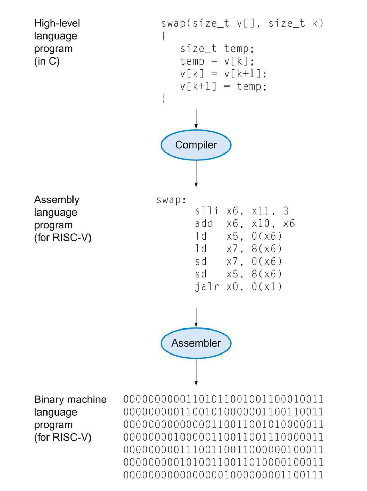
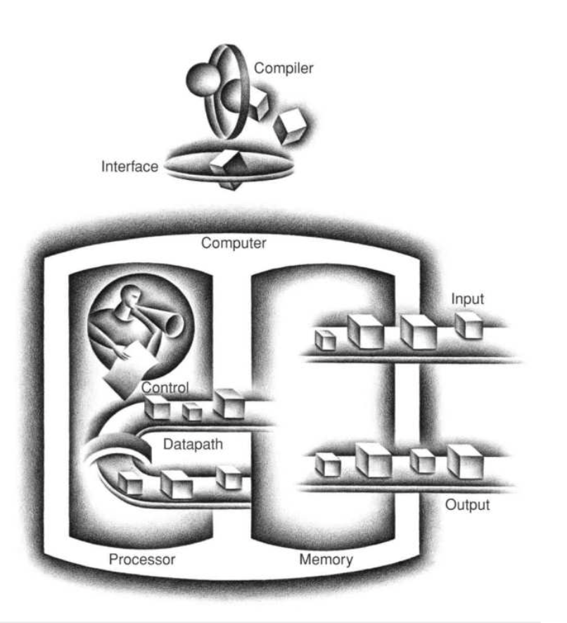

# Computer Organization and Design (RISC-V Edition)

> Based on *Computer Organization And Design (RISC-V Edition)* written by David A. Patterson and John L.Hennessy.

## I: Abstractions 

### 1: Main contents of the book 

- The translation, executing of the high-level language.

- Interface between software and hardware.

- Improve the effectiveness using hardware design.

- Basics concepts of modern computer design.

- Sequential processing and parallel processing.

### 2: Systems software 

-  Software including operating systems, compliers, loaders and assemblers.

- An **operating system** interfaces between a user's program and the hardware and provides a variety of services and supervisory functions.

- The **complier** perform the translation of a program written in a high-level language.

### 3: Form High-level to hardware 

- We refer to each letter as a b**inary digit or bit**.

- Instructions are collections of bits.

- The **assembler** is invented to translate a **symbolic version of instructions** into the binary version. (symbolic notation: add A, B; Ninary codes: 100010010)

- The symbolic language is called **assembly language**.

- **High-level language** is a portable language such as C, C++, Java or Visual Basic that is composed of words and algebraic notation that can be translate into assembly language by a complier.

- Example of C program complied into machine language:

### 4: The organization of a computer

### 5: Processor integrated circuit example 

- The **data path** performs the arithmetic operations, and the **control path** tells the data path, memory, I/O devices what to do according to the instructions of the program.

### 6: Instruction set architecture

- As mentioned above, one of the most important abstractions is the interface between the hardware and the low-level software, which is named of the **instruction set architecture**.

- The instruction set architecture includes anything programmers need to know to make a binary machine language program work properly, including the instructions, I/O, and so on.

- Typically, the operating system will encapsulate the details of doing I/O, allocating memory. 

- The combination of the basic instruction set and the operating system interface provided for application programmers is called **application binary interface(ABI)**.

- An instruction set allow designers to talk about function independently from the hardware such as clock hardware (quartz crystal, LED, buttons). The hardware that obeys the architecture abstraction is called **implementation**.

### 7: Memory 

- **Volatile** refer to the memory which lose data when the power is off. **Non-volatile** memory can keep the data even when power is off.

- **Main memory** also called **primary memory** is the memory used to hold programs while they are running, typically consists of DRAM in today's computers.

- **Secondary Memory** is non-volatile used to store programs and data between runs; typically consists of flash memory and magnetic disks in servers.

### 8: Tech for building processors and memory 

- Transistors: an on/off switch controlled by signal 

- VLSI (very large-scale integrated circuit): a device containing hundreds of thousands to millions of transistors.

- The transistor manufacturing process starts with a **silicon crystal ingot**, then finely sliced into **wafers**.

### 9: Performance 