# Fundamentals of Electric Circuits
> The source textbook is the *Fundamentals of Electric Circuits,The Seventh Edition*, written by Charles Alexander and Matthew Sadiku.
> The index of this note are not following the same number of the textbook. 

## 1: Basic Concepts 

### Passive sign convention
- Passive sign convention is the convention we commonly used, which is satisfied when the current enters through the *positive terminal (+)*of an element. For the voltage analysis (eg. mesh analysis), if we follow a vested direction (mostly clockwise) of a loop, if the direction arrow enter the *positive terminal (+)* of a element, that voltage will be marked as *'+'* and vice versa.
- For example, the 5 V source in the Loop 1 should be marked as '-' as the following image.

### Type of the Sources 
- **Ideal Independent sources** is an active elements(could generate power) that provides a specified voltage or current is *completely independent* of other elements. We use the 'circled sources' refer to **independent sources**.

- **Ideal dependent (controlled) source** is an active element in which the source quantity is controlled by another voltage or current. There are four types of dependent sources, namely:  VCVS (voltage-controlled voltage source), CCVS, VCCS, CCCS. We use the 'diamond-shaped symbols' refer to **dependent source**.

## 2: Basic Laws 

### Ohm's Law & Conductance 

- Ohm's Law which is $v\propto i$, or more commonly $v=iR$. The unit of resistance is Ohm.
- A useful quantity in circuit analysis is the reciprocal of resistance $R$, **Conductance**,$G=\frac{1}{R}$. The unit of the conductance is *mho* ($\mho$) or *Siemens* ($S$).

### Nodes, Branches, and Loops 

- A **branch** represents a single element such as a voltage source or a resistor. Such as the 10-V voltage source, the 2-A current source and three resistors.
- A **node** is the point of the connection between two or more branches.(the point with same electric potential).
- A **Loop** is a closed path formed by starting at a node. A loop is said to be independent if it is a single circle which doesn't contain another loop. (a brief understanding) The circuit in the graph have 3 independent loops for example.
- According to the topology, we have $*b=l+n-1*$.

### Series and parallel

- Two or more elements are in **series** if they exclusively share a single node and consequently carry the same current.
- Two or more elements are in **parallel** if they are connected to the same two nodes and consequently have the same voltage across them.

### Kirchhoff's Laws 

- **Kirchhoff's current Law** states that the algebraic sum of currents entering a node is zero.
- **Kirchhoff's voltage Law** states that the algebraic sum of all voltages around a closed loop is zero.

### Wye-Delta Transformations 

- **Wye-Delta Transformation** is used to convert 'Y' or 'T' networks and '$\Delta$' or '$\Pi$' each other. 

|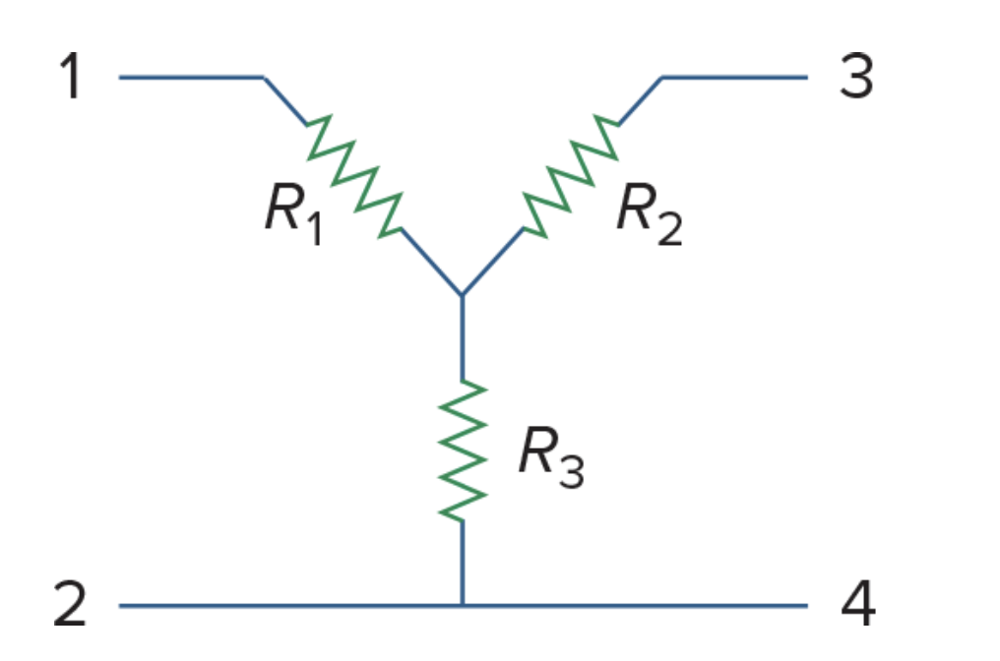|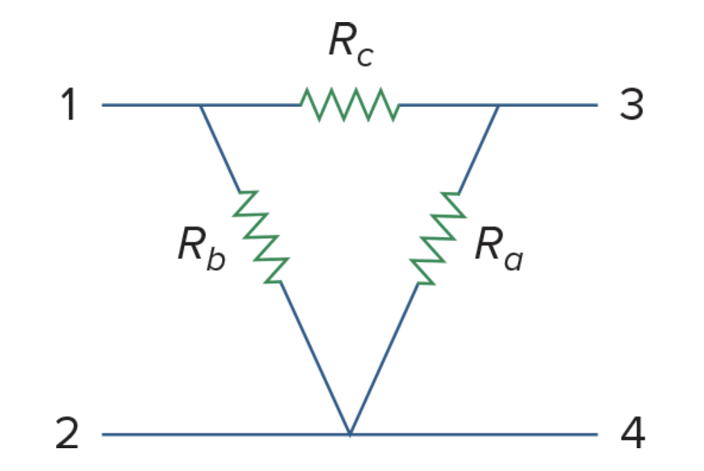|
|  ----  |  ----  |

- Normally we use the graph below to do the conversion between 'Wye' and 'delta'.

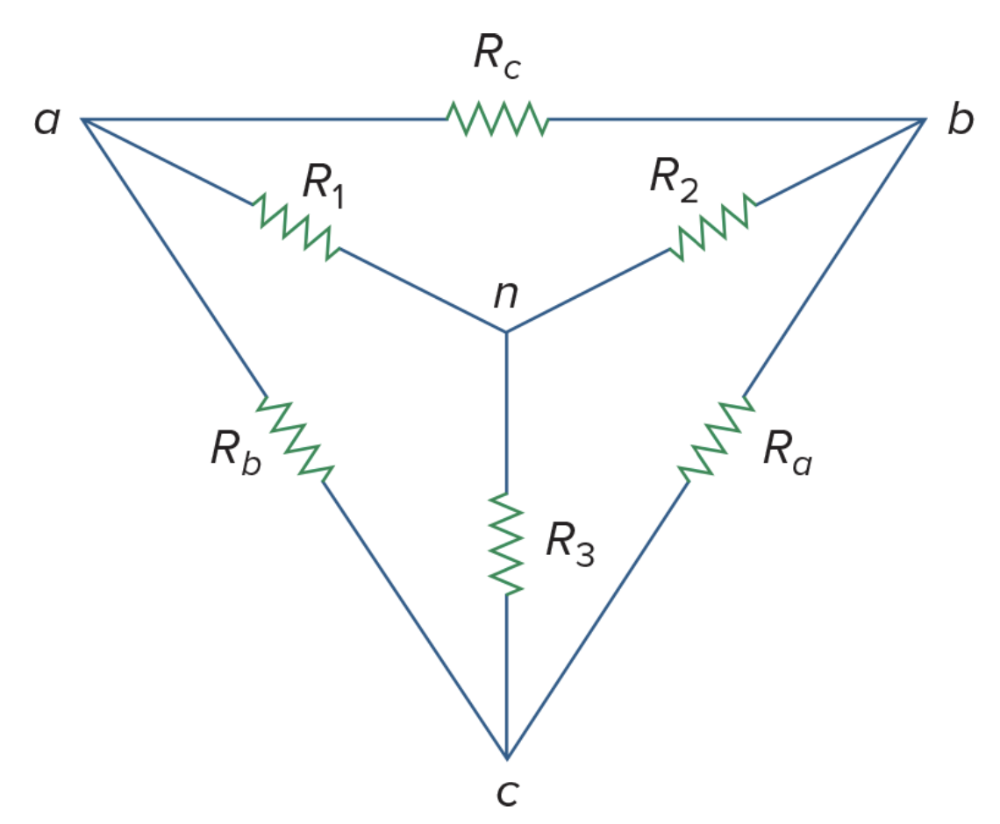

- Note the rule that $R_1$ faces to the $R_a$ and same for other two resisters.(use alphas for 'delta' and digits for 'Wye')
- For the Delta to Wye conversion:
    - $R_1=\frac{R_bR_c}{R_1+R_b+R_c}$
    - $R_2=\frac{R_cR_a}{R_a+R_b+R_c}$
    - $R_3=\frac{R_aR_b}{R_a+R_b+R_c}$
- For the Wye to Delta conversion:
    - $R_a=\frac{R_1R_2+R_2R_3+R_3R_1}{R_1}$
    - $R_b=\frac{R_1R_2+R_2R_3+R_3R_1}{R_2}$
    - $R_c=\frac{R_1R_2+R_2R_3+R_3R_1}{R_3}$
- When $R_1=R_2=R_3$, we say the network is **balanced**.

## 3: Methods of Analysis 

### Nodal Analysis 

- Nodal Analysis is a general method to analyze the circuits which using the nodal voltages as variables, so it is also known as *node-voltage method*.
- The Step of nodal analysis:
    - Determine a *reference node* which could be treated as ground.
    - Apply KCL to each of the non-reference nodes, then use Ohm's Law to express the current in nodal voltages.
    - Solve the Simultaneous Equations.
- Nodal analysis with voltage sources:
    - When voltage source is connected between the reference node and a non-reference node, simply set the voltage at the no-reference node equal to the voltage of the voltage source as the '10 V' source in the picture below.
    - When voltage source is between two non-reference nodes, which form a *supernode*(as the '5 V' source below) we use both KCL and KVL on the supernode: $i_1-i_2+i_4-i_3=0$, then use the KVL between the supernode and the ground (a loop): $-v_2+5+v_3=0$.

|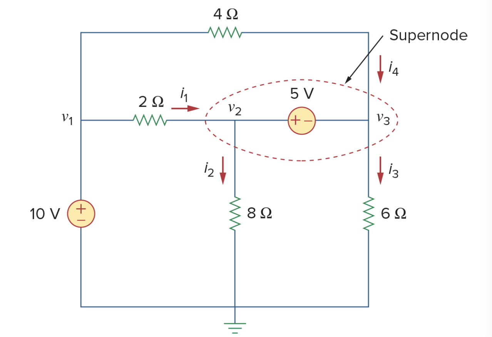||
|----|----|

### Mesh Analysis 

- Mesh analysis is also known as *loop analysis*, which focus on the *mesh*, (i.e.a independent loop). The mesh analysis is only available to a circuit that is a *planar* (a topology term, means can be redraw with non branches crossing one another).
- For example, there are two meshes on the picture below.

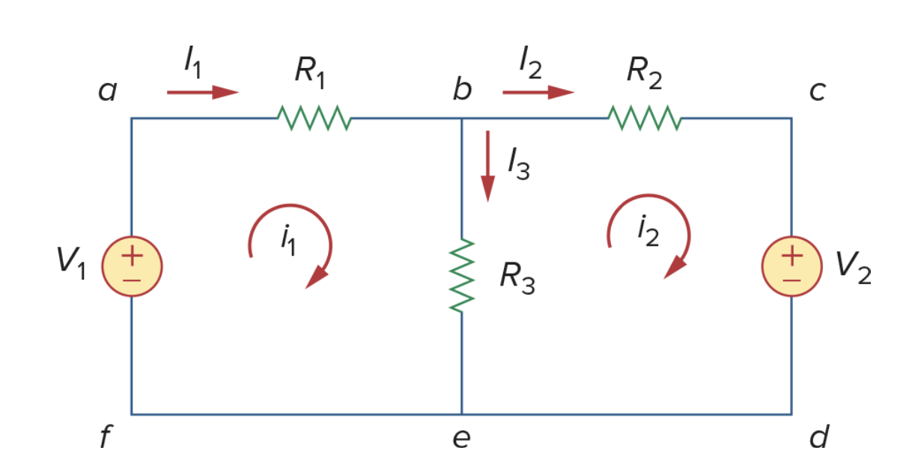

- Steps to determine the mesh current:
    - Assign mesh current of the each mesh as the picture above. (Note that the direction of the current is arbitrary)
    - Apply KVL to the meshes, use Ohm's Law to express the voltage in terms of the mesh current.
    - Solve the equations. 
- Mesh Analysis with Current Sources:
    - The presence of the current sources will reduce the equations. 
    - When a current source exists only in one mesh, such as the left picture below, set $i_2=5$ A and write the other mesh in usual way.
    - When a current source exists between the two meshes, such as the right picture below, we will create a *supermesh*, which means two meshes have a (dependent or independent) current source in common.

|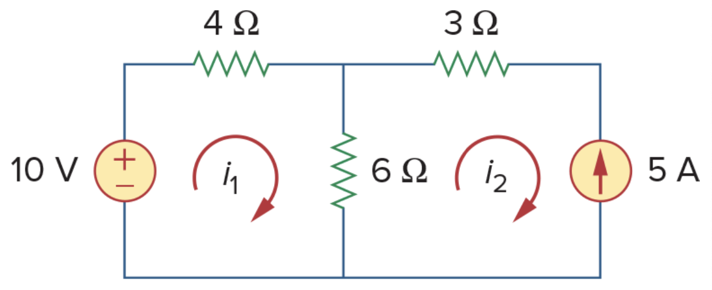|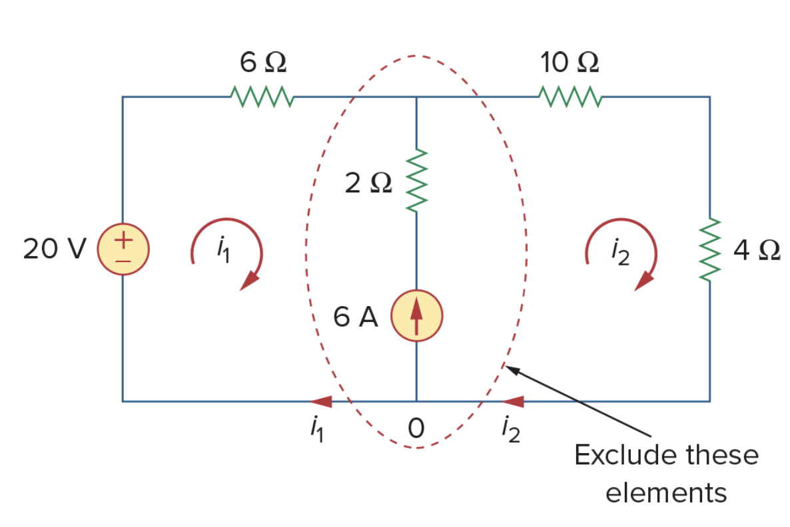|
|----|----|

- When dealing with the *supermesh*, we can omit the branch with the current source, as the picture below, then apply the KVL of the new loop as $-20+6i_1+10i_2+4i_2=0$ and KCL to node in the branch when two meshes intersect as $i_2=i_1+6$, the answer will be apparent.
- Three meshes can also create a large *supermesh*.(the right schematic)

|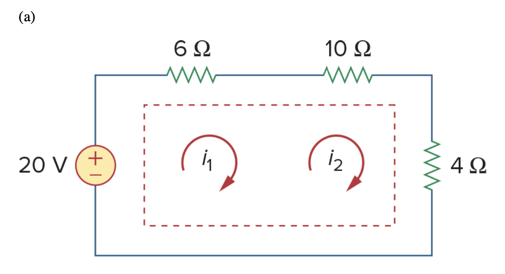|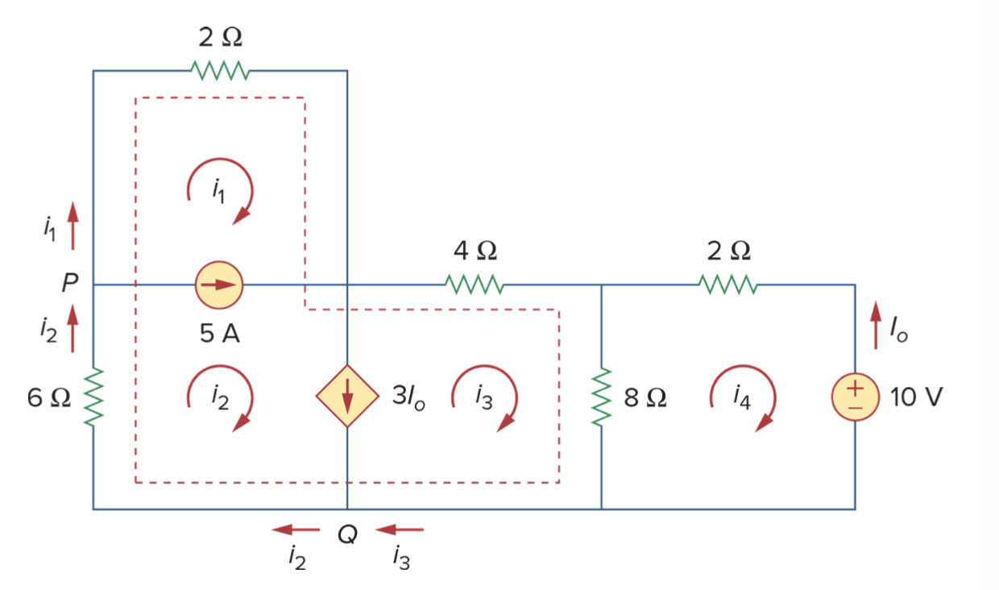|
|----|----|

### Nodal and Mesh Analysis by inspection 

- When **all the sources in a circuit are independent current sources**, we have a easier way to get the matrix form of the equations.
- We can use the formula $Gv=i$ to generate the *conductance matrix*, such as:

$$
\left(\begin{array}{cccc}
G_{11} & G_{12} & \cdots & G_{1N} \\
G_{21} & G_{22} & \cdots & G_{2N} \\
\vdots & \vdots & \vdots & \vdots \\
G_{N1} & G_{n2} & \vdots & G_{NN}
\end{array}\right)\left(\begin{array}{cccc}
v_1 \\
v_2 \\
\vdots \\
v_N
\end{array}\right)=\left(\begin{array}{cccc}
i_1 \\
i_2 \\
\vdots \\
i_N
\end{array}\right)
$$

- In the formula above:
    - $G_{kk}$= Sum of the conductances connected to node k.
    - $G_{kj}=G_{jk}=$ Negative of the sum of the conductances of directly connecting nodes $k$ and $j$.
    - $v_k$= Unknown voltage at node $k$
    - $i_k=$ Sum of all independent current sources directly connected to node $k$, with current entering the node treated as positive.

- When a linear resistive circuit **has only independent voltage sources**, we can obtain the mesh equations by inspections.
- We can generate the *resistance matrix* using the formula $Ri=v$, such as:

$$
\left[\begin{array}{cccc}
R_{11} & R_{12} & \cdots & R_{1N} \\
R_{21} & R_{21} & \cdots & R_{2N} \\
\vdots & \vdots & \vdots & \vdots \\
R_{N1} & R_{N2} & \cdots & R_{NN}
\end{array}\right] \left[\begin{array}{cccc}
i_1 \\
i_2 \\
\vdots \\
v_N
\end{array}\right]=\left[\begin{array}{cccc}
v_1 \\
v_2 \\
\vdots \\
v_N
\end{array}\right]
$$

- In the formula above:
    - $R_kk$= Sum of the resistances in mesh $k$.
    - $R_{kj}=R_{jk}=$ Negative of the resistances **in common** with meshes $k$ and $j$.
    - $i_k$ = Unknown mesh current for mesh $k$ in the clockwise direction.
    - $v_k$ = Sum taken clockwise of all independent voltages sources in mesh $k$, with voltage rise treated as positive.

### Analysis Methods of BJT 

- The structure of a NPN BJT (left) and the current direction (right):

|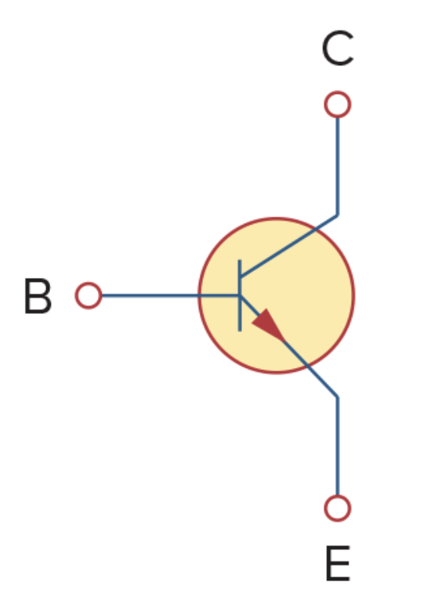||
|----|----|

- The basic rules of BJT: $I_C=\beta I_B$
- To use the nodal analysis method on BJT, we can change it to the equivalent model below:

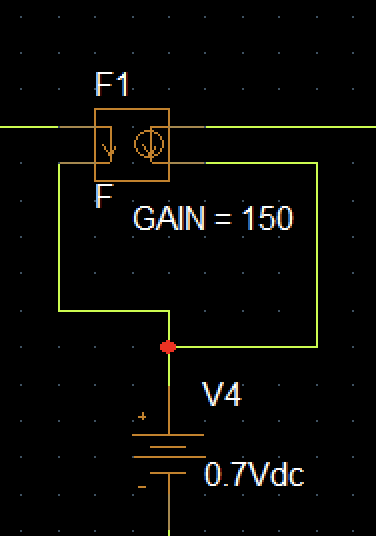
  

