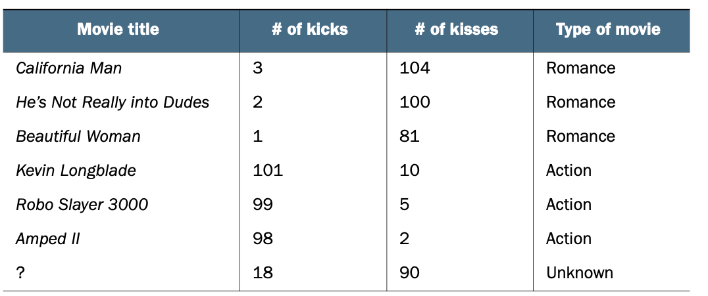
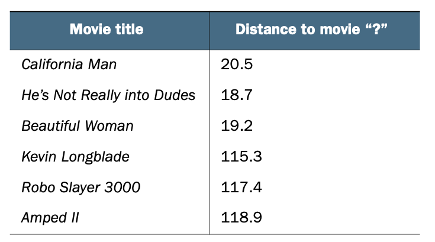

# Machine Learning in Action 

## I: Basics

- Classification: The target variable only have **discrete** values such as "true or false", " reptile or fish or mammal...".

- Regression: The target variables are **continuous**.

- **Features** or **Attributes**: the characteristics we measured to classify 

- **Training set** is the set of training examples we will use to train the classification algorithm.

- **Target variable** is the data what we are going to predict, which is called the **classes** in classification problem.

- **Test set** is the set of data to test the accuracy of the algorithm.

- **Knowledge representation** is what the machine learned, which maybe the form of a set of rules, a probability distribution or an expert system.

- Classification and regression are known as supervised learning because we are telling the algorithm what to predict.

- In unsupervised learning, a task we group similar items together is known as a **clustering**. 

- We try to find statistical values that describe the data, which is called **density estimation**.

- If you’re trying to predict or forecast a target value, then you need to look into supervised learning. If not, then unsupervised learning is the place you want to be.


## II: Basics of Python 

- Use command entering the python shell in unix-like system:

```
python3 
```

- Import the numPy() library:

```
from numpy import *
```

- numPy have two different types for dealing with rows and columns of data: **matrix and array**

- Array can be converted to matrix using:

```
randMat = mat(random.rand(4,4))
```

- The '.I' operation can be used to reverse the matrix:

```
randMat.I
```

- The function 'eye(n)' can create an indentity matrix of size n:

```
eye(4)
```

## III: K-nearest Neighbors classification algorithm 


### 1: Classifying with distance measurement 


- Pros: High accuracy, insensitive to outliers, no assumptions 

- Cons: Requires a lot of memory 

- Works with: Numeric values, nominal values 

- We look at the **top k most similar pieces of data** from our known dataset. (k < 20)

- Lastly, we take a majority vote from the k most similar pieces of data , and the majority is the new class we assign to the data we were asked to classify.

- For the example of movie classification, if we calculate the number of kicks and kisses:



- If we choose the top three of action and romance movie, there should be one unknown movie. So that we calculate the distance to movie "?" of other movies:

 

 - Let's assume k=3, as the top closest movies are all romances, so we forecast that the mystery movie us a romance.

### 2: General approach to kNN 

- Collect: Any method 

- Prepare: Numerical values are needed for a distance calculation

- Analyze: Any 

- Train: No training 

- Test: Calculating the error rate.

- Use: The application runs the kNN algorithm on this input data and determines which class the input data should belong to. The application then takes some action on the calculated class.


### 3: Prepare: Importing data with Python 


- Assume all codes in the file kNN.py.

- Import the NumPy and operator module, which is used later in the kNN for sorting.

- The function 'createDataSet()' can create the dataset and labels.

- Import kNN in the target directory:

```
import kNN
group,labels = kNN.createDataSet()
```
- This creates two variables called *group* and *labels*:


- Here we have four pieces of data, each piece of data has two attributes or features. For example, we assigned the data point (1,1.1) to the class A, '1' and '1.1' are the numerical features.

- The plotted data should be:


### 4: Putting the kNN classification algorithm into action 

- The pseudo-code should be like this:

    - Calculating the distance between inX and the current point
    - Sort the distance in increasing order 
    - Take k items with lowest distances to inX 
    - Find the majority class among this items
    - return the majority class as our prediction for the class of inX 

- kNN algorithm Python codes:

```python
def classify0(inX, dataSet, labels, k):
    # The input vector to classify called inX;
    # Our full-matrix of training examples called dataSet.
    # Labels is a vector of labels
    # k is the value of nearest neighbor
    # The labels vector should have as many as many elements in it as rows in dataSet matrix
    dataSetSize = dataSet.shape[0]
    # 'shape' function can get the order of matrix
    # 'shape[0]' can get the value of row in the matrix
    diffMat = tile(inX, (dataSetSize,1)) - dataSet 
    # 

```

