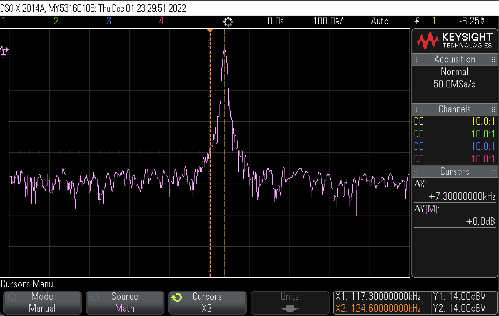
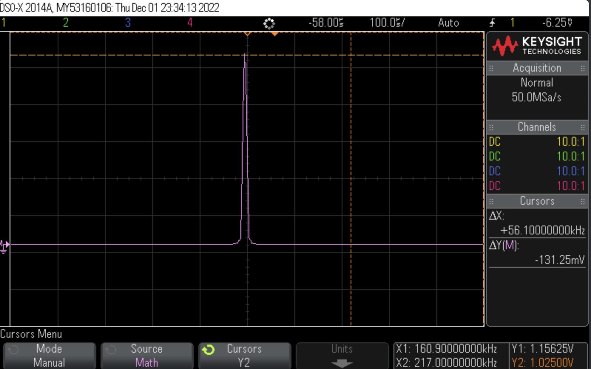
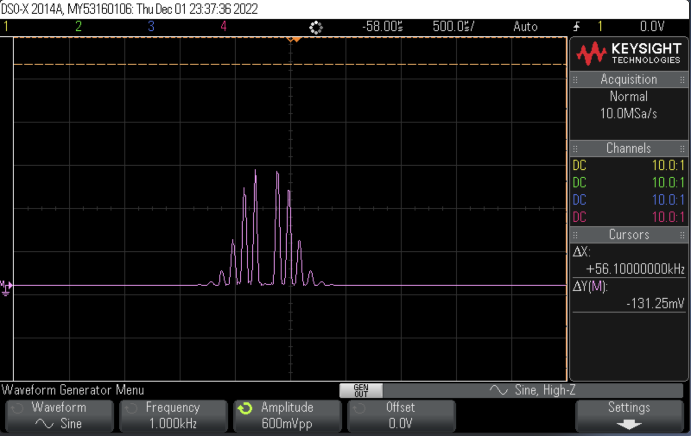
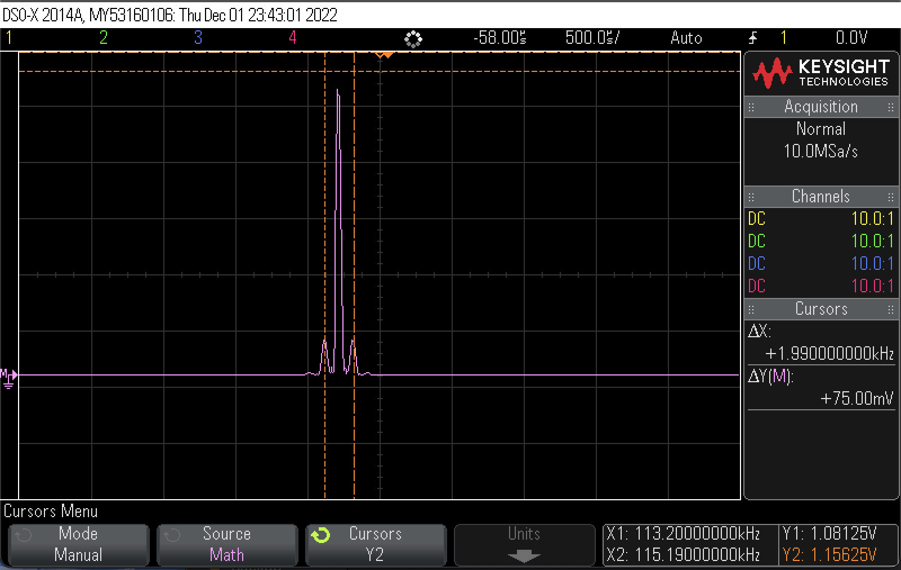
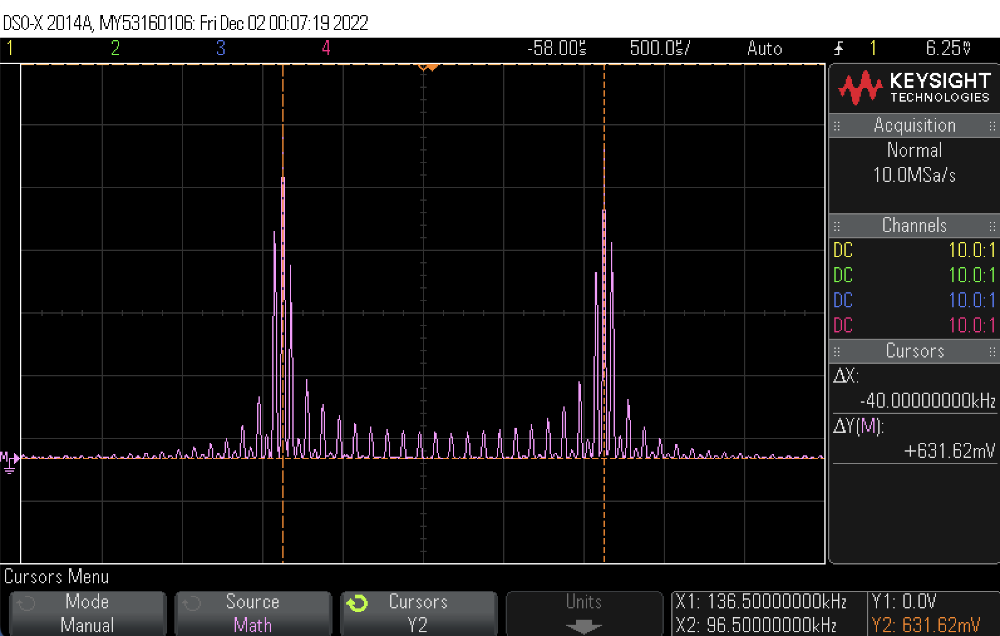
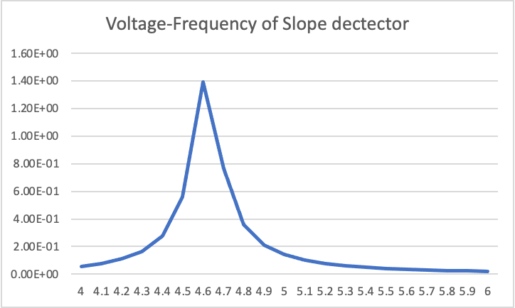
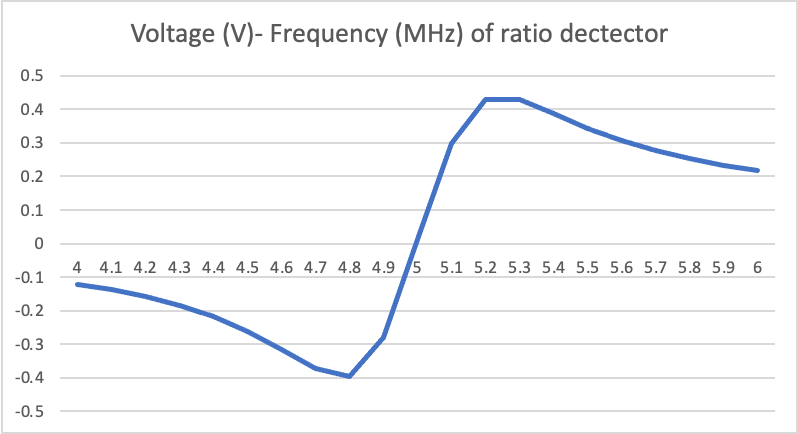

Frequency  Modulation and Frequency Shift Keying Lab Report 

## Abstract 

This experiment calculated the frequency conversion factor $\alpha$, generated and validated the frequency spectrum of narrow-band FM (NBFM) and wide-band frequency modulation (WBFM) with FM theory, verified the relationship of band-limit FM power and total power in final result. Carried out the frequency shift keying (FSK) and frequency demodulation with the plotted measurement graph of demodulated frequency response using both slope detector and ratio detector, which satisfied the theoretical properties.

## Introduction

The main principle of this experiment is using the formula of linear voltage-frequency convertor to calculated frequency conversion factor $\alpha$:
$$
\alpha = \frac{\Delta f_{OUT}}{\Delta V_{IN}}\tag{1}
$$
with the modulation index $\beta$ [1] calculated by:
$$
\beta = \frac{\Delta f}{f_m}\tag{2}
$$
then measuring the narrow-band FM, wide-band FM properties and frequency response of FSK to validate the result.

With this theory, this experiment mainly aimed at determining frequency conversion factor $\alpha$, using this value to verify the frequency spectrum of suppressed carrier FM, NBFM and WBFM, calculating and comparing the total power and band-limit power of FM, finally discovering the difference type of slope detector and ratio detector. To achieve the aims above, the tasks have been done as below:

- Determine the $\alpha$ using equation (1).

- Calculate the $\beta$ using equation (1) and equation (2) when no carrier-component in frequency spectrum, then comparing the result with Bessel Function Table (Fig.1).

- Determine the max voltage of NBFM and the max voltage of WBFM ($\beta = 10$), then find the bandwidth of both spectrum.

- Calculate the total power and band-limit power when $\beta = 1$.

- Plot and compare the frequency response of slope-detector and ratio-detector.

[2]Fig.1.Bessel Function Table

## Procedure 

- To calculate the $\alpha$, we set $V_1 = 0$ for the initial condition and $V_2 = 1 V$. According to the measurement on oscilloscope, record the $f_1$ and $f_2$ for two conditions respectively.

- Connect the AC signal output of 1 kHz, varying the $V_m$ values, so that the number of the sidebands may change until the carrier component being suppressed, then record and compare the spectrum of signal.

- Narrow-band means there is only one pairs of sideband in spectrum[3]. Change the $V_m$ until only have one pair of sideband, record the spectrum and modulation index $\beta$.

- Determine the value of $V_m$ of WBFM with $\beta =10$ using equation (1) and equation (2), record the spectrum and bandwidth.

- Determine the total power using the formula:

$$
P_T = \frac{V_{RMS}}{R_L}\tag{3.1}
$$
and determine the sideband voltage using:
$$
P_{BL} = \displaystyle\frac{1}{R_L}\sum_{n=-\infty}^{\infty}[V_{RMS}J_n(\beta)]^2\tag{3.2}
$$

- Add square wave to oscilloscope, using FFT generate and record the spectrum of FSK signal, then calculate the $\Delta f$ between two peaks.

- Connect the wave generator as input, vary the frequencies between 4.0 MHz to 6.0 MHz, record the response value of slope detector and ratio detector.

## Result and Discussion 

In terms of the measurement, we record the values of $f_1$ adn $f_2$ using x-cursor, for the $V_1=0$ and $V_2 = 1V$ respectively in Fig.2. As the formula:
$$
\Delta f_{OUT} = f_2 -f_1\tag{4.1} 
$$
$$
\Delta V_{IN} = V_2 - V_1\tag{4.2}
$$

Fig.2. $f_1$ and $f_2$

In consequence, the $\displaystyle\alpha = \frac{f_1-f_2}{V_2 -V_1}=7.3$ kHz/V.

When there is no sine wave connect, according to equation(1) and equation(2):
$$
\beta = \frac{\alpha V_m}{f_m}\tag{5}
$$
as $V_m = 0$ of sine wave disconnected, $\beta = 0$, there is only one carrier component in spectrum as shown in Fig.3.

Fig.3. Spectrum when $\beta =0$

Varying the max voltage (shown as $V_{pp}$) in oscilloscope, it is found that the carrier component suppressed when $V_{pp}=600$ mV, i.e. $V_m = 300$ mV shown in Fig.4. Using equation (5): 
$$
\beta = \displaystyle\frac{7.3 \times 0.3}{1} = 2.19 \quad V/kHz
$$ 
Compared with Bessel Function Tables in Fig.1, the $\beta$ is close to $\beta = 2$, which have four pairs of sidebands, just as Fig.4 shown.

Fig.4. Suppressed Carrier Spectrum 

Continue varying the max voltage until the signal is NBFM, it is noted the $V_{pp} = 60$ mV (i.e. $V_m = 30$ mV) in Fig.5. According to equation (5):
$$
\beta = \displaystyle\frac{7.3 \times 0.03}{1} \quad V/kHz
$$ 
Compared to the Bessel Function Tables in Fig.1, $\beta = 0.219$ closes to $\beta = 0.2$, which has 1 pair of sideband, verify the experimental result of NBFM. 

Fig.5. NBFM Spectrum 

Following the lab sheet, using the equation (5) to determine the $V_m$ when $\beta = 10$:
$$
V_m = \frac{\beta f_m}{\alpha} = 1.37\quad V
$$
so $V_{pp} = 2.74$ V. Change the voltage to 2.74 V, the spectrum of WBFM can be found using cursors in Fig.6, the bandwidth is 31.9 kHz. Check the Bessel Function Tables (Fig.1), when $\beta =10$, the signal have 14 pairs of sideband, which is the same as result in Fig.6.

Fig.6. WBFM Spectrum 

The $P_T$ is calculated by equation (3.1). Using the given value of $R_L =180 \Omega$ and $V_{RMS} = 1.05$ V as measured:
$$
P_T = \frac{V_{RMS}^2}{R_L} = 6.125 \quad mW
$$

Then change to the condition of $\beta = 1$, according to the equation (5), $V_m = 0.137$ V (i.e.$V_{pp} = 0.274$ V), we got the spectrum as Fig.7. Using formula (3.2), the $P_{BL}$ can be expressed:
$$
P_{BL} = \displaystyle\frac{1}{R_L}(V_1^2 + 2V_2 ^2 + 2V_3 ^2 + 2V_4 ^2) = 6.094 \quad mW
$$

The $\frac{P_{BL}}{P_T}\times 100 = 99.49$ %.

Fig.7. $\beta =1$ Spectrum 

Setting the signal to square wave and then using FFT processing, the FSK spectrum and measurement of frequency between two peaks generated shown in Fig.8.

Fig.8. FSK Spectrum 

Carrying out the frequency modulation experiment, the voltage-frequency relationship of slope-detector and ratio-detector being plotted in Fig 9.1 and Fig.9.2.

Fig.9.1. Voltage-Frequency of Slope detector 

Fig.9.2. Voltage-Frequency of ratio detector 

## Conclusion

Using the oscilloscope to measure the spectrum of FSK, the frequencies between two peak can be read form Fig.8. The $\Delta f_{pp}$ is 40 kHz as the cursors shown.

Varying the frequency between 4 MHz to 6 MHz, measuring the voltage in different frequency, we plot the voltage-frequency results of both slop detector (Fig.9.1) and ratio detector (Fig.9.2). The result validate that the slope detector only have limited linear range (4.5-4.6 MHz in Fig.9.1) to demodulate the FM signal, while ratio detector have a wide-range demodulation area.

Following the results above, we verified the FM modulation theory, compared the real signal spectrum of suppressed FM, NBFM and WBFM with theoretical results in Bessel Function Tables (Fig.1). According to the values and graphs above, the sideband pairs explicitly followed the theory values, which validate the accuracy of FM theory. 

During the FM power calculation, the result of $P_T$ and $P_{BL}$ show the difference of band limited power and total power significantly, only a few of insignificant component being omitted in real condition, which follow the FM theory.

In FSK experiment, the graph (Fig.8) shows the result of spectrum and the measurement of bandwidth.

According to the frequency demodulation tests, the frequency response curves (Fig.9.1 and Fig.9.2) verify the properties of slope detector and ratio detector apparently: the slope detector have small range of demodulation, which suited to be used in NBFM; while ratio detector have a wide-range which can be used in WBFM.

In conclusion, this experiment validate the theory above successfully.

## References

[1]: S.S.Haykin, *Communication Systems*, New York: Wiley, 2010, pp. 110–111. 

[2]: L.E.Frenzel, *Principles of Electronic Communication Systems*, New York, NY: McGraw-Hill, a business unit of The McGraw-Hill Companies, Inc., 2014, pp. 159. 

[3]:L.E.Frenzel, *Principles of Electronic Communication Systems*, New York, NY: McGraw-Hill, a business unit of The McGraw-Hill Companies, Inc., 2014, pp. 160.