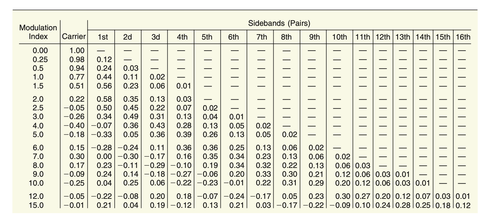

Frequency  Modulation and Frequency Shift Keying Lab Report 

## Abstract 

This experiment calculated the frequency conversion factor $\alpha$, generated and validated the frequency spectrum of narrow-band FM (NBFM) and wide-band frequency modulation (WBFM) with FM theory, verified the composition ratio of FM carrier power and total power in final result. Carried out the frequency shift keying (FSK) and frequency demodulation with the plotted measurement graph of demodulated frequency response of slope detector and ratio detector, which satisfied the theoretical properties.

## Introduction

The main principle of this experiment is using the formula of linear voltage-frequency convertor to calculated frequency conversion factor $\alpha$:
$$
\alpha = \frac{\Delta f}{\Delta V}\tag{1}
$$
with the modulation index $\beta$ [1] calculated by:
$$
\beta = \frac{\Delta f}{f_m}\tag{2}
$$
then measuring the narrow-band FM, wide-band FM properties and frequency response of FSK to validate the result.

With these theory, this experiment mainly aimed at determining frequency conversion factor $\alpha$, using this value to verify the frequency spectrum of suppressed carrier FM, NBFM and WBFM, calculating and comparing the total power and sideband power of FM, finally research the difference type of slope detector and ratio detector. To achieve the aims above, the tasks have been done as below:

- Determine the $\alpha$ using equation (1).

- Calculate the $\beta$ using equation (1) and equation (2) when no carrier-component in frequency spectrum, then comparing the result with Bessel Function Table (Fig.1).

- Determine the max voltage of NBFM and the max voltage of WBFM when $\beta = 10$, then find the bandwidth of both spectrum.

- Calculate the total power and sideband power when $\beta = 1$.

- Plot and compare the frequency response of slope-detector and ratio-detector.

[2]Fig.1.Bessel Function Table

## Procedure 

- To calculate the $\alpha$, we set $V_1 = 0$ for the initial condition and $V_2 = 1 V_{pp}$. According to the measurement on oscilloscope, note down the $f_1$ and $f_2$ for two conditions.

- Connect the AC signal output, varying the $V_m$ values, so that the number of the sidebands may change until the carrier component being suppressed, then record and compare the spectrum of signal.

- Narrow-band means there is only one pairs of sideband in spectrum[3]. Change the $V_m$ until only have one pair of sideband, record the spectrum and modulation index $\beta$.

- Determine the value of $V_m$ of WBFM with $\beta =10$ using equation (1) and equation (2), record the spectrum and bandwidth.

- Determine the total power using the formula:

$$
P_T = \frac{V_{RMS}}{R_L}\tag{3.1}
$$
and determine the sideband voltage using:
$$
P_{BL} = \displaystyle\frac{1}{R_L}\sum_{n=-\infty}^{\infty}[V_{RMS}J_n(\beta)]^2\tag{3.2}
$$

- Add square wave to oscilloscope, using FFT generate and record the spectrum of FSK signal, then calculate the $\Delta f$ between two peaks.

- Connect the wave generator as input, vary the frequencies between 4.0 MHz to 6.0 MHz, record the response value of slope detector and ratio detector.

## Result and Discussion 

Fig.2. $f_1$ and $f_2$

## Reference 

[1]: S.S.Haykin, *Communication Systems*, New York: Wiley, 2010, pp. 110–111. 

[2]: L.E.Frenzel, *Principles of Electronic Communication Systems*, New York, NY: McGraw-Hill, a business unit of The McGraw-Hill Companies, Inc., 2014, pp. 159. 

[3]:L.E.Frenzel, *Principles of Electronic Communication Systems*, New York, NY: McGraw-Hill, a business unit of The McGraw-Hill Companies, Inc., 2014, pp. 160.