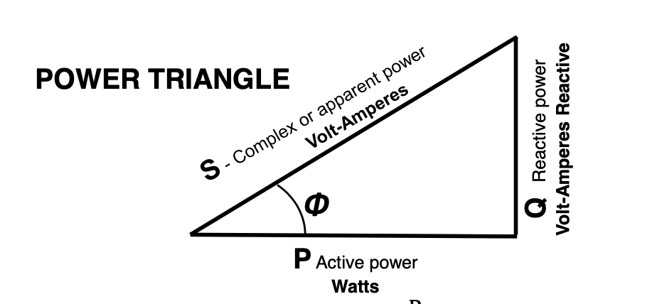
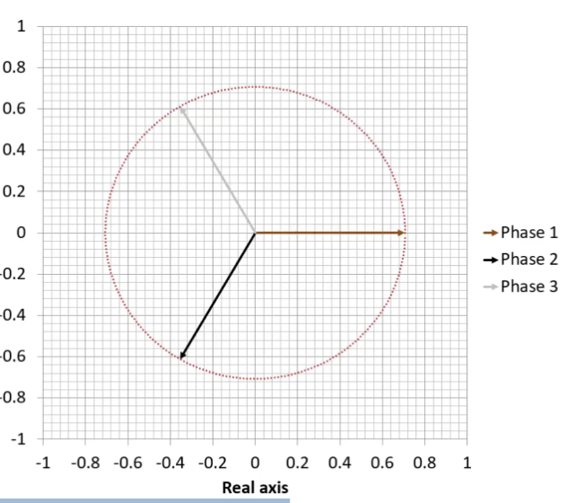

# AC Electrical Power and Conversion 

## I: AC Systems 

### 1: Conventions 

#### 1.1: Convention for magnetic flux and current 

- 'X' in circle means into paper.

- '.' in circle means out of paper.

- Right-hand (coil) rule can justify the direction of flux generated by current.

#### 1.2: Structure of Single phase generator 

- The *armature coil 1 & 2* in the **fixed** *stators*.

- The *filed coil* curled out of two different current are in the swirling *rotor*.

#### 1.3: Flux linkage and induced voltage 

- The *flux linkage* $\psi = N\phi$. We omit the coil number $N$ at this condition. As:

$$
\phi = Li 
$$

- If we note that $i = i_m\cos{(\omega t)}$:

$$
\phi = \phi_{mutual}\cos{(\omega t)}
$$

- According to Faraday's Law:

$$
V = -N\displaystyle\frac{d\phi}{dt}
$$

### 2: AC Phasors 

#### 2.1: Expression of AC phasor 

- For a signal $f(t) = A\cos{(\omega t + \phi)}$, it can be represented in complex plane as $F = Ae^{j\phi}$ or $F =A\angle \phi$

- For example of V and I, if is is for a capacitor, which V is lagging the I, the expression would be:

$$
V = V_{rms}\angle \theta_v \\
I = I_{rms}\angle \theta _v + \theta _i
$$

- Note the reminder tips of capacitor V lagging and inductance I lagging: "**CIVIL**".

- Usually take positive angle in anti-cw and **take voltage as reference point and lock it to the horizontal or vertical axis.**

#### 2.2: Returning phasors to time domain 

For example, a signal named '$F=e^{j\phi}$' in complex domain, to change it back to time domain, we can multiply it by $e^{j\omega t}$:

$$
Fe^{j\omega t} = Ae^{j(\omeg t +\phi)} = A\angle (\omega t+ \phi)
$$

This expression can be simplified to:

$$
f(t) = A[\cos{(\omega t+\phi)}+j\sin{(\omega t+ \phi)}]
$$

If we only take the real part:

$$
f(t) = A\cos{(\omega t +\phi)}
$$

#### 2.3: AC current, flux and the induced voltage 

### 3: Properties of AC Power 

#### 3.1: Single Phase Power 

- Using the sink convention, which power into the load is positive.

- The instantaneous power flow into circuit is:

$$
P=v.i
$$

- For AC case, 

$$
v = \hat{V}\cos{(\omega t)} \\
i = \hat{I}\cos{(\omega t -\phi)}
$$

- Bring the V and I together:

$$
P = \hat{V}\hat{I}[\displaystyle\frac{1}{2}(1+\cos{(2\omega t)}\cos{(\phi)}+\frac{1}{2}\sin{(2\omega t)}\sin{(\phi)}]
$$

- The PULSATING part deliver the **active** power and the OSCILLATING part deliver the **reactance** power which just goes back and forth. The stored energy in inductance or capacitor is $\frac{1}{2}CV^2$ OR $\frac{1}{2}LI^2$

#### 3.2: Complex Power 

$\hat{I}\cos{(\omega t-\phi)}$ and $\hat{V}\cos{(\omega t)}$ can be expressed as:

$$
I = \frac{\hat{I}}{\sqrt{2}}-j\frac{\hat{I}}{\sqrt{2}}+j0
$$

- So the complex is defined as:

$$
S = P + jQ = VI*
$$

- $I*$ is called the **Conjugate** I, which change the imaginary part symbol to "-":

$$
I* = \frac{\hat{I}}{\sqrt{2}}\cos{(\phi)}+j\frac{\hat{I}}{\sqrt{2}}\sin{(\phi)}
$$

- So the complex power is defined as:

$$
S = \frac{\hat{V}\hat{I}}{2}\cos{(\phi)} + j\frac{\hat{V}\hat{I}}{2}\sin{(\phi
)}
$$

- The unit of complex power is **unit voltamps(VA)**, the unit of active power is just **Watts** and the unit of reactive power is **Volt-Ampere Reactive (VAR)**.

- The power factor is defined using the power triangle:

$$
\cos{(\phi)} = \frac{Power}{Volt-Amperes}
$$

#### 3.2: Resistance and Impedance 

- Compared to $V=IR$ in DC circuits, Z is used so $V = IZ$.

- For a pure resistance, Z = R.

- For a pure inductance:

$$
Z = jX_L = j\omega L
$$

$X_L$ is defined as *inductive reactance*.

- For a pure capacitance:

$$
Z = -jX_C = -\frac{j}{\omega C}
$$

$X_C$ is defined as *capacitive reactance*.

- Note that the resistance and reactance measured in ohm.

#### 3.3: Power with an Resistive Load 

- Voltage and current are in phase, so the $\phi = 0$ and the power factor is 1.

- $P = V_{rms}I_{rms}$

#### 3.4: Power with an Inductive Load 

- Current lags the voltage by 90 degrees according to the calculation.

- The average power delivered should be '0', and anergy is released then stored each 1/2 cycle.

#### 3.5: Power with a capacitive Load 

- Current leads the voltage according to the calculation.

- The average power is '0'.

#### 3.6: Meaning of Reactive Power 

- Reactive power is the power that helps create and sustain the electric and magnetic fields required by alternating current.

- The reactive power in AC circuit depends on phase angle.

### 4: Single phase AC to Three phase AC 

#### 4.1: Single phase 

- To get more current spread out the winding, we add one pair of coil:

#### 4.2: Simple three phase generator 

- As $I_1+I_2+I_3 =0$, the return path can be removed:

- **The three phases using 3 cables and use machine better with 0.96 use factor**, compared to single and four phase machines.

#### 4.3: Vector representation of three-phase generator 

- $V = V_{rms}\angle{0}$

- $V = V_{rms}\angle{-120}$

- $V = V_{rms}\angle{-240)$

#### 4.4: Star connection to Line connection 

- Line voltage: measure across two lines.

- Line current: measure through a line.

$$
V_{LINE} = \sqrt{3} \times V_{PHASE} \\
I_{LINE} = I_{PHASE}
$$

- If the phases are the same or balanced:

$$
P = \sqrt{3}V_LI_L\cos{\phi}
$$

#### 4.5: Delta connection to line quantities

$$
I_{LINE} = \sqrt{3} \times I_{PHASE} \\
V_{LINE} = V_{PHASE} 
$$

- If all phases are the same or balanced:

$$
P = \sqrt{3}V_LI_L\cos{\phi}
$$

