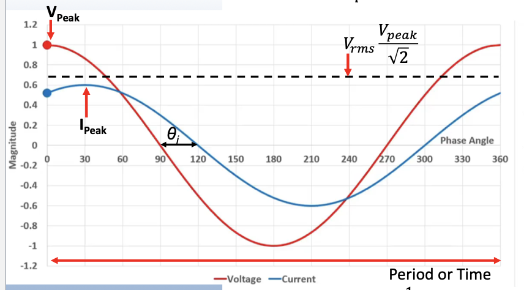

# AC Electrical Power and Conversion 

## I: AC Systems 

### 1: Conventions 

#### 1.1: Convention for magnetic flux and current 

- 'X' in circle means into paper.

- '.' in circle means out of paper.

- Right-hand (coil) rule can justify the direction of flux generated by current.

#### 1.2: Structure of Single phase generator 

- The *armature coil 1 & 2* in the **fixed** *stators*.

- The *filed coil* curled out of two different current are in the swirling *rotor*.

#### 1.3: Flux linkage and induced voltage 

- The *flux linkage* $\psi = N\phi$. We omit the coil number $N$ at this condition. As:

$$
\phi = Li 
$$

- If we note that $i = i_m\cos{(\omega t)}$:

$$
\phi = \phi_{mutual}\cos{(\omega t)}
$$

- According to Faraday's Law:

$$
V = -N\displaystyle\frac{d\phi}{dt}
$$

### 2: AC Phasors 

#### 2.1: Expression of AC phasor 

- For a signal $f(t) = A\cos{(\omega t + \phi)}$, it can be represented in complex plane as $F = Ae^{j\phi}$ or $F =A\angle \phi$

- For example of V and I, if is is for a capacitor, which V is lagging the I, the expression would be:

$$
V = V_{rms}\angle \theta_v \\
I = I_{rms}\angle \theta _v + \theta _i
$$

- Note the reminder tips of capacitor V lagging and inductance I lagging: "**CIVIL**".

- Usually take positive angle in anti-cw and **take voltage as reference point and lock it to the horizontal or vertical axis.**

#### 2.2: Returning phasors to time domain 

For example, a signal named '$F=e^{j\phi}$' in complex domain, to change it back to time domain, we can multiply it by $e^{j\omega t}$:

$$
Fe^{j\omega t} = Ae^{j(\omeg t +\phi)} = A\angle (\omega t+ \phi)
$$

This expression can be simplified to:

$$
f(t) = A[\cos{(\omega t+\phi)}+j\sin{(\omega t+ \phi)}]
$$

If we only take the real part:

$$
f(t) = A\cos{(\omega t +\phi)}
$$

#### 2.3: AC current, flux and the induced voltage 

### 3: Properties of AC Power 

#### 3.1: Single Phase Power 

- Using the sink convention, which power into the load is positive.

- The instantaneous power flow into circuit is:

$$
P=v.i
$$

- For AC case, 

$$
v = \hat{V}\cos{(\omega t)} \\
i = \hat{I}\cos{(\omega t -\phi)}
$$

- Bring the V and I together:

$$
P = \hat{V}\hat{I}[\displaystyle\frac{1}{2}(1+\cos{(2\omega t)}\cos{(\phi)}+\frac{1}{2}\sin{(2\omega t)}\sin{(\phi)}]
$$

- The PULSATING part deliver the **active** power and the OSCILLATING part deliver the **reactance** power which just goes back and forth. The stored energy in inductance or capacitor is $\frac{1}{2}CV^2$ OR $\frac{1}{2}LI^2$

#### 3.2: Complex Power 

