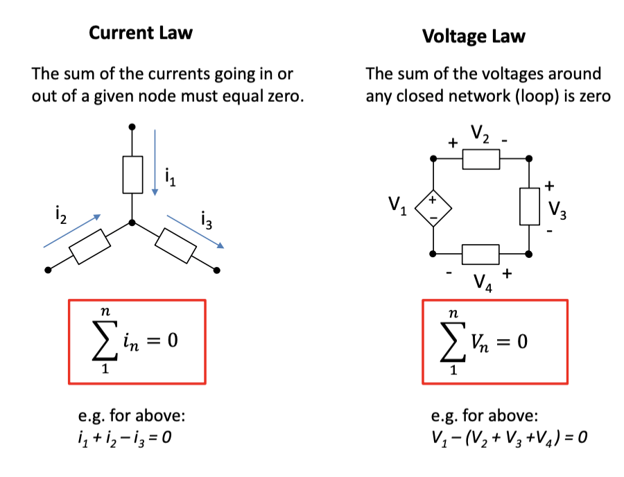
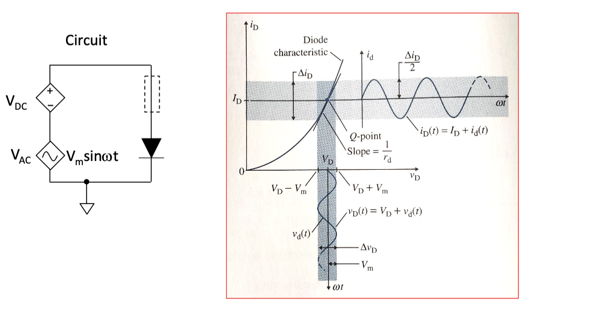
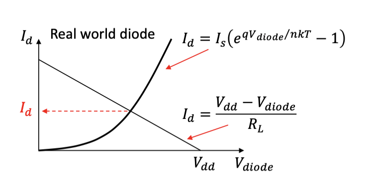
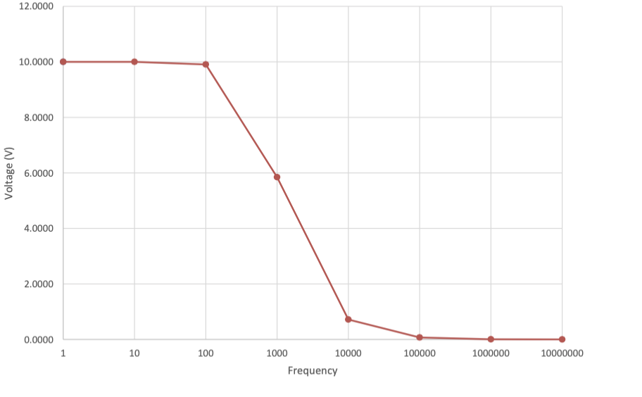
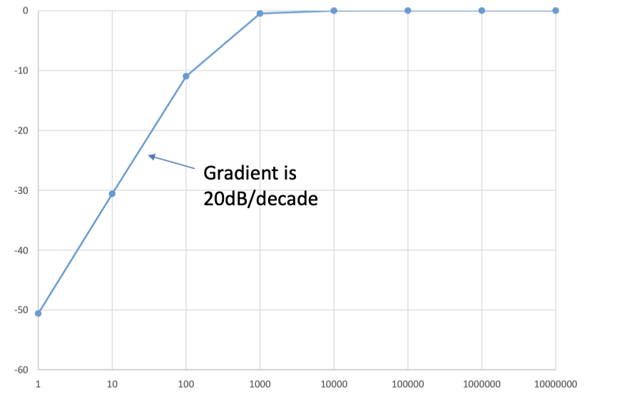
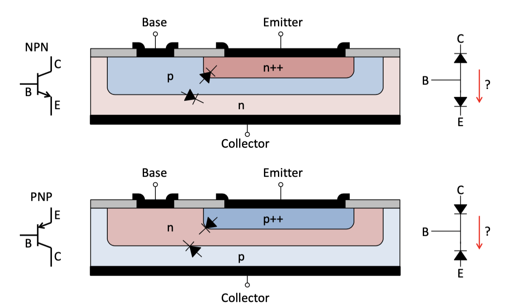
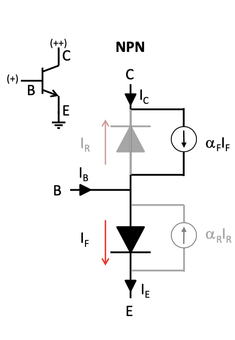
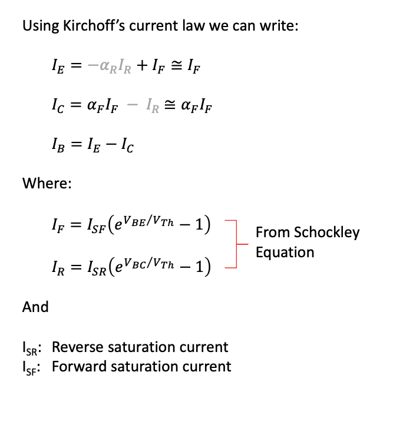
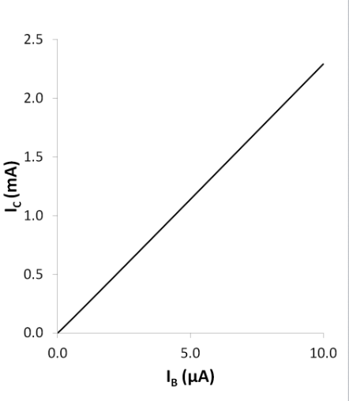

# Analog Electronics 

## I: Introduction & Overview

### 1: Introduction 

- Consider what can affect these circuits (noise etc)

- Consider how to improve designing circuits 

- Focus on 2 examples:
    - instrumentation amplifier for sensors
    - Power amplifier 

### 2: Basic Laws 

#### 2.1: Kirchoff's Law 

#### 2.2: The diode basics 

#### 2.3: Ideal Sources 

#### 2.4: Equivalent circuits 

#### 2.5: Small and Large signal modelling 

- The input signal can be separated to the large signal (DC component) and small signal (AC component).

- The DC component is called **the DC bias** (Quiescent point, Q point, or the operating point, bias point)

#### 2.6: Small signal conductance 

For AC model:

we tend to think in terms of conductance g:

$$
\frac{1}{r_{AC}} = g_{ac} = \frac{\Delta I_{AC}}{\Delta V_{AC}}
$$

noted that we typically use $i_{ac}$ and $v_{ac}$ short for $\Delta I_{AC}$ and $\Delta I_{AC}$。

#### 2.7: Load line analysis 

### 3: Noise 

- Noise refers to unwanted signals.

- Noise can originate in the sensor, lines or amps.

#### 3.1: Thermal Noise 

- Also known as Johnson-Nyquist noise.

- Thermal noise from random motions of electrons in conductors.

#### 3.2: Shot noise 

- Also known as Poisson noise.

- From the quantum nature of charge flow.

## II: Filters & Bode Plots 

### 1: Low Pass filter 

- For resistance, $Z_R=R$; for capacitance, $Z_C = X_C = \frac{1}{j\omega C} = \frac{1}{2\pi f C}$

- Low pass filter can be considered as a potential divider:

$$
V_{OUT} = V_{in}\times (\frac{Z_C}{Z_{total}})
$$

The total impedance $Z_{total}$ is given by:

$$
Z_{total} = \sqrt{R^2 +X_C ^2}
$$

So 

$$
V_{out} = V_{in} \times (\frac{X_C}{\sqrt{R^2+X_c ^2}})
$$

- If we increase the frequency, the output voltage will be:

And the gain in dB = 20log(Vout/Vin):

- This plot is known as a **Bode Plot**.

- There is a frequency at which $X_c = R$, which is know as the cut-off frequency ($f_c$).

- The cut-off frequency is 100 Hz as above.

- The gain in dB in $f_c$ usually defines the band-width.

### 2: High Pass Filter 

Use the same method, the formula is:

$$
V_{out} = V_{in} \times (\frac{R}{\sqrt{R^2 +X_c^2}})
$$

- If we increase the frequency, the output will be:

### 3: Multi-stage Filter 

$$
V_{out2} = V_{in1} * (\frac{R_1^2}{R_1^2+X_{c1}^2})
$$

### 4: Passive bandpass filter 

**A band pass filter** is to be constructed using RC components will only allow a range of frequencies to pass, calculating the 

- Note that the high pass filter defines the lower threshold.

## III: BJT transistors - the analog perspective 

### 1: Discrete BJT structure 

### 2: BJT large signal operation 

#### 2.1: Ebers Moll model for BJT

For example of NPN:

where $\alpha _F$ is the forward current gain:

$$
\alpha _F = \frac{I_C}{I_E}
$$

and 

$$
\beta _F = \frac{I_C}{I_B}
$$

with some operations we can also get the relation between $\alpha$ and $\beta$:

$$
\beta _F = \frac{\alpha _F}{1-\alpha _F}
$$

#### 2.2: Driving the BJT with V_BE and I_B

The collector current increases exponentially with $V_{BE}$.

|||
|---|---|

#### 2.3: BJT operating regions 

