# Computer Systems and Microprocessors 

## I: Background

### 1: Fundamentals of CMOS 

#### 1.1: Transistor fundamentals: NMOS 

* NMOS, i.e. Negative Metal Oxide Field Efficient Transistor.

* The drain / source area are both doping with electrons (n-type doping), while the substrate is doped with holes.

* The insulator is filled with oxide.

* The gate is a switch which controlled by the $V_{GS}$ (voltage between gate and source). The high potential voltage will attracts the minor electrons in substrate so that form the channel.

* The electrons will move from the source to the drain and inverse for the current.

* The symbol of NMOS is below (sometimes using 'inlet' arrow ):

#### 1.2: Transistor fundamentals: PMOS 

* The same mechanism as NMOS. 

|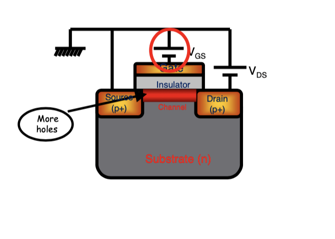||
|---|---|

#### 1.3: CMOS: complementary MOSFET

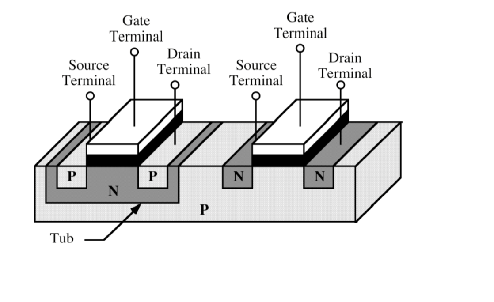

### 2: CMOS logic Circuits: Inverter

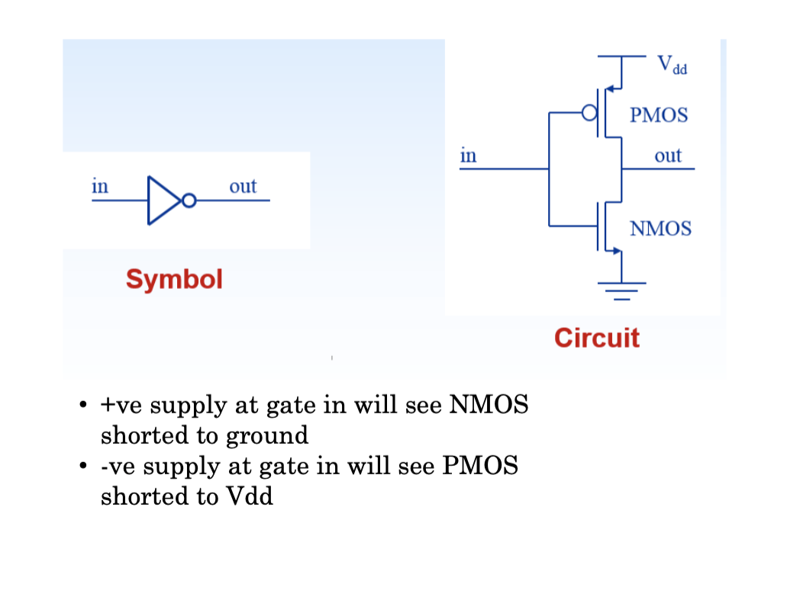

* Note that the positive voltage for gate for NMOS is ON, the negative voltage for PMOS is ON.

 * 2 transistors needed.

### 3: CMOS Logic Circuits: NAND 

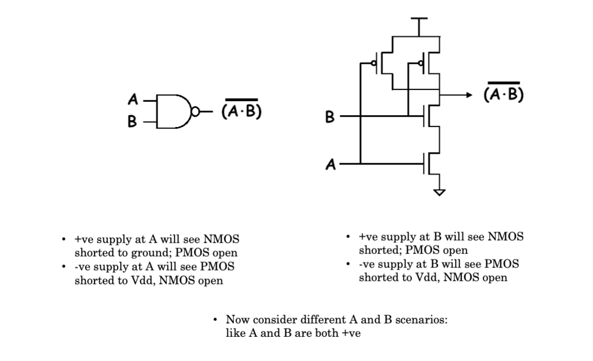

- If we fix one input as '1', this can also be used as an inverter. 

### 4: CMOS Logic Circuits: NOR 

- If we fix one of the input as '0', this can be used as an inverter.

### 5: D-type flip-flop (Latches)

- '0' for reset and '1' for set when clock is '1'.

## II: Computer Systems 

### 1: Modern Computing Systems 

* High Performance Computing 

* General Purpose Computing

* Embedded Computing 

* Ubiquitous Computing 

### 2: Computer Architecture 

* Core to the computation is the processors and memory organization.

* IO devices allow various user-interfaced.

* Modulation keeps the things simple.

- Key components of a Microprocessor:
    - Memories 
    - Busses / Interconnects
    - Processors (CPU,etc.)
    - IOs and controllers.

### 3: Memory 

* Provides the temporary or permanent storage needed by the processors/ IOs.

#### 3.1: Type of Memory 

- A. Register:
    - Small and fast; consists of a number of flip-flops
    - Flashed out when powered off.
- B. Cache Memory:
    - Large but slower memories, usually Static Random Access Memories (SRAMs)
    - Flashed out when powered off.
- C. Main Memory:
    - Even larger and slower.
    - Usually Dynamic Random Access Memories (DRAMs)
- D. Secondary Storage:
    - Larger and even slower.
    - Usually disk drives.
- E. Other Memories: Offline/Flash Memories
    - Used to store offline information.

#### 3.2: Memory Trade-offs 

#### 3.3: Memory Hierarchy 

- The memory elements close to CPU are generally the fastest and costliest.

#### 3.4: Register 

- A register is a parallel set of N flip-flops, with all clock lines connected with the CPU clock.

- Size N is equal to the CPU word length. In 32-bits CPU, you can find 32-bits registers.

- Registers can be different types:
    - *Accumulators*: register that directly stories/retrieves from memory.
    - *General purpose*: store data during execution.
    - *Special purpose*: used by the computer systems instead of the user:

- Different architectures have different number of registers depend on the **Instruction Set Architecture**.

#### 3.5: Cache Memory 

- Cache memories are usually static random memory (SRAM) (6 transistors)

- SRAMs have three operations:
    - Hold (WL = 0), Write and Read (WL = 1)
- BL: bit line feeds data into the cell.
- WL: word select line

- BL/WL basically feed two inverters.

- Back to back inverters in the red circles.

- M4 and M5 are access transistors as switches.

#### 3.6: Cache Memory: SRAM basics

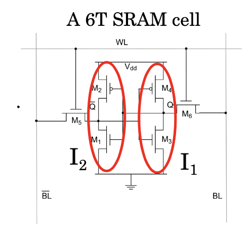

- Hold
    - WL=Low, M5 and M6 (access transistors) are OFF.
    - data held in latch.(back to back inverter)
- Write: (BL = High and WL = High, write 1)
    - M5 and M6 are switched on.
    - M6 allows the current through (High) and feeds the inverter $I_2$.
    - $I_2$ generates Low output; then the output is fed back to $I_1$; $I_1$ generate High output.
    - The high and low loop between the inverters remember the logic ($I_1$ output).

- Read: (WL = High select the word line)
    - M5 and M6 are switched on.
    - If $I_1$ is high - M4 is on, causes current ($V_{dd}$) to flow through M4 to the BL.
    - The current and its direction is read by a current sense amp (detect logic high).

#### 3.7: Cache Memory Operation 

- Cache exploits the **principle of locality**: programs tends to execute the same small set of instructions and data repeatedly.

- When the processor needs data for execution, first checks the cache:
    - If the data in the cache, it is called a HIT.
    - If else, it is called a MISS.

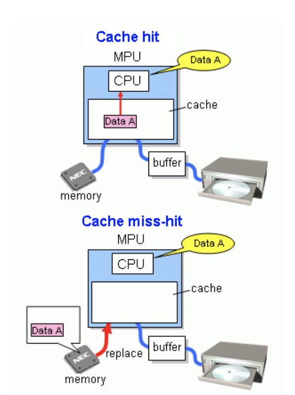

- Size and Performance trade-offs:
    - Larger cache may increase HIT ratio, but the overall access time may increase.
    - Smaller cache may increase MISS ratio, which may affect the performance.

- The first write is slow and the following writes are faster as you just need to write or update cache.
- The speed-up factor using cache is almost 10.
- When the cache becomes full, 'old' entries can be overwritten by randomly chosen.
- When cache entries are more updated than main memory, the entries marked as **dirty entries**.
    - Dirty lines are updated in the main memory soon.
    - The process of ensuring integrity of data is called **cache coherence**.

#### 3.8: Cache Size Tradeoff 

- The word 'latency' means the latency time for the computer to read the data.
- Effective Latency = Hit ratio * Hit Latency + Miss Ratio * Miss Latency
(the average time required for memory access)
- If the caches missed in the L1 Cache, then it will come to L2 cache.

- Note if we treat the miss ratio is fixed in every level as p, then the hit ratio will be 1-p.

- 'Temporal locality' refers to the reuse of the data which are time relatively.
- 'Spatial locality' refers to use of the data within close storage locations. When am instruction or a data is repeated a number of time it manifests spatial locality.

- Caches contains several blocks.
- For the same caches size, larger block size lead to good temporal locality.

#### 3.9: Main Memory 

- Generally DRAMs:
    - Dynamic: refreshed needed (the electrons may discharge when time past)
    - Volatile: loses data when power is removed.
- Comparison to SRAMs:
    - Smaller but more expansive.
    - Not fast as SRAMs.(more refreshing circuitry)
- Main memory is the primary storage - all changes in registers and caches must be coherent with the mai memory.

- In theory, when the word line is '0', the electrons in the capacitor may keep. However the electrons may leap, if the original voltage is 1 V, the electrons will not be detected when V = 0.5. So we need a charging after the 0.5 point, which is the freshing.

##### 3.9.1: The DRAM basics

- Write:
  - BL = '1' and WL = '1':
  - Access transistor ON, C charge to Vdd (HI).
  - After refresh period, rewrite the data.
- Read:
  - WL = HI
  - Access transistor is ON, assume C has ~Vdd(HI) charge.
  - Bit line read the voltage across C.
- Hold:
  - C will retain the charge.
  - The leakage current cause the discharge.
  - Refresh needed.

##### 3.9.2: DRAM Read: Sense Amplifier 
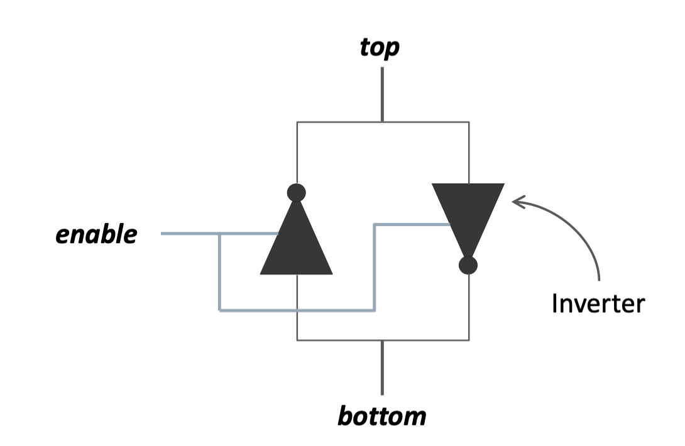

- To read '1':
    - WL = '0', the up and down BL keep 0.5 V.
    - WL = '1', the BL connected with C (HI), the discharging begin.
    - In the side with BL, the voltage increased and other side decreased.
    - Then the signal '1' in BL side can be detected.
    - The voltage will soon charge the C again.
- To read '0':
    - WL = '0', the up and down keep 0.5 V.
    - WL = '1', the BL connected with C (LOW), the charging begin.
    - In the side with BL, the voltage decreased and other side decreased.
    - Then the signal '0' in BL side can be detected.
    - The voltage will soon discharge the C again.
- To write dada:
    - The double side pre-charged to 0.5 V.
    - Activate the WL, set BL to '0' or '1'.
    - Data wrote to cell.

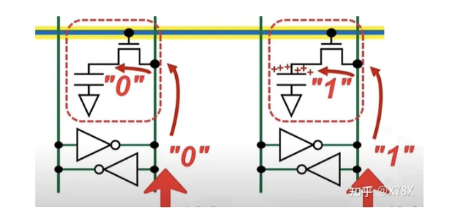

##### 3.9.3: DRAM Array 

- Several memory cell consist the memory array.

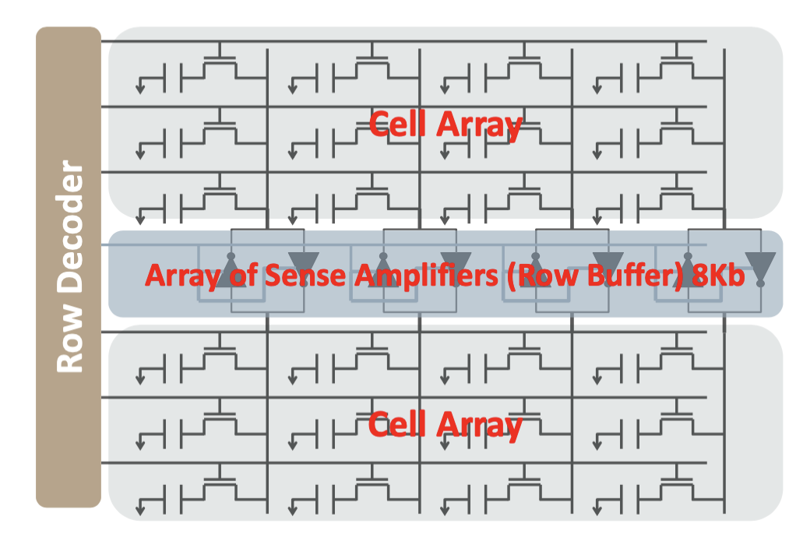

#### 3.10: The Memory Wall

- Faster and parallel processor reducing CPI (clocks per Instruction).

- Complicated memory hierarchy is increasing the memory latency.

- The memory will limit the core efficiency.

#### 3.11: Other Memories: ROM 

- Read-only Memory
    - No capability for memory write.
    - Data programmed
    - Stable storage even when power is off
- Example: NOR-based ROM 
    - 8 bits words
    - Address selects active (HI) row 
    - The row selects lines program which line is HI, so teh data stored is fixed.

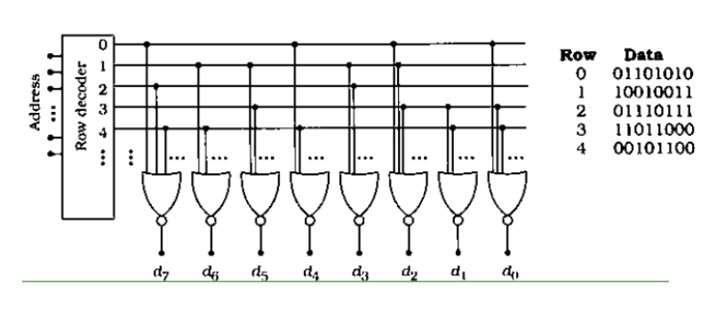

#### 3.12: Secondary Storage: Magnetic Disks

- Non-volatile memory, large and slower
- The disc is coated with magnetic material。
- Data is written serially in CW direction.
- Magnetise for '1', demagntise for '0'.

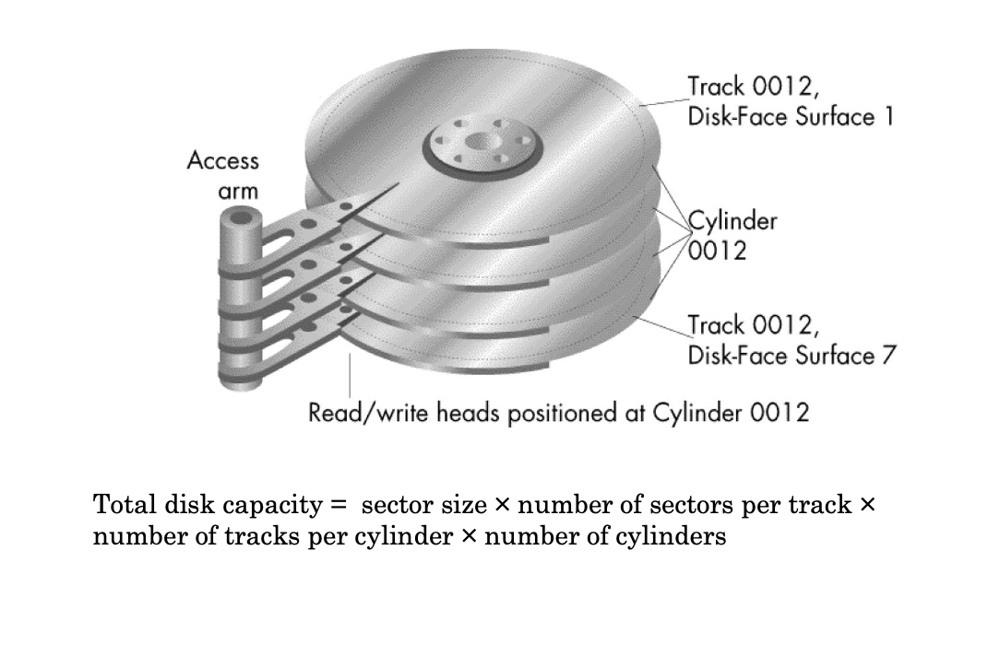

- The magnetic disks are consisted of:
    - Head: the head detector to read the magnetic direction.(hovering)
    - Track: the circle track drawn by head.
    - Cylinder: consist of different surface located in same radium circle, is a cylinder surface.
    - Sector: the different sector area divided by gap.
- Total disk capacity = sector size x sector per track x number of tracks per cylinder x number of cylinder.

- The sector is the actual data container:

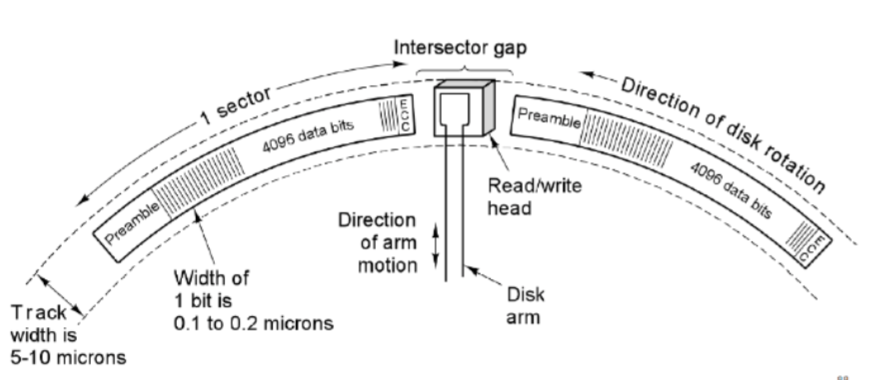

#### 3.13: Off-line Storage: CD-ROM, DVD 

- Optical non-volatile, for long-term storage.
- Coated in metal with the area reflect light differently.
- Normal surface called the 'land'.
- Surface affects by laser is called the 'pit'.
- The pit and land can be read by weak laser beam.
- From inside to outside.

#### 3.14: Tertiary Storages: Flash memories 

- Non-volatile; can be electronically erased and reprogrammed.
    - Modern solid-state drives (SSD) for secondary storage.
    - Secure Digital (SD) Cards.
- Semiconductor non-volatile, non-rotary devices.
    - Faster than HDDs.
- Flash memories are made of storage cells:
    - Eg. Single-level cell (SLC)
    - Control Gate is the MOS gate.
    - Floating Gate electrically isolate the channel.
    - Higher threshold  voltage need to charge FG for write.
    - A voltage lower than threshold for reading.
    - For higher electron biasing hot electrons injection needed.
- 

- Two charge states:
    - By default non charge in the float gate means '1'.
    - If the electrons injected to float gate, means '0'.

- Operations (NOR-based flash)
    - Reading:
        - For the '0', higher CG bias ($V_{T0}>5V$) required. (high voltage required to overcome the channel potential and the trapped charged impact)
        - For the '1', lower CG bias ($V_{T1}<V_{T0$) required.
    - Writing:
        - Need hot electrons injection (HEI)
        - HEI follow the quantum tunnelling.
        - Write '0': HEI applies HI (+ve) across the gate-source to allow FG to be charged negatively with low bit line.
        - Write '1': HEI applies HI (-ve) across gate-source to allow FG data to be erased with low bit line.
    - Hold:
        - The FG dictates the hold operation.
        - Negative charge for bit value = 0
        - No FG charge for bit value = 1
        - HEI causes oxide layer damage and this limit the lifetime of flash memories.
        - SLC have ~100k write cycles.

#### 3.15: NOR Multi-Level Cells

- Multi-level Cell (MLC)
    - Popular and high packing density
    - Multiple SLC in parallel give multiple logic levels.
    - MLC have typically ~10k cycles
- REading 
    - SImilar to the SLC, but with different biasing for different cells and configuration.

#### 3.16: Emerging Non-volatile Memories: Memristors

- Also called RRAM or register-RAM.
- T

- Two terminal element with variable doping:
    - The width and resistance of doped region varies with biasing.
    - When biasing makes w=D (device width) it is ON with $R_{ON}$
    - When biasing makes w=0 it is OFF with $R_{OFF}$.
    - The resistance cannot change without biasing.
- Resistive Memory: Meristor
- Current-Mode In-Memory Circuits: A *multiplier*
    - 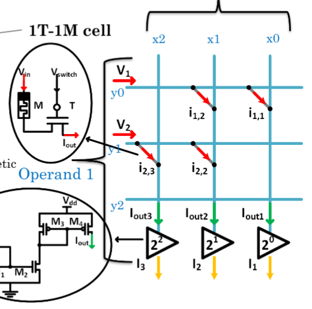

