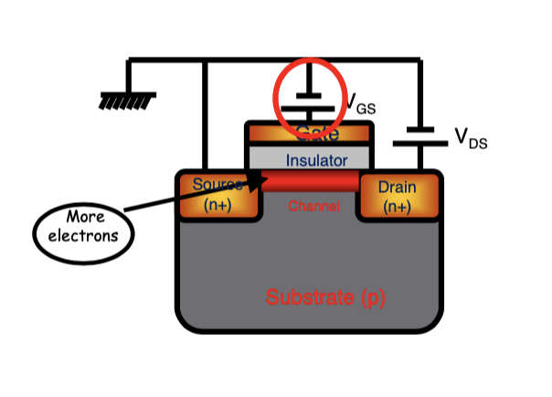
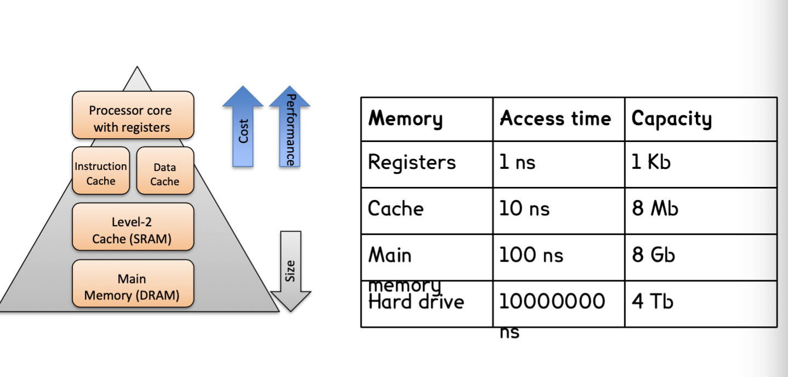
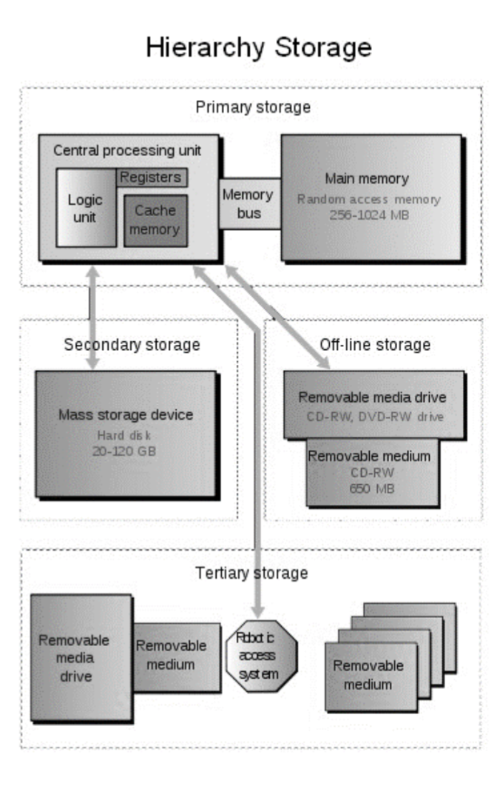
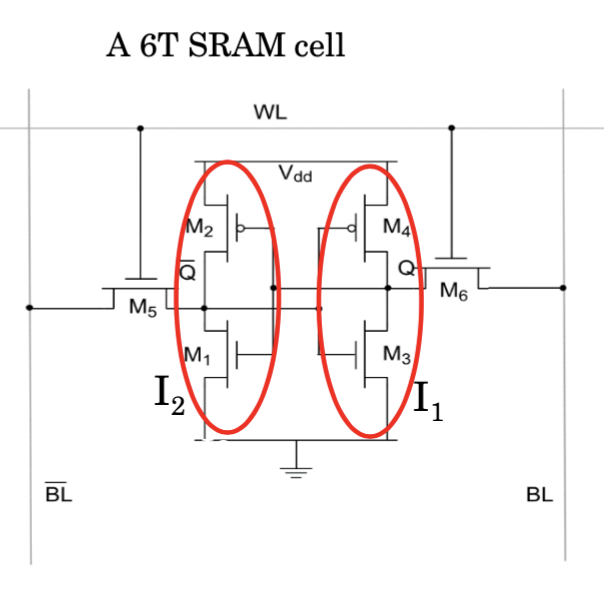

# Computer Systems and Microprocessors 

## I: Background

### 1: Fundamentals of CMOS 

#### 1.1: Transistor fundamentals: NMOS 

* NMOS, i.e. Negative Metal Oxide Field Efficient Transistor.

* The drain / source area are both doping with electrons (n-type doping), while the substrate is doped with holes.

* The insulator is filled with oxide.

* The gate is a switch which controlled by the $V_{GS}$ (voltage between gate and source). The high potential voltage will attracts the minor electrons in substrate so that form the channel.

* The electrons will move from the source to the drain and inverse for the current.

* The symbol of NMOS is below (sometimes using 'inlet' arrow ):

#### 1.2: Transistor fundamentals: PMOS 

* The same mechanism as NMOS. 

|||
|---|---|

#### 1.3: CMOS: complementary MOSFET

### 2: CMOS logic Circuits: Inverter

* Note that the positive voltage for gate for NMOS is ON, the negative voltage for PMOS is ON.

 * 2 transistors needed.

### 3: CMOS Logic Circuits: NAND 

- If we fix one input as '1', this can also be used as an inverter. 

### 4: CMOS Logic Circuits: NOR 

- If we fix one of the input as '0', this can be used as an inverter.

### 5: D-type flip-flop (Latches)

- '0' for reset and '1' for set when clock is '1'.

## II: Computer Systems 

### 1: Modern Computing Systems 

* High Performance Computing 

* General Purpose Computing

* Embedded Computing 

* Ubiquitous Computing 

### 2: Computer Architecture 

* Core to the computation is the processors and memory organization.

* IO devices allow various user-interfaced.

* Modulation keeps the things simple.

- Key components of a Microprocessor:
    - Memories 
    - Busses / Interconnects
    - Processors (CPU,etc.)
    - IOs and controllers.

### 3: Memory 

* Provides the temporary or permanent storage needed by the processors/ IOs.

#### 3.1: Type of Memory 

#### 3.2: Memory Trade-offs 

#### 3.3: Memory Hierarchy 

- The memory elements close to CPU are generally the fastest and costliest.

#### 3.4: Register 

- A register is a parallel set of N flip-flops, with all clock lines connected with the CPU clock.

- Size N is equal to the CPU word length. In 32-bits CPU, you can find 32-bits registers.

- Registers can be different types:
    - *Accumulators*: register that directly stories/retrieves from memory.
    - *General purpose*: store data during execution.
    - *Special purpose*: used by the computer systems instead of the user:

- Different architectures have different number of registers depend on the **Instruction Set Architecture**.

#### 3.5: Cache Memory 

- Cache memories are usually static random memory (SRAM).

- Back to back inverters in the red circles.

- M4 and M5 are access transistors as switches.

- First, enable the word line to read or write 

