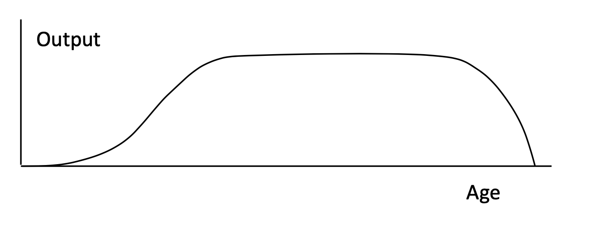
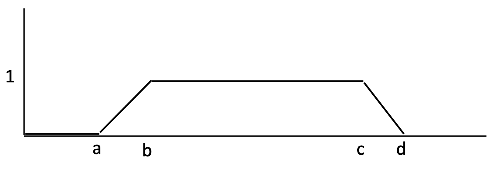
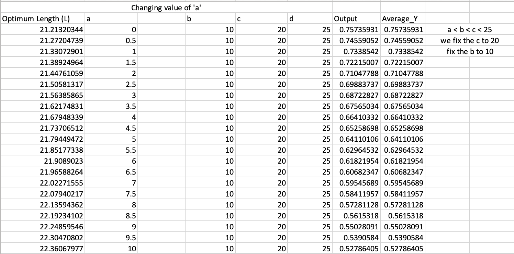
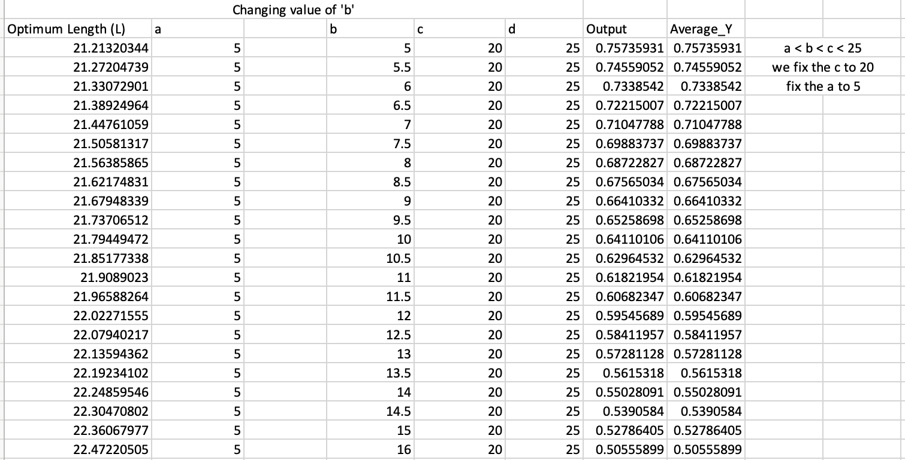
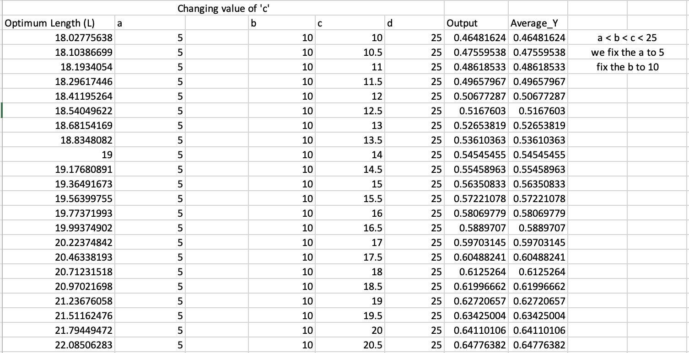
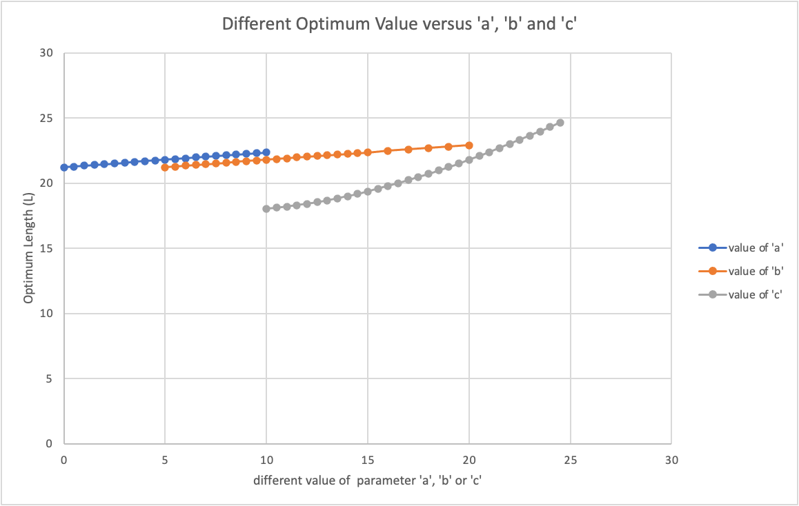

Crops Production Optimization Analysis 

Ziyu Tian 

## Introduction 

To investigate the optimum time point to harvest the crops (or replanted the machine), which could make the average yield maximum during the crops production or machine working lifetime, we set the initial model to describe the *Output - Age* relationship shown in *Fig.1.1*.

*Fig.1.1* Initial Modelling of *Output - Age* Relationship

For this model, an initial period of zero output is to be followed by a gradually increase to max output, which is maintained for some time, before a period of decline. The target is to find the expression of the optimum value of age (time length 'L') to maximum the average output.

## Assumptions and Simplifications 

To simplify the conditions, we assume that the crops or machines working normally without any interruption and the internal properties keep unchanged during the producing lifetime.

As the graph shown in *Fig.1.2*, we use the maximum value of '1' refer to 100% output efficiency. From 0 to *a* is the zero region, *a* to *b*, *c* to *d* is treated as linear relationship for the purpose of simplification, and *b* to *c* is the flat region of the curve.

We fix the value of *d* is 25 in this condition.

*Fig.1.2* Simplified Model of *Output - Age* Relationship

## First-stage Solutions 

#### Model Construction

If we note the output in the Y-axis is *y* ($ y\le 1$) and $L$ stand for the length of the continuous production ages. The average yield $\bar{Y}$ can be expressed by the integration of output divided by the stopped age $L'$:

$$
\bar{Y} = \displaystyle\frac{\int _0 ^{L'}y{\rm d}L}{L'}\tag{1.1}
$$

After the simplification of the formula, we can get the expression below:

$$
\bar{Y} = - \displaystyle\frac{1}{2(d-c)}L + \frac{d}{d-c} + \frac{1}{L}[\frac{1}{d-c}(\frac{1}{2}c^2-dc)+ c - \frac{a+b}{2}]\tag{1.2}
$$

Using the formula 1.2 above, the optimum length $L'$ can be found:

$$
L' = \sqrt{(d-c)(a+b-2c)+2cd-c^2}\tag{2}
$$

#### Testing and Feedback
Now that we got the expression of the optimum length, we have done several simple test of this model with different values of *a*, *b* and *c* shown in *Table.1*:

*Table.1* Optimum Length, Output and Average_Y with different *a,b*,and *c*

The values of the optimum length with the output and average_Y at the optimum points are about 0.6 to 0.7, which below the max output 100% we assumed previously.

#### Parameters Analysis 

As we assumed before, the parameter *d* is fixed to 25, so we researched the influence to the optimum length of *a, b* and *c* independently by fixing two parameters and changing the other one:

||||
|---|---|---|

*Table.2* Spreadsheet when changing *a*, *b* or *c* and fixing the other two parameters

To show the different increasing ot decreasing influence trend of different parameters, the scatter-point graph of the *Table.2* can be plotted:

*Figure.2* Scatter-point graph for different *a, b, c*

According to the results shown in *Figure.2*, when we changing one of the parameters and fixing the others, parameter *a* and *b* have a linear-like relation with the optimum length with a small positive gradient, while the increasing of parameter *c* have a larger positive gradient than *a* and *b*.

In conclusion, the parameter *c* have a larger effect on the value of optimum length, which is more critical than others.

## Model Application 

#### Practical Conclusions

For the application of the model we proposed above, there are several key-points need to be considered before the real-world deployment.

- The first perquisite of applying this model is collecting related data of the crops/machine production output in previous years. It is essential to find the value of parameter *a, b*, and *c*.

- According to the result shown in *Figure.2*, the parameter *c* have more influence on the optimum length *L'*, so the estimation of *c*, which is the beginning of the output declining, is extremely important in the application.

- The second step of the application is choosing the calculated value of optimum stopped using the Formula.2. Due to the calculated result, the client or manager is suggested to harvest or replant the crops (machines) at the optimum length to have the most efficient average yield.

#### Assumptions and Simplifications Reconsideration 

- During the assumption and simplification stage, we assumed that the internal properties and continuous condition remain constant during the whole production process.

- If the real process situation does not fit the assumption and simplification, the conclusion of optimum length may be effected. For example, if there is any interruption during the production process, the *output-age* curve would not be the shape assumed in *Figure 1.1* and *Figure 1.2*, so that the result may not correct.

- In another aspect, the quantity of the researching target also have an effect on the final conclusion:

    - For a single unit or a small number of units, the output can be correctly described using the formula above.
    - For a large area or large numbers of unit, the accuracy of this model might be affected as the different machine may have different parameter *a*, *b* and *c* so that different optimum length.

## Second modelling using different curves 

To try different fitting the final stage of the curve, we changed the curve between *c* and *d* as a quadratic function:

$$
y(L) = \displaystyle - \frac{1}{(d-c)^2}(L^2 - 2cL + 2cd -d^2)\tag{3}
$$

The whole model will be like *Figure.3*:

*Figure.3* Another fitting model with quadratic function

As the analytic solution of optimum length is too complicated to solve, we got the numerical solution using MATLAB:

$$
L'_1 = \displaystyle\frac{3cd^2}{2} - \frac{3ac^2}{4} -\frac{3ad^2}{4} -\frac{3bc^2}{4} - \frac{3bd^2}{4} - 3cd^2 + \frac{3c^3}{2} + \frac{3acd}{2} + \frac{3bcd}{2} + 8 - 3c\tag{4.1}
$$

$$
L'_2 = \displaystyle\frac{3cd^2}{2} - \frac{3ac^2}{4} -\frac{3ad^2}{4} -\frac{3bc^2}{4} - \frac{3bd^2}{4} - 3cd^2 + \frac{3c^3}{2} + \frac{3acd}{2} + \frac{3bcd}{2} + 27 - \frac{9c}{2}\tag{4.2}
$$

According to the limit of *a*, *b* and *c*, if $c <\frac{38}{3}$, $L'_2$ will be the optimum length, or else $L'_1$ will be the chosen length.

The calculation of different above shown a different solution compared to the first model, which lead to two numerical solution. In conclusion, the client or manager should choose the model carefully according to different collected data.

## Final Conclusion and Application advice 

- According to the solutions above, we can find that different model would lead to different choice of the optimum length:
    - For the first model using linear shown in formula.2, the key-point of the application is to define the parameter *a*, *b* especially *c*, which affects the $L'$ most. The client is suggested to choose the stopped ages as $L'$ calculated above.
    - For the second model, the formula 4.1 and 4.2 shown the optimum length is related to the value of *c*. Using the collected data, the client is suggested to choose $L'_1$ or $L'_2$ by the range of *c*.

- The historical conclusion above is based on the limited condition shown in the content under title 'Assumptions and Simplifications'. To make the model work more accurately, the following advice could be applied in real conditions:

    - For large quantity of targets (crops area or machine quantity), some type of the crops or machines may not suitable to this single formula. For further work, it is suggested to classify the type of different targets, and construct different model for each types.
    - For the continuity of the production, it is advised that another model with interruption is needed in further research to improve the efficiency of the model.

