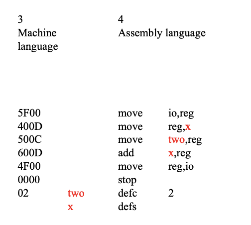
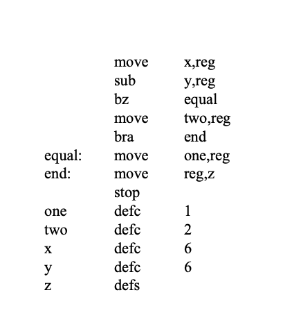

# Microprocessors 

## I: Introduction 

### 1: Microprocessor and micro-controller

A basic computer consists of IO unit, arithmetic unit, memory, control unit and a bus connect the components above.


If we combine the arithmetic unit, bus and control unit to one chip, it is called the *Microprocessors*:


To more integrated, the microprocessors, IOs and memory can be combined to form *micro-controller*:


### 2: Generation of computers 


#### 2.1: 1st Generation 

The gen 1 computer using **valves** to doing computation.

eg: ENIAC by US Army (no memory) and EDSAC by Cambridge Uni (have memory).

#### 2.2: 2nd Generation

Using Transistors, PCBs, core memory and disks.

eg: IBM 7090, using independent IOs.

#### 2.3: 3rd Generation

Using integrated circuits.

eg: Cray 1, IBM S/360 (commercialized)


#### 2.4: 4th Generation

Using LSI, VLSI.

#### 2.5: The Microprocessors 

Intel 8080 (8 bits), Motorola 68000 (16-bits), Intel Core 2 Duo (64-bits), TI TMS320C50 

## II: Assembly language 

### 1: High level language, Machine language and Assembly language 

- High-level language: The programming language easily to understand for human, such as C, which can be compiled to machine language by complier.

- Machine Language: The language can be understood by computer, normally in hexadecimal.

- Assembly Language: The language which is low level but can be understood by human, can be transferred to machine language by Assembler.

### 2: Example of READ and PRINT in assembly language 

- We assume that each instruction has 16 bits (2 bytes).

- At the beginning, we input a '3' at IO unit.

- In assembly language, we use:

```
move io,reg
```

which **move the io input to register**. Then the '3' is stored in ALU register.


```
move reg,D
```

which store the value in register to memory location 'D'.

```
move C.reg 
```
'C' is an location stored a constant '2'.

```
add D,reg
```

this instruction add the value in D to register.

- Finally:

```
move reg,io
stop 
```

moving the result to output again and stop the instruction.


- To make the program simple, we use **symbolic name** 'x' for position 'D' and another name for position '2':




### 3: Example of conditional statements in assembly language 


- The introduce of zero flag: Z= 1: result is zero and Z=0: result is NOT zero.

- If we defined that x = y = 6 in constant:

```
x defc 6
y defc 6
```

- Moving x to register:

```
move x,reg
sub y,reg
```

- The result should be zero, Z = ture:

```
bz equal 
```

'bz' means branch if zero-flag is true, or it will be ignored. So it moves to the 'equal' branch:

```
equal: move one,reg
```
moving one (stored '1') to register.

then end the program.




- If the zero flag is not true, the program would do:

```
end: move reg,z
```

- Then stop.


- The true instructions:


