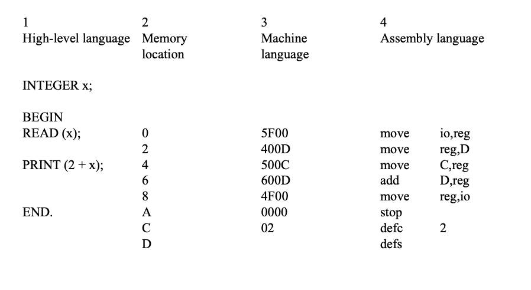
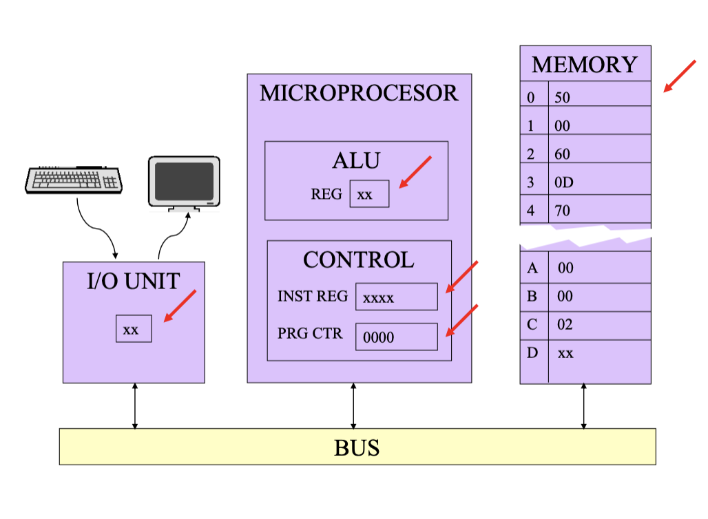
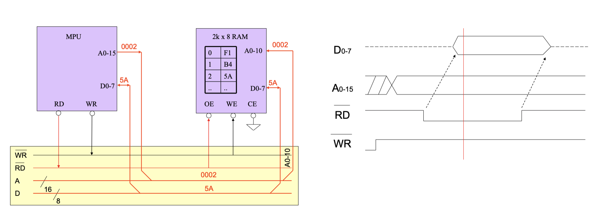
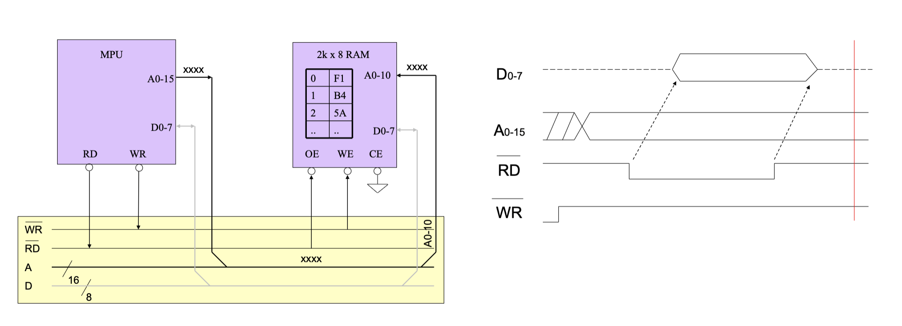
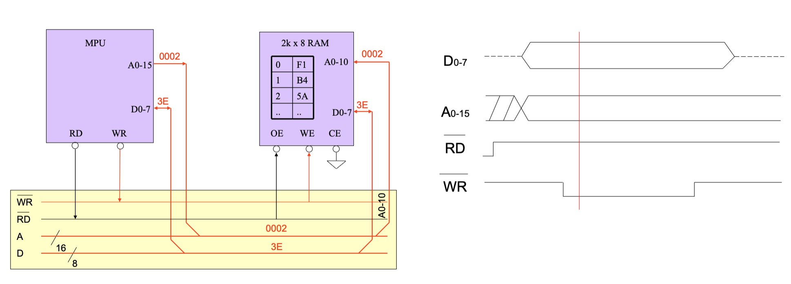
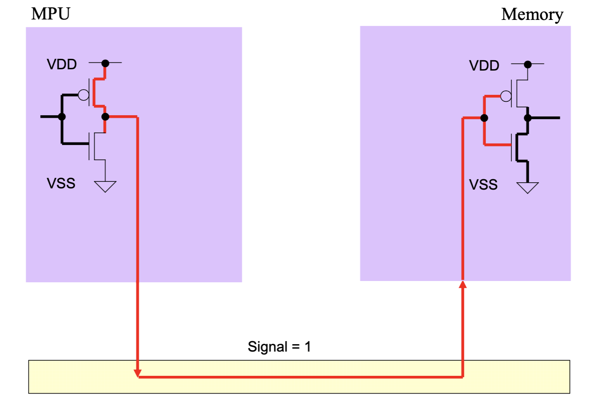
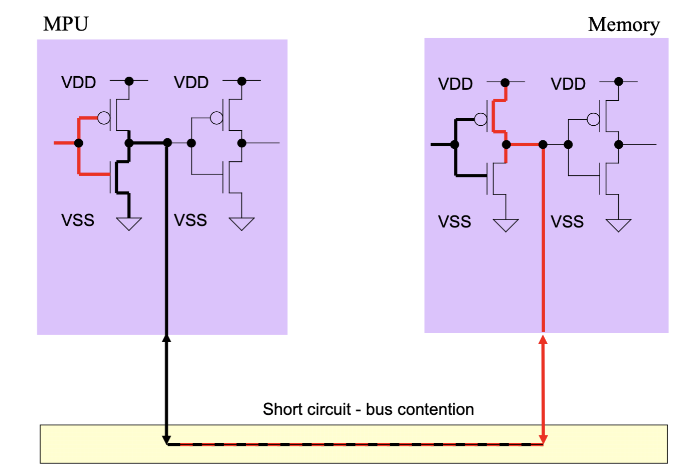
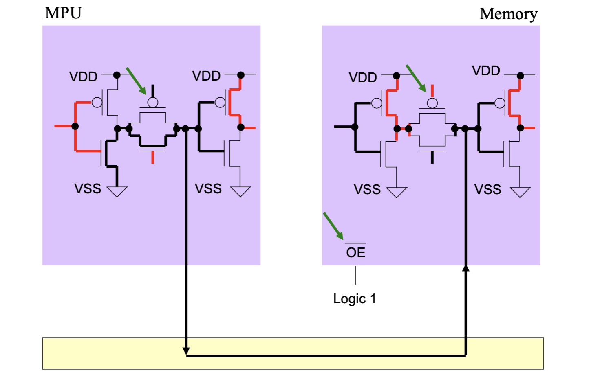
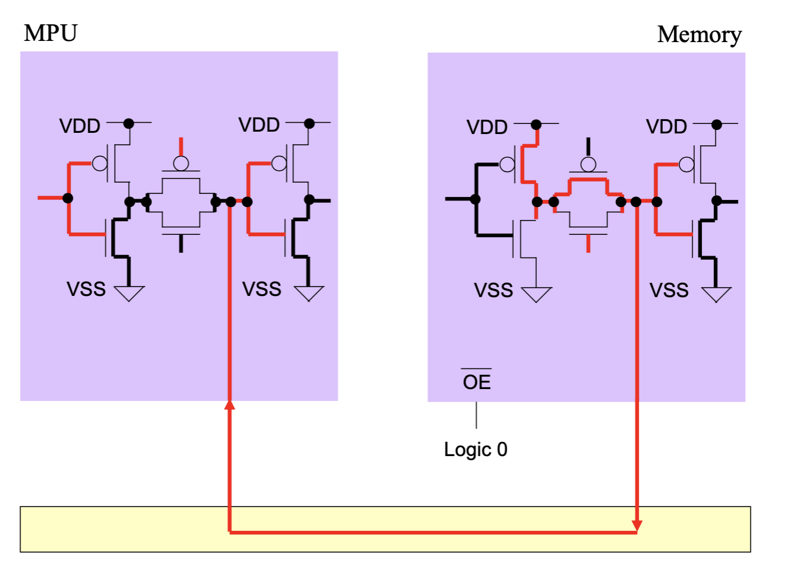

# Microprocessors 

## I: Introduction 

### 1: Microprocessor and micro-controller

A basic computer consists of IO unit, arithmetic unit, memory, control unit and a bus connect the components above.


If we combine the arithmetic unit, bus and control unit to one chip, it is called the *Microprocessors*:


To more integrated, the microprocessors, IOs and memory can be combined to form *micro-controller*:


### 2: Generation of computers 


#### 2.1: 1st Generation 

The gen 1 computer using **valves** to doing computation.

eg: ENIAC by US Army (no memory) and EDSAC by Cambridge Uni (have memory).

#### 2.2: 2nd Generation

Using Transistors, PCBs, core memory and disks.

eg: IBM 7090, using independent IOs.

#### 2.3: 3rd Generation

Using integrated circuits.

eg: Cray 1, IBM S/360 (commercialized)


#### 2.4: 4th Generation

Using LSI, VLSI.

#### 2.5: The Microprocessors 

Intel 8080 (8 bits), Motorola 68000 (16-bits), Intel Core 2 Duo (64-bits), TI TMS320C50 

## II: Assembly language 

### 1: High level language, Machine language and Assembly language 

- High-level language: The programming language easily to understand for human, such as C, which can be compiled to machine language by complier.

- Machine Language: The language can be understood by computer, normally in hexadecimal.

- Assembly Language: The language which is low level but can be understood by human, can be transferred to machine language by Assembler.

### 2: Example of READ and PRINT in assembly language 

- We assume that each instruction has 16 bits (2 bytes).

- At the beginning, we input a '3' at IO unit.

- In assembly language, we use:

```
move io,reg
```

which **move the io input to register**. Then the '3' is stored in ALU register.


```
move reg,D
```

which store the value in register to memory location 'D'.

```
move C.reg 
```
'C' is an location stored a constant '2'.

```
add D,reg
```

this instruction add the value in D to register.

- Finally:

```
move reg,io
stop 
```
- If we defined that two = 2 in constant:

```
two defc 2
```
moving the result to output again and stop the instruction.



- To make the program simple, we use **symbolic name** 'x' for position 'D' and another name for position '2':


### 3: Example of branch and flags in assembly language 


- In assembly language Motorola 68000, we use branch to express conditional cases:

```
initial:
            move #$10000, d0 ; # for constant, $ for hexadecimal
delay:      
            sub  #1,d0
            bne  delay ; if d0 is not zero, go back to the beginning of delay
```
- 'bne' means "branch if the previous instruction is not equal to zero", same as the function of 'bz'

- We can also use 'bne' for not zero, 'bra' for jump directly.

- Apart form the 'z', the zero flag, we can also use the negative flag 'N':

```
bmi loop1  ; branch if minus, N flag is '1'
bpl loop2  ; branch if positive, N flag is '0'
```
- For the bit that gets pushed out at left-hand side (MSB), it will be moved to 'C' flag for carrying:

```
bcs     loop1       ; branch if carry set (true)
bcc     loop2       ; branch if carry is not set (false)
```

### 4: Other instructions in assembly language 

- The way to define storage and constant:

```
name ds 1       ; define a 16-bit storage 
name dc 1       ; define a constant
```

- Logic shift left, which moves every bits one place to the left and add '0' to the right. The MSB will be set to flag 'C':


```
lsl     #1,d0
```
- If a binary value is shifted left one place, it is **multiplied by 2**, and **divided by 2 if shifted right**. For signed , then this may not work because the most significant bit (the far left-hand bit), which represents the sign, will have problems. Therefore use the arithmetic shift instruction, which maintains the sign bit whilst shifting all the other bits.

```
asl     #1,d0
```

## III: Internal micro-processor structure 



- Initialization: 
    - Memory contains the machine codes, one byte per address.
    - Program Counter (PC) shows address of first instruction.

- Fetching:
    - Control unit sends value of PC to memory, and instructs memory to read out bytes from this address to bus.
    - Control unit writes this byte to the IR (instruction register).

- Next instruction:
    - PC increments to 0001 from 0000.
    - After the fetch of IR (machine code of current instruction), execute the instruction (read or write).


## III: Bus 


- $\bar{RD}$ for read ('not gate' should be noted)
- $\bar{WR}$ for write 
- OE for 'output enable' to enable data reading form memory.
- WE for 'write enable' to enable data writing to memory.

### 1: Sequential graph before the R/W 


- The shadow in A0-A15 means 'we don't know'.

- RD and WR are all in 'LOW'.


### 2: Sequential graph in read-from-memory


- The crossing A0-A15 means data connection among MPU - Address bus - memory.

- Address of the instruction is been sent to memory.



- Put up the RD, than D0-D7 can read the data from memory to MPU.



- Finish the reading.

### 3: Sequential graph in reading-from-memory 



- After the cross of A0-A15, the address of instruction has been sent to memory. Then the data connection has been created. 

- After a period of delay, WR has been put up so that data has been moved from MPU to memory.


## IV: Three-State Logic 


### 1: Single direction transmission 



- Two CMOS inverters at both sides, which could send '0' or '1'.


### 2: Bi-direction transmission 



- The VDD in memory may connect to the VSS in MPU directly, which causing bus contention in circuit.

### 3: Three-state switch 

- if we put a MOS gate between the input and output of each side:



- Switch on the switch ( PMOS = 0, NMOS = 1) on sender side (keep the other switch off), the input '1' can be inverted to '0' in bus, and sent to memory side in '1' without any short-circuit. 

- This switch is integrated in chip as **OE** (output enable).

- For the transmission from memory to MPU:



- If both the OE in MPU and memory is off, then the bus is called 'floating' or 'High-Z', which may be influenced by other wires.


