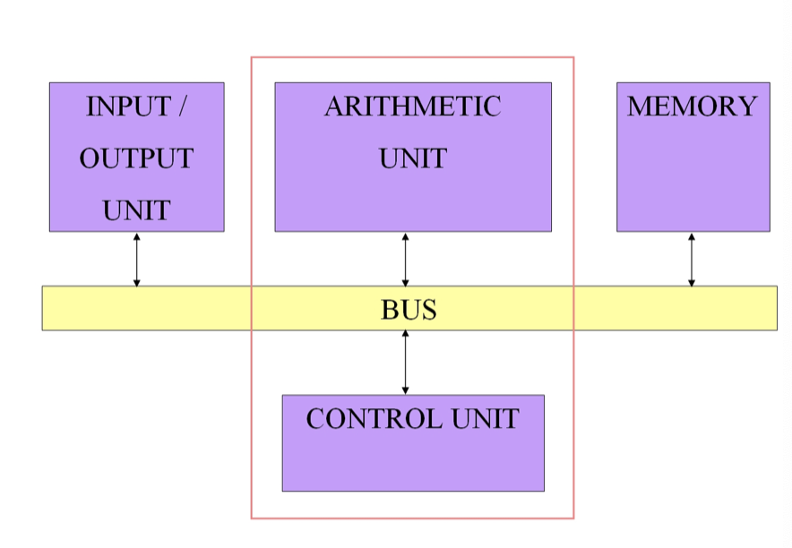
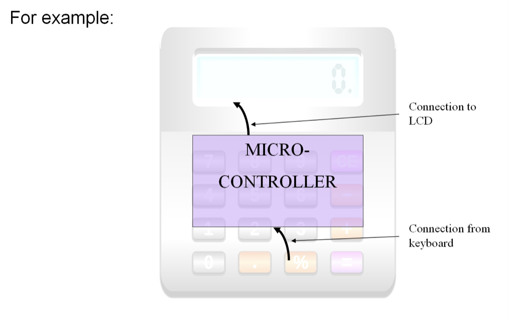

# Microprocessors 

## I: Introduction 

### 1: Microprocessor and micro-controller

A basic computer consists of IO unit, arithmetic unit, memory, control unit and a bus connect the components above.

If we combine the arithmetic unit, bus and control unit to one chip, it is called the *Microprocessors*:

To more integrated, the microprocessors, IOs and memory can be combined to form *micro-controller*:

### 2: Generation of computers 

#### 2.1: 1st Generation 

The gen 1 computer using **valves** to doing computation.

eg: ENIAC by US Army (no memory) and EDSAC by Cambridge Uni (have memory).

#### 2.2: 2nd Generation

Using Transistors, PCBs, core memory and disks.

eg: IBM 7090, using independent IOs.

#### 2.3: 3rd Generation

Using integrated circuits.

eg: Cray 1, IBM S/360 (commercialized)

#### 2.4: 4th Generation

Using LSI, VLSI.

#### 2.5: The Microprocessors 

