# Semiconductors Devices 

## I: Introduction 

### 1: Silicon Electronic Devices 

- Si is the workhorse technology. (-99% of the market)
- Cheap.
- High Performance. 
- Challenges ahead,

### 2: Transistors-- the building block 

- 2 types:
    - Bipolar (NPN, PNP), 20% of the market 
    - MOSFET (CMOS), 80% of the market 
- Used for:
    - Analog - eg. Amplification 
    - Digital: ON or OFF

## II: Electrical Conduction in Solid 

### 1: Conduction in Solid

#### 1.1: Bond and Band Models 

* In the *bond model*, atoms is connected with bonds (electron pairs). Conduction is possible when sufficient energy is given to break the bond and free the electrons to holes.

* In the *band model*, the bonding electrons are in the valence band. Conduction will be possible when moving electrons to into the conduction band.
* To cross the energy band between conduction band and valence band, the efficient energy $E_G=E_C-E_V$ should be given (same to the Si-Si bond energy).

* The band-gap Energy is 0 for metals, but it is very large for insulators.

* The intrinsic number of electrons can be found using the formula below:

$$
    n_i^2 = N_cN_v\exp{\frac{-E_g}{k_B T}}
$$

* $N_c$, $N_v$ is the **effective density of states in conduction Band / valence band**.
* $k_B$ is the **Boltzmann Constant**.
* $E_g$ is the energy gap.

#### 1.2: Doping 

* The conduction properties of semiconductors can be influenced by n-type or p-type doping.

### 2: Electrical Conduction

#### 2.1: Drift Current: Ohm's Law

* The drift current occurs because of the charge carriers in solid experience a force from the external E-field so that have a tendency of drifting in one direction.
* The Ohm's Law defined for drift current per unit volume can be written as:

$$
J=\sigma E
$$

* $J$ is the drift current per unit volume, $\sigma$ is the conductivity (S/cm) and $E$ is the electric field.

* According to the $I=nesv$ in general current, we can define the drift current as:

$$
J=env
$$

* $n$ is the carrier density per unit volume and $v$ is the electron velocity.

* The carrier velocity can also be defined as:

$$
v = \mu E
$$

* $\nu$ is the **drift mobility**

So we can get:

$$
J= en\mu E
$$

We also found the relation below:

$$
\sigma = ne\mu 
$$

Which can be finally written as:

$$
J = \sigma E
$$

If we consider the minor carriers in semiconductors:

$$
\sigma = e(n\mu_n+p\mu _p)
$$

#### 2.2: Diffusion Current 

* Diffusion current only exit in semiconductors due to the uneven distribution of carriers (electrons or holes).

* The carriers will diffuse from the high concentration side to another.

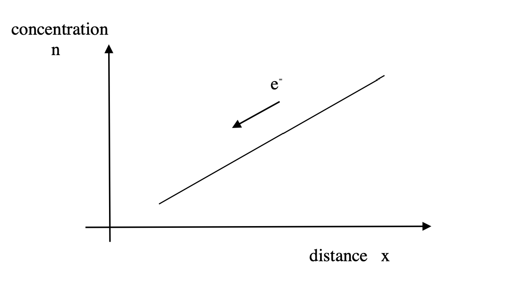

* That diffusion depends on the concentration] gradient $-dn/dx$, the electronic charge $e$ and the diffusion coefficient $D$:

$$
J = -eD_n(-\frac{dn}{dx})
$$

or 

$$
J = eD_n(\frac{dn}{dx})
$$

* Both the diffusion processes (D) and the collision limit the $\mu$, this is called the *Einstein Relation*:

$$
\mu = D\frac{e}{k_BT}
$$

#### 2.3: Drift-Diffusion Current 

Drift and diffusion current both exist in semiconductors:

$$
\begin{align*}
J_n &= e\mu _n En +e D_n \frac{dn}{dx} \\
J_p &= e\mu _p En -e D_p \frac{dn}{dx}
\end{align*}
$$

* The drift current direction is only related to the external voltage direction.

#### 2.4: Mechanism of drift-diffusion current 

* There is a *Fermi Level* between the conduction and valence band, which is a energy level have 50% to be fulled with electrons, the energy of it called $E_F$.

* Cause the *Fermi level* is the level of electrons, in n-type semiconductors the $E_F$ will be higher than p-type, which means closer to the conduction band.

* The diffusion and drift current will reach a balance for a p-n junction.

* If drift current < diffusion, it will be 
**Forward Biased**:

* If drift current > diffusion, it will be **Reverse Biased**:

#### 2.5: The size of drift and diffusion current for p-n junction 

* Use the equation below, we can calculate the size of the electric potential form the drift current:

$$
\phi _b = \frac{E_g}{e}+\frac{kT}{e}\ln{(\frac{N_d N_a}{N_c N_v})}
$$

* $N_d$ for density of donor and $N_a$ for the accepter.

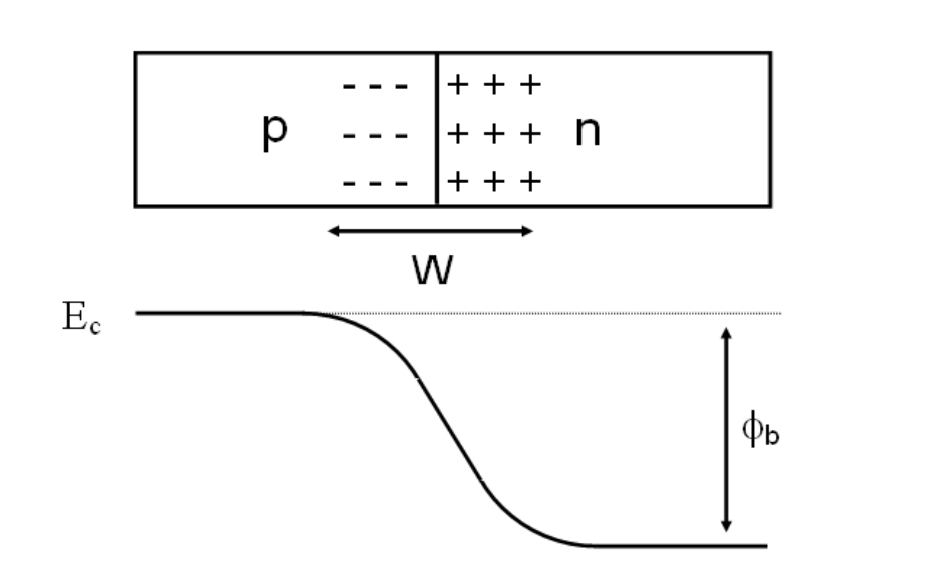

* The depletion width can also be calculated using:

$$
W=\sqrt{\frac{2\varepsilon _0 \varepsilon _r \phi _b}{e}(\frac{N_d N_a}{N_c N_v})}
$$

* Then the electric field $E$ can be estimated. 
* The $\phi$ is the build-in voltage generated in the depletion area.
* The build-in electric field can be : $E = \frac{\phi }{W}$

* In real condition, we assume that the drift and diffusion currents are almost equal but opposite for P-N junctions even under forward or reverse bias.

## III: P-N Junction

### 1: Relation between carrier concentration and potential difference

The drift and diffusion current are almost equal and opposite for a p-n junction, so the current of the junction for electrons will be:

$$
J_n \approx en\mu _n E_n + eD_n\frac{dn}{dx} = 0
$$

Using the Einstein Relation $\mu _n = D_n \frac{e}{k_B T}$:

$$
-\frac{e}{k_B T}n E_n = \frac{dn}{dx}
$$

Since $E=-\frac{dV}{dx}$ ('-' as for electrons), we can get:

$$
\frac{e}{k_B T}(\frac{dV}{dx}) = \frac{1}{n}(\frac{dn}{dx})
$$

If we integrate over all of the junction:

$$
\begin{align*}
\int{\frac{e}{k_B T}\frac{dV}{dx}}{\rm d}x &= \int{\frac{1}{n}\frac{dn}{dx}}{\rm d}x \\
\int_{V(x_1)}^{V(x_2)}{\frac{e}{k_B T}}{\rm d}V &= \int_{n(x_1)}^{n(x_2)}{\frac{1}{n}}{\rm d}n 
\end{align*}
$$

|||
|---|---|

- The left picture is the voltage drop across the junction.
- The right one is the carrier concentration varies from p-side to n-side at the zero bias.

if no applied voltage (the difference of voltage will be initial $\phi _{bi}$):

$$
\int_{n(x_1)}^{n(x_2)}{\frac{1}{n}}{\rm d}n = \frac{e}{k_B T}\phi_{bi}
$$

So we can get: 

$$
\frac{e}{k_B T}\phi_{bi} = \ln{\frac{n_{no}}{n_{po}}}
$$

- $n_{po}$ and $n_{no}$ means the initial concentration of electrons in p-side and n-side.

So that we can get:

$$
\frac{n_{no}}{n_{po}} = \exp{(\frac{e\phi _{bi}}{k_B T})}
$$

Same for the holes:

$$
\frac{p_{po}}{p_{no}} = \exp{(\frac{e \phi_{bi}}{k_B T})}
$$

We can combine the result and get:

$$
\frac{n_{no}}{n_{po}} = \frac{p_{po}}{p_{no}}
$$

- Now if we apply an external bias on the p-n junction:

$$
\begin{align*}
\frac{n_n}{n_p} &= \exp(\frac{e}{k_B T}(\phi _{bi} -V_A)) \\
\frac{p_p}{p_n} &= \exp(\frac{e}{k_B T}(\phi _{bi}-V_A))
\end{align*}
$$

- Even the carrier concentration changed, in fact we can omit the change:

$$
n_{no} \approx n_n \quad p_{po} \approx p_p
$$

so that:

$$
\begin{align*}
\frac{n_{no}}{n_p} &= \exp(\frac{e}{k_B T}(\phi _{bi} -V_A)) \\
\frac{p_{po}}{p_n} &= \exp(\frac{e}{k_B T}(\phi _{bi}-V_A))
\end{align*}
$$

Using the previous formula, we got:

$$
\begin{align*}
\frac{n_p}{n_{po}} &= \exp(\frac{e}{k_B T}V_A) \\
\frac{p_n}{p_{no}} &= \exp(\frac{e}{k_B T}V_A)
\end{align*}
$$

- This graph shows the condition of the reverse bias and forward bias.

Combine the formula above, we can get:

$$
np=n_i^2 = N_cN_v \exp(\frac{-E_g}{k_BT})
$$

- While 'n' ,'p' can be both n-side or p-side, $n_i$ is the concentration of the intrinsic semiconductor.

### 2: Current flow in p-n junctions 

If we neglect the effects of recombination, the electrons current in the n-side is equal to that in the p-side and for holes are the same.

There are two possible types of current flow:

- Drift: $e\mu _n En$
- Diffusion: $eD_n\frac{dn}{dx}$

* For electrons, according to the calculation result, the minority carrier diffusion current control the conduction mechanism.

### 3: Current-Voltage Relationship 

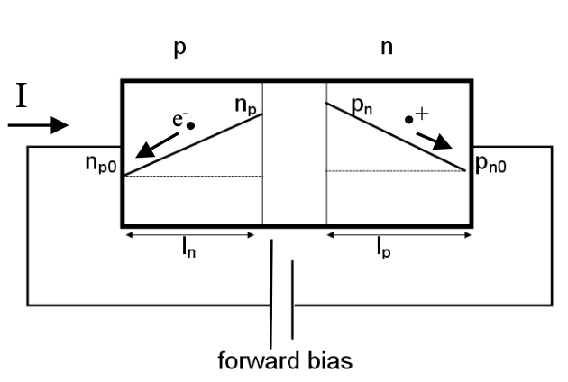

Hole diffusion in the p-type is given:

$$
\begin{align*}
I_p &= AeD_p \frac{dp}{dx} \\
&= AeD_p (\frac{p_n-p_{no}}{l_p})
\end{align*}
$$

And same for n-type:

$$
\begin{align*}
I_n &= AeD_n \frac{dn}{dx} \\
&= AeD_n (\frac{n_p-n_{po}}{l_n})
\end{align*}
$$

So that we can get:

$$
\frac{n_p}{n_{po}} = \exp{(\frac{e}{k_B T}V_A)}
$$

If we add the $I_n$ and $I_p$, the Shockley's Equation will be got:

$$
I = I_o(\exp{(\frac{eV_A}{nk_B T})}-1)
$$

$n$ is a non-ideal fiddle factor.

This analysis is valid only for thin p and n bulk regions. Or else (bulk length > diffusion length) the length of layers has to be replaced by $l=\sqrt{D\tau}$.(The $\tau$ is called the carrier lifetime)

If the PN-junction without external voltage, the $\frac{dn}{dx}$ can only consider the minority carrier to '0'. Note that the saturation current should be sum of p-type and n-type.

### 4: Junction Breakdown 

When the sufficient high field is applied to a p-n junction, the junction may break down and conducts a very large current.

#### 4.1: Thermal Instability 

At high reverse bias the reverse current cause considerable heat dissipation. The effect is known as thermal instability and occurs at the turn over voltage $V_n$.

#### 4.2: Tunneling (Zener Breakdown)

For a p-n junction under reverse bias:

both electrons and holes need significant barrier so the current is low.

At sufficiently large applied bias, the picture changes:

The electrons may tunnel from valence band to conduction band if the junction is heavily doped.

The band gap in Si and GaAs decreases with increasing temperatures, the negative temp coefficient can be used to recognize this mechanism.

#### 4.3: Avalanche Multiplication (Impact Ionization)

If the electric field in the depletion region is high enough, current gain enough energy to ionize collisions which create electron-hole pairs.

The avalanche breakdown voltage imposes an upper limit on reverse bias for diodes, collector voltage of BJT and drain voltage for MOSFET.

Avalanche breakdown has a positive temp coefficient.

## IV: Bipolar Transistor

### 1: Bipolar Transistors
- PNP and NPN depend on the base material.

- The majority of the emitter current flows through to the collector, rather than the base ($I_B$), so we have a small base current.

- $\displaystyle\frac{I_C}{I_E}$ Common Base DC Current Gain $\alpha \approx 1$

- $\displaystyle\frac{I_C}{I_B}$ Common Emitter DC Current Gain $\beta \approx 50$

### 2: BJT: Principle of Operation 

For a NPN device, the majority carrier will be: emitter heavily doping (with e), base moderate doping and collector low doping.

For the minority carrier densities will be:

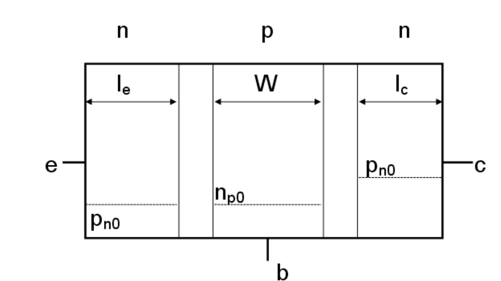

($n_{pe}$ the 'e' means the emitter side)

If we forward bias the emitter-base junction and apply no bias to the collector-base junction (short circuit):

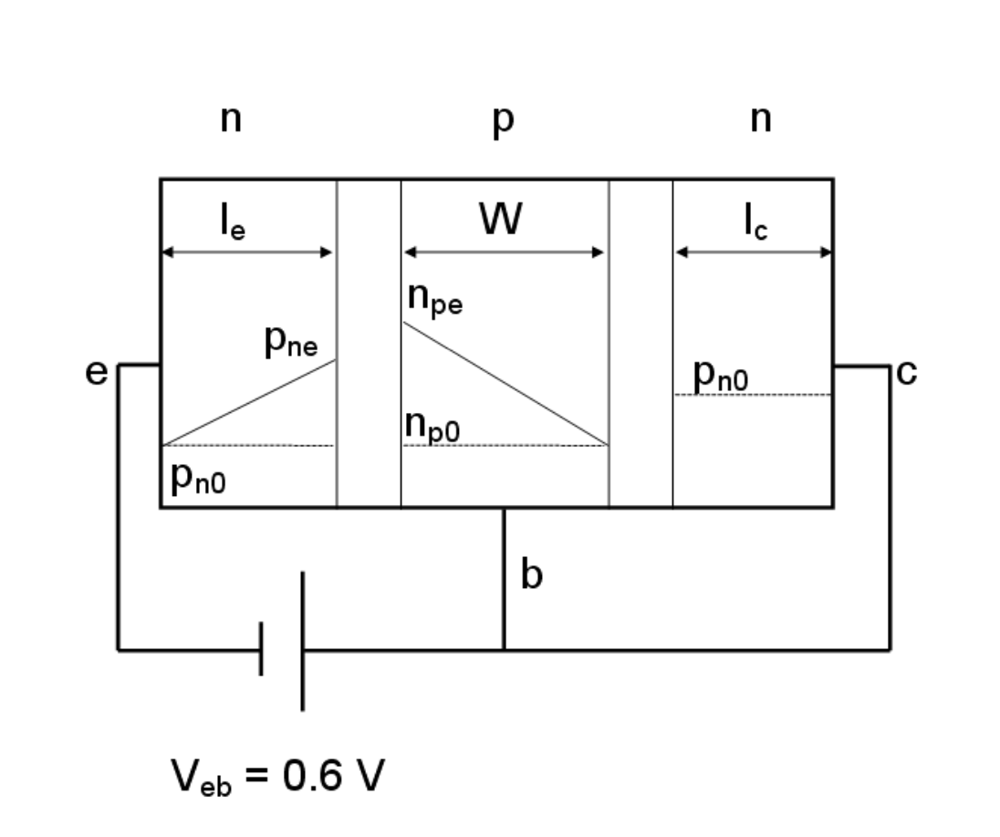

which we can get:

$$
\frac{n_p}{n_{po}} = \frac{p_n}{p_{no}}=\displaystyle\exp{(\frac{eV_{EB}}{k_B T})}
$$

- Under the forward bias, the *electrons* in the emitter moving to the base *according to the diffusion* (large concentration gradient).

- As the base wide is thin, only little electrons will come to base (this electron-current can be ignored), most of the $I_e$ will come and become $I_c$.

- Ignore the recombination, the holes in base will move to emitter according to diffusion.This hole current due to $p_{ne}$ is the only base current cause holes cannot pass the reverse c-b junction. So by controlling the doping ratio $\displaystyle\frac{N_e}{N_b}$ we can control the current gain $\beta = \displaystyle\frac{I_C}{I_B}\approx \frac{I_E}{I_B}$. (the most effective situation is all the electrons from emitter move to the collector)

For the collector current, we can get:
(Same as the diffusion current)
$$
I_C = AeD_n(\frac{n_{pe}-n_{po}}{W})
$$

$n_{pe}$ is the electron from emitter finally reach the collector *bypassing the base*, while $n_{po}$ is the original electrons in base. Note that the $W$ means the diffusion distance of the concentration gradient, so it is the length of base. (which should be minimize)

- We can find that **electrons concentration gradient in base** determine the $I_C$.

For the base current:
$$
I_B = AeD_p(\displaystyle\frac{p_{ne}-p_{no}}{l_e})
$$

- The concentration gradient determine the size of $I_B$.

The emitter efficiency $\gamma$ can be defined as:

$$
\displaystyle\frac{Electron\quad Current\quad in\quad Emitter}{Total\quad Emitter\quad Current} = \displaystyle\frac{I_{En}}{I_{En}+I_{Ep}}=\gamma
$$

$I_{En}$ is the $I_C$ and $I_{Ep} = I_B$

Note that for no-recombination $\alpha = \gamma$.

Now if we apply a reverse bias to the C-B junction:

The minority carrier concentration should be decreased under the reverse bias (the input from other side will reduced according to voltage)

In addition, the majority carrier may be limited by the reverse bias, while the minority carrier form the current due to the bias, which is defined as:

$$
I_{SC}(\exp(\frac{eV_{CB}}{k_B T})-1) 
$$

The total collector current can be expressed as: 

$$
-I_C = I_{SC}(\exp(\frac{eV_{CB}}{k_B T})-1)-\alpha I_{SE}(\exp(\frac{e V_{EB}}{k_B T})-1)
$$

Note that the sign convention follow the $V_{CB}$.

### 2: DC Characteristic 

For the $I_E = 0$, we got a diode characteristic:

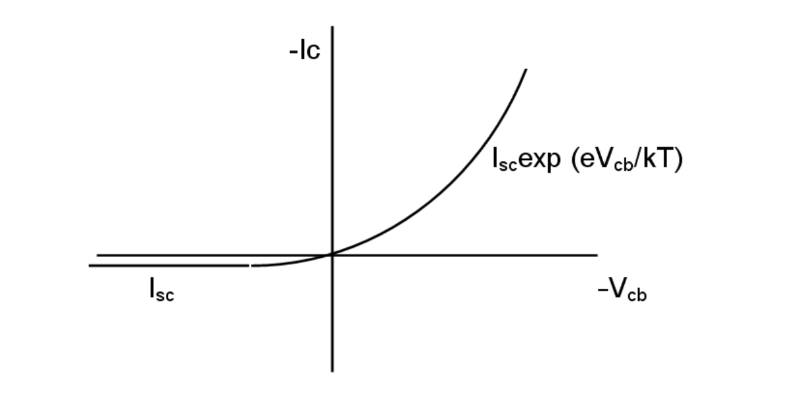

If $I_E$ is not 0 but defined by $\alpha I_E$. $I_{SC}$ is called the collector cut-off current.(for the cut-off current or saturation current of C-B, the increasing of inverse bias will not increase the current)

|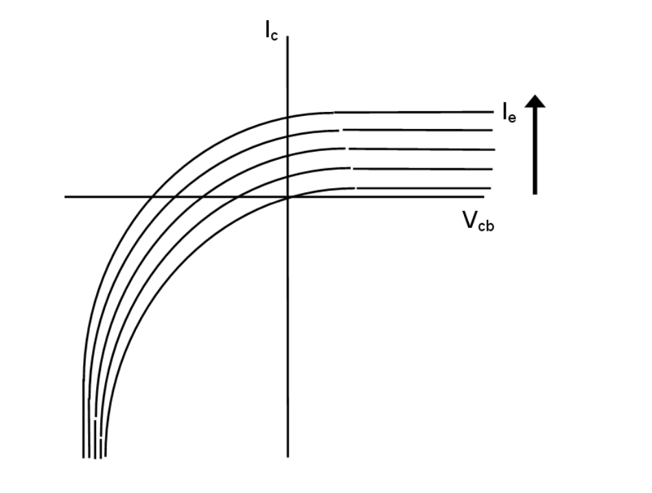||
|---|---|

The straight line parts (active region) have a small gradient due to the base narrowing effect.

As $V_{CE} = V_{CB} + V_{BE}$, we can get the $V_{CE}$ graph:

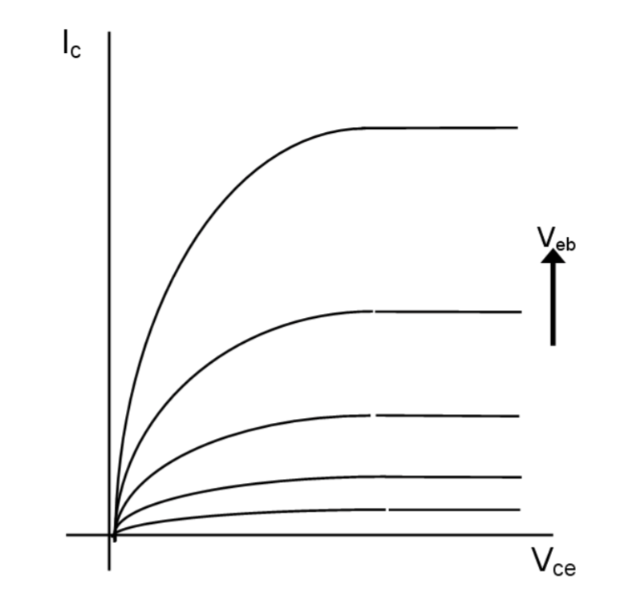

For the equation of collector current:

$$
-I_C = I_{SC}(\exp(\frac{eV_{CB}}{k_B T})-1)-\alpha I_{SE} (\exp(\frac{eV_{EB}}{k_B T})-1)
$$

For the reverse version:

$$
-I_E = I_{SE}(\exp(\frac{eV_{EB}}{k_B T})-1)-\alpha I_{SC} (\exp(\frac{eV_{CB}}{k_B T})-1)
$$

- These equations are called Ebers Moll equations which are useful to derive the DC circuits.

## V: MOSFET

### 1: Inversion Layer 

- The electron energy is $-ve$, so a -ve voltage is shown as a $+ve$ shift on energy.
- The depletion region is shown as a region where $E_C-E_F$ is larger than the bulk.
- If we put a positive bias on the n type, the electrons will be attracted so the conduction band will be up :

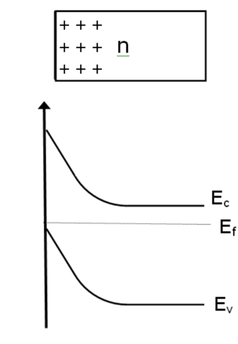

- If we put a negative voltage, the result will be:

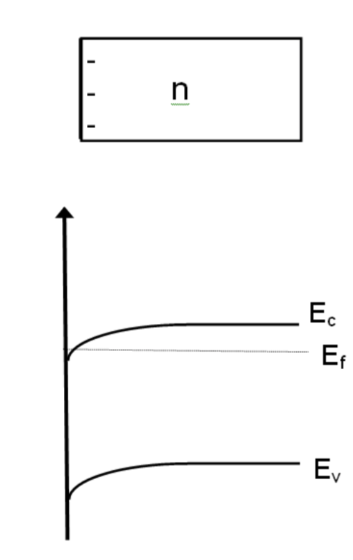

- The surface region is called an accumulation layer, which is more complicated than the depletion width as we consider the free carriers.

- As we increase the voltage:

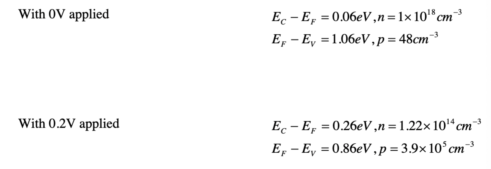

- The Fermi level is more closer to valence band than conduction band, so we call it is more p-type than n-type. This surface is called an **inversion layer**.

### 2: Metal-Oxide-Semiconductor Field Effect Transistor (MOSFET)

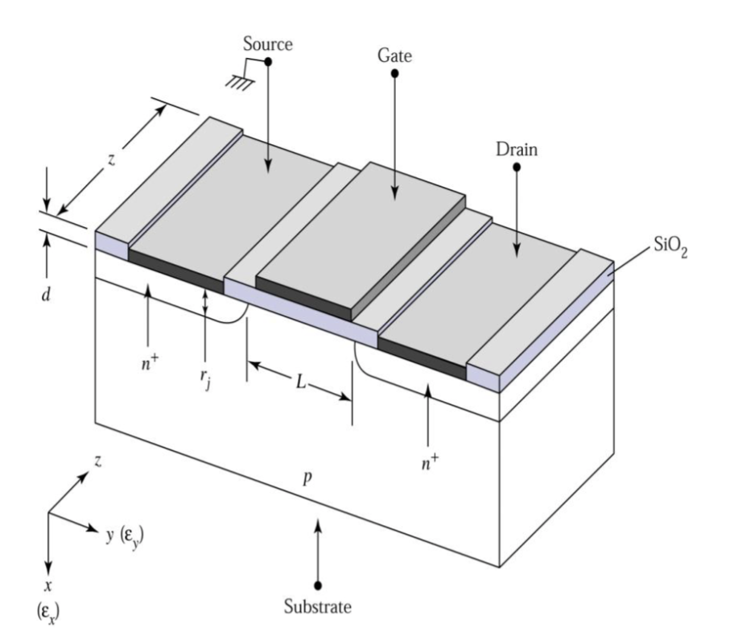

- The MOSFET have 4 terminals, source, gate , drain and substrate (earthed).
- The idea is to modulate the current flow between source and drain by changing the bias voltage on the gate.
- The $n^+$ regions are highly doped to give ohmic contacts to metal.
- The substantial current will only flow between source and drain if there is a n-ype layer (surface inversion layer) connecting them.
- The oxide layer prevents the electrons in the inversion layer crossing the gate. The conduction band and valence band in the oxide are linear, so no change in E.
- To create the inversion layer, the gate voltage must be $+ve$ relative to the source (earthed), while the p-type must be $-ve$ between source and drain, so that the p-n junction will be reverse biased and only leakage current will flow when no inversion layer is present.

### 3: Mode of Operation

- For an enhancement mode device, i.e. no drain current for $V_{GS} = 0$, the current flows when the $+v$ applied.

- The drain current increases (drift current) when increasing the $V_{DS}$  but the potential between the drain and gate decreases.

- This reduce the electrons in drain side and finally the inversion layer lost and the channel is said to be 'pinch off'. For higher $V_{DS}$ the drain current saturates (remain constant).
- There is just sufficient channel beyond pinch off to allow the saturation current.

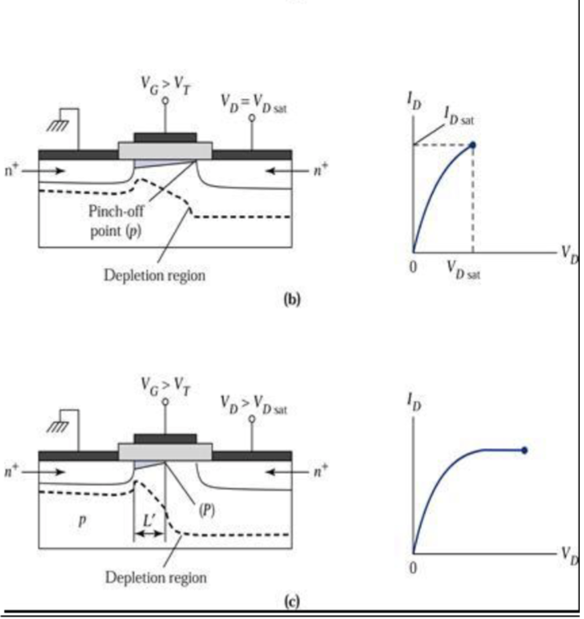

- The minimum gate voltage $V_{GS}$ at which a channel current can be sustained is called the **threshold voltage $V_T$**.
- Thus the pinch off will begin when $V_{DS} = V_{GS}-V_T$.

- The DC characteristic for a MOSFET will be:

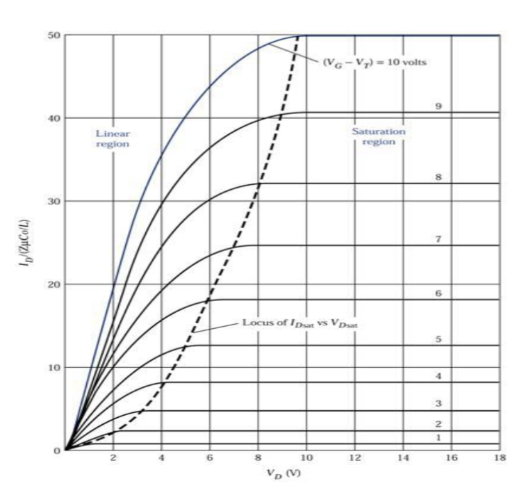

- When $V_T$ is '+' and a '+' gate voltage enhances the channel the device is called the enhancement mode. But MOSFET cannot be designed to have $V_T$ negative. Then a negative gate voltage depletes the channel of electrons and the devices switches off.
And these are depletion mode devices.

- P-channel enhancement an depletion devices is possible.

#### 3.1: Analysis of Operation (n-channel device)

- We assume long gate and channel.

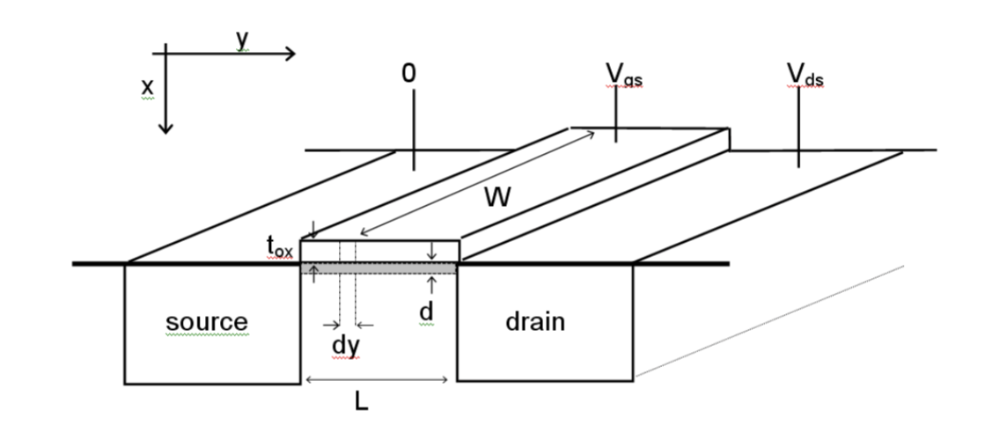

- The channel-oxide-gate forms a capacitor with $C_{ox}$ per unit area. $Q = CV$ followed.

- Note that the formula of capacitance $C=\frac{\varepsilon_r \epsilon _0 A}{d}=\frac{\varepsilon A}{d}$ can be applied. $\varepsilon$ is the dielectric constant.

- For a small length of channel dy:
    - $Q_y$ = Capacitance x (Voltage across the oxide in excess of $V_T$)
    - $Q_y = -C_{ox}Wdy(V_{GS}-V_y-V_T)$

- Where $Q_y$ is the volume density of charge in the channel, $W$ is the gate length and $V_y$ is the channel voltage at position $y$ along the channel.
- The electron charge density in the channel is:

$$
en = \frac{Q_y}{Wddy}
$$

- Where $d$ is the depth of the inversion layer:

$$
en = \frac{C_{ox}}{d}(V_{GS}-V_y-V_T)
$$

- Assuming diffusion current, the current density in y-direction:

$$
\begin{aligned}
J &= en\mu _n E_y \\
J &= -\frac{\mu _n C_{ox}}{d}(V_{GS}-V_y-V_T)E_x
\end{aligned}
$$

As $E_y = -\frac{dV}{dy}$:

$$
\begin{aligned}
    I_{SD} &= \displaystyle\int{J}{\rm} ds\\
    &= JWd \\
    &= \mu _n [-\displaystyle\frac{C_{ox}}{d}(V_{GS}-V_y-V_T)][-\displaystyle\frac{dV}{dy}Wd] \\
    &= W\mu _n C_{ox}(V_{GS}-V_y-V_T)\frac{dV}{dy}
\end{aligned}
$$

The gradual channel approximation allows us to sum along the whole channel. $I_{SD}$ is a constant at each point:

$$
I_{SD}L = W\mu _n C_{ox}\int_0^{V_{DS}}(V_{GS}-V_y-V_T){\rm d}V
$$

or

$$
I_{SD} = \beta [(V_{GS}-V_T)V_{DS}-\frac{V_{DS}^2}{2}]
$$

where $\beta = \frac{W\mu _n C_{ox}}{L}$

- $\beta$ is the gain factor and is determined by $\frac{W}{L}$ and the gate capacitance $C_{ox}$. This equation is valid for $V_{DS} << V_{GS}-V_T$, i.e. the region below pinch off. For higher values of $V_{DS}$.
- For higher values of $V_{DS}$ $I_{SD}$ saturates. So we set $V_{DS} = V_{GS}-V_T$.
and obtain:

$$
I_{SD}=\frac{\beta}{2}(V_{GS}-V_T)^2
$$

- In real device, increasing $V_{DS}$ above pinch off actually reduces the effective channel length, by increasing the depletion region around the drain and so there is a slight increase in $I_{SD}$.

#### 3.2: Transistor Delay Time 

This can be estimated form the time taken for 1 transistor to supply sufficient current to change the gate on the next, as $Q=It$ and $Q=CV$:
$$
t = \frac{CV}{I} = \frac{C_{GS}}{g_m}
$$

- $g_m$ is the transconductance.

The capacitance us $C_{ox}WL$, at saturation, this can be estimated:

$$
g_m = \frac{dI_{DS}}{dV_{GS}} = \beta V_{DS} = \frac{W}{L}\mu _N C_{ox}(V_{GS}-V_T)
$$

So $t = \displaystyle\frac{L^2}{\mu_n (V_{GS}-V_T)}$

This is related to the transistor cut off frequency, $f_t$, 

$$
t = \frac{C_{GS}}{g_m} = \frac{1}{w} = \frac{1}{2\pi f_t}
$$

