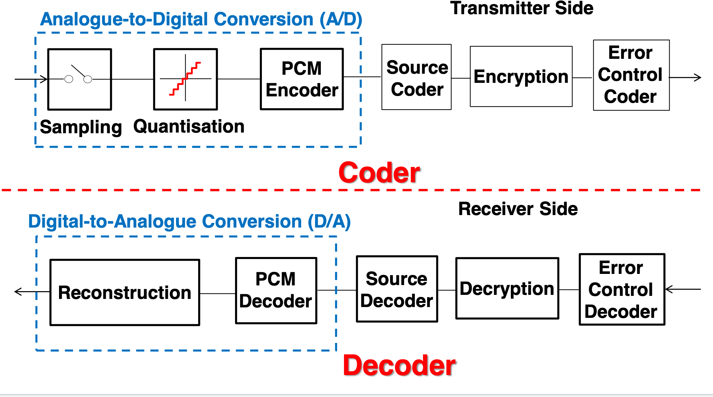
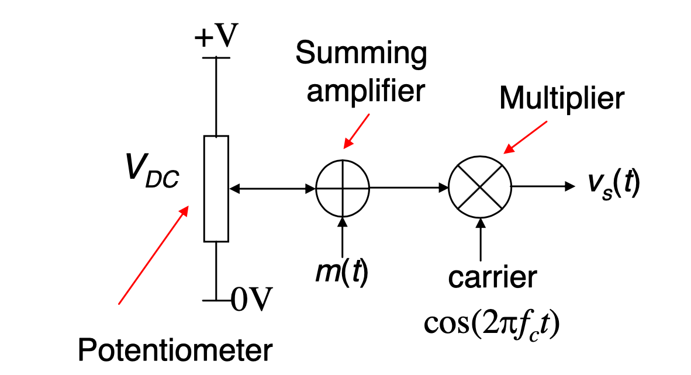
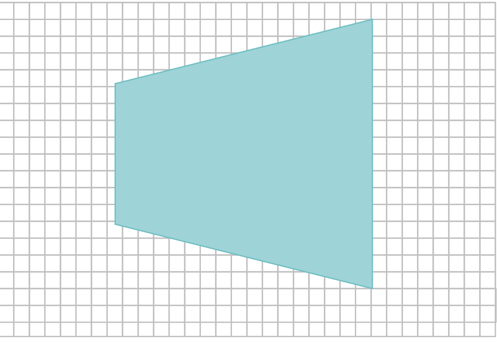
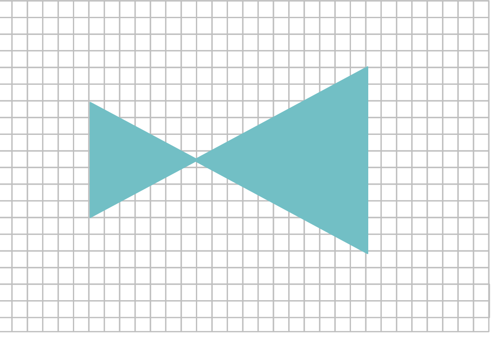

# Signals and Communications 

## I: Introduction to a Communication System

### 1: Communication Systems

### 2: General Digital Communication System Model 

#### 2.1: Coder/Decoder (CODEC)

#### 2.2: Modulator/Demodulator (MODEM)

### 3: Radio Transmission 

### 4: Modulation 

#### 4.1: The Message 

#### 4.2: The Carrier 

## II: Amplitude Modulation 

### 1: Schematic Diagram of AM 

### 2: Equations for DSB-AM 

* **Double Sideband Amplitude Modulation - DSBAM**:

$v_s(t)=V_{DC}\cos{(2\pi f_c t)}+\frac{V_m}{2}\cos{(2\pi (f_c+f_m)t)}+\frac{V_m}{2}\cos{(2\pi (f_c-f_m)t)}$

### 3: Spectrum and Waveforms 

### 4: Modulation Depth 

### 5: Double Sideband Modulation Types 

- Double Sideband Amplitude Modulation, DSB-AM, with carrier 

- Double Sideband Diminished (Pilot) Carrier, DSB-DimC

- Double Sideband Suppressed Carrier, DSB-SC 

### 6: Graphical Representation of Modulation Depth and Modulation Types 

### 7: Trapezoid Method of Measuring Modulation Depth 

#### 7.1: Trapezoid when m < 1 

#### 7.2: Trapezoid when m = 1

#### 7.3: Trapezoid when m > 1

### 8: DSB-SC from a Balanced Modulator (Used in AM experiment)

