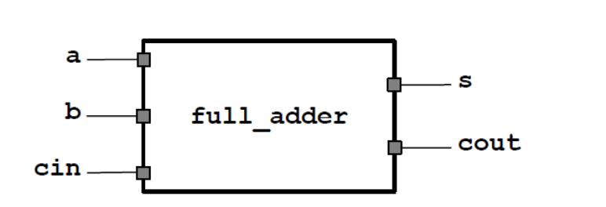

# VHDL Programming 

## I: Introduction 

- VHDL short for VLSI hardware description language.

- VHDL is not an executable language but represents the **elements of a digital circuit**.

### 1.1: Structural-level or gate-level 

The example of gate-level be like:


At this level the VHDL describes elements and how they connected to each other:

- 1: names and types for inputs and outputs.

- 2: logical elements types (AND, NOT, MUX)

- 3: names for internal signals (T1)

- 4: names for the instances of logical elements (U1)

- 5: connection between signals and ports

This representation is called the **netlist**.

### 1.2: Register Transfer Level (RTL) or data-flow level 

The RTL describes the transformation that data undergo while propagating through the circuit. The circuits can be seen as a set of two types of elements:

- 1: Combinatorial logic:
    - explicitly expresses data transformation using algebra, arithmetic expression and condition statements.

- 2: Registers 
    - Registers are responsible for storing the intermediate results.
    - In structural terms, an RTL specification is a sequence of combinatorial logic elements interrupted by registers:


I is the input , U is the output, and CLK is the clock. At RTL level, each operation is explicitly assigned to a **particular process** or **a specific clock cycle**.

- The operation assignment at the various CLK is called **scheduling**.

### 1.3: Arithmetic or behavioral level 

It will be the synthesis tool that will schedule the operations on the  various  clock cycles based on  constraints imposed  by the designer, such as the minimum clock 
frequency or the maximum area. (not considered in this module)

## II: Design entitles 

Each system can be simplified to **modules or blocks**.

For example of roots calculation of second-degree equation:


- To reuse some of the modules, the difference between module and instance should be introduced.

### 1: Modules and instances 

- Module is single entity composed of an **interface** and defined **behavior**.

- Instance represents an **object** of this module used in this circuit.

For example:


this diagram consists of **3 modules and 5 instances**.

### 2: Entity 

- The module interface is called **entity** and determined by the *entity* construct.

- The behavior is called **architecture** and is represented by *architecture* construct.

The entity construct specifies the module name, the ports and a set of generic parameters if needed:

```
entity entity_name is 
    [generic(generic_list);]
    [port(port_list);]
end entity_name;
```

- The *entity_name* must be unique for each design, the *prot_list* describes the input and output signals of the design entity.

- The *port_list* describes the input and output as:

```
prot_name[,port_name,...]:{in|out|inout} port_type

```

For example of full adder:



- Note that a delay parameter is also specified for simulation purpose only. A value will be assigned to this parameter when the component is instantialised.

The code would be like (-- for comments):

```
entity full_adder is
    generic (delay: time);
    port(
        -- inputs
        a:  in bit; 
        b:  in bit;
        cin: in bit;

        -- output 

        s: out bit; 
        cout: out bit;
    );
    
end full_adder;

```

### 3: Architecture 

An entity declaration defines the module interface, but it does not specify the functionality, which is described by architecture declaration:

```
architecture architecture_name  of entity name is 
    [declaration]
begin 
    [implementation]
end architecture_name;
```

It is possible to specify different architecture for same entity and select one before proceeding. The association between a particular architecture and an  entity is called *configuration declaration*.

For the implementation of full-adder:

```
architecture first of full_adder is 
begin 
    s <= a xor b xor cin after delay;
    cout <= (a and b) or (b and cin) or (a and cin) after delay;
end first
```

- Note that the synchronous problem should be mentioned, for example of the circuit below:


the code would be:

```
begin 
    t <= a and b;
    x <= t and c;
    y <= d or e;
end par_two
```

Note that the first AND gate and second AND gate are not executed synchronous, while the sentences under "begin" would execute at same time, which would lead to conflict.

So if we choose another architecture:

```
architecture par_three of circuit is 
    signal t: bit;
begin 
    y <= d or e;
    x <= t and c;
    t <= a and b;
end par_three;
```

The conflict would be solved.


