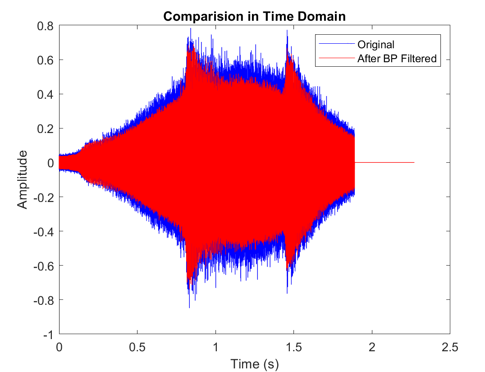
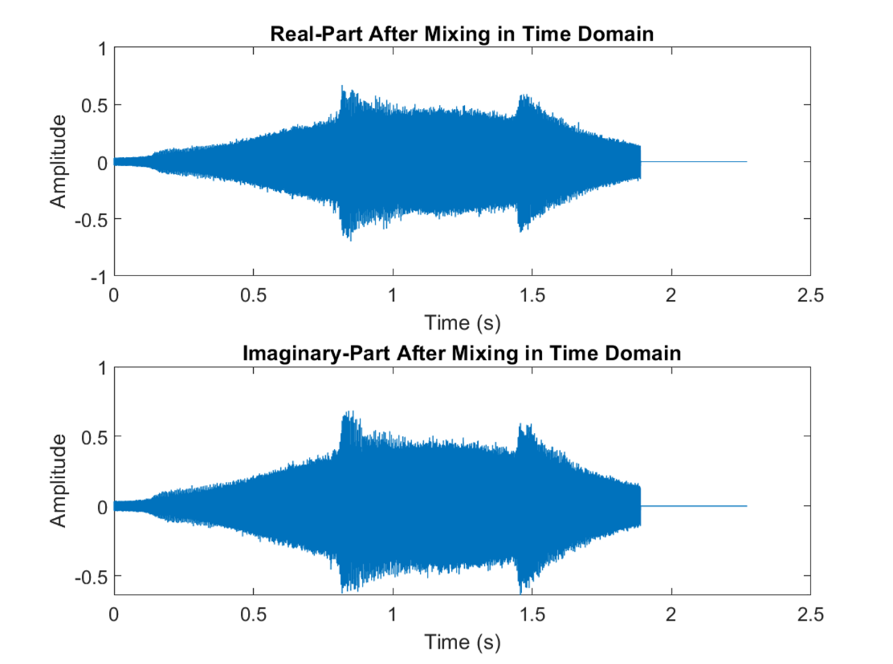
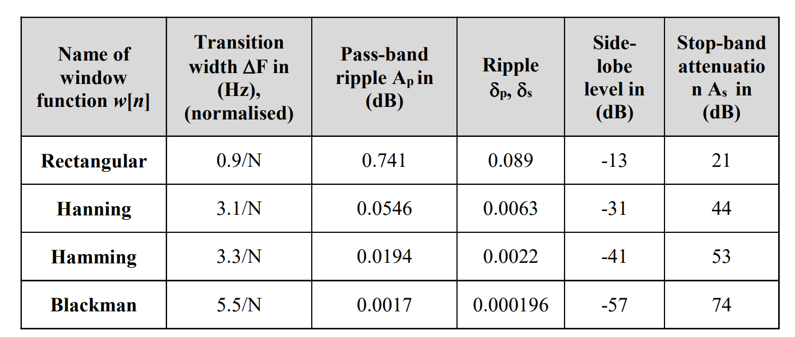
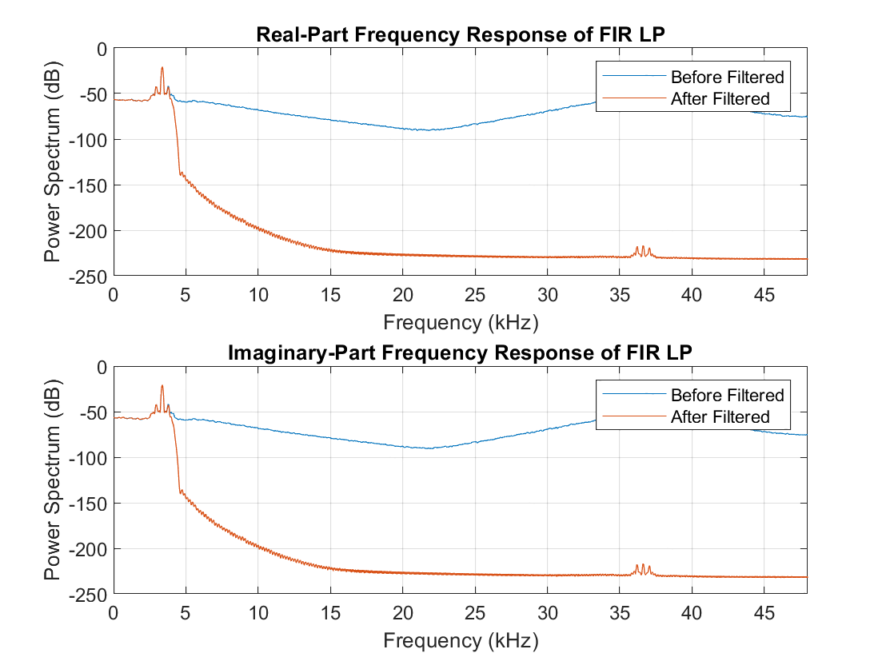
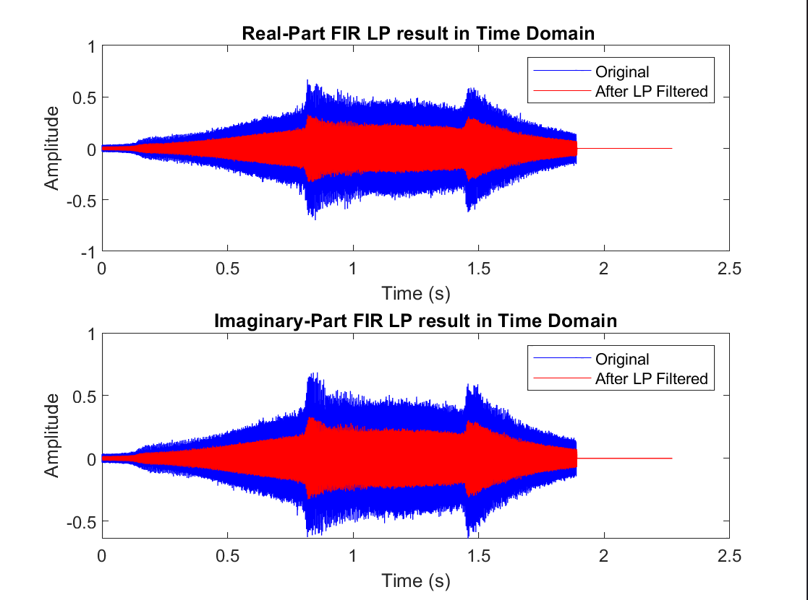
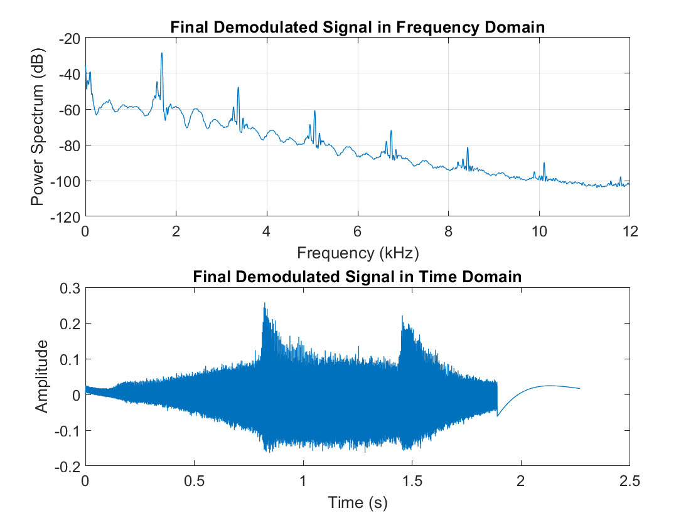

<div align='center' ><font size ='6'>EEE3030 Digital Signal Processing Report </font> </div>

<div align='center' ><font size ='3'>Ziyu Tian</font> </div>


## <font size=5 face=Times New Roman>I: Introduction</font>
<font size=3 face=Times New Roman>

This assignment aims at building a AM demodulator system shown in Fig.1, which should be implemented based on appropriate digital filter codes in MATLAB. The designed AM demodulator would be implemented on the given .wav soundtrack to extract the contained message finally. In the following report, I would demonstrate the detailed solution for the five given tasks separately combined with necessary MATLAB codes.
</font>


<font size=2><center>*Fig.1*. AM Demodulator System Block Diagram </center></font>

## <font size=5 face=Times New Roman>II: Task-1: Original AM Analysis</font>
<font size=3 face=Times New Roman> 
Using the audioread() function in MATLAB, the .wav file could be read into the demodulation system with sampling rate 'F_s' and amplitude array 'y'. Combined with the time-axis generated using length() function, the AM signal in time domain could be plotted in Fig.2 by following MATLAB codes:


```matlab
% Read wav file
filename = 'Ziyu Tian.wav';
[y, Fs] = audioread(filename);

% Calculate soundtrack duation time
duration = length(y) / Fs;

% Time Domain
time = linspace(0, duration, length(y));
figure;
plot(time, y);
title('Time Domain');
xlabel('Time (s)');
ylabel('Amplitude');
```


<font size=2><center>*Fig.2*. AM signal in time domain </center></font>

From the soundtrack in Fig.2, the total length of the .wav file is 2.27 seconds with obviously noises being mixed. 

To show the original AM signal in frequency domain, a Fast Fourier Transform is needed to do the conversion. As the sampling frequency is 96 kHz with the sound length is 2.27 s, the total samples should be calculated as:

$$
n = F_s . t = 2.27\times96000 = 217920
$$

The number 217900 is close to the result calculated by MATLAB length(), which is 217992. The sampling number n could be used as the Number of FFT directly. However, for the purpose of improving FFT efficiency, we normally choose the closet power of 2 to the total samples number. Applied with the nextpow2() function, the appropriate Number of FFT N could be found as 262144 by the codes below:

```matlab
% Frequency Domain
n = length(y); % Use length of sound as FFT points, which meet the requirement of frequency resolution
N = pow2(nextpow2(n));
```

In this condition, the Frequency of Resolution could be calculated as:

$$
FR = \displaystyle\frac{F_s}{N} = \displaystyle\frac{96000}{262144} = 0.367
$$

The size of window in this case would be calculated as 6.20 s, which would result in FFT spectral leakage. To reduce this problem, a Hamming Window is chosen to applied before the FFT operation. In addition, due to the extra sampling points in FFT compared to original AM signal, the zero-padding operation is necessary. The following codes shown the window-adding and FFT process:

```matlab
frequencies = linspace(0, Fs, N);
frequencies = frequencies / 1000; % Change unit to kHz
y_padded = [y; zeros(N - n, 1)];  % Zero-padding to match N
Y = fft(y_padded); % FFT
% Hamming Windows applied 
window = hamming(N);
Y_windowed = fft(y_padded .* window);
```

For the purpose of normalization and scaling, I normalized the signal amplitude with the chosen Number of FFT and converted it into decibel expression before plotting:

```matlab 
% Amplitude Normalization 
amplitude = abs(Y)/N; 

% Amplotude Scaling to dB
amplitude_dB = 20 * log10(amplitude); 

% According to Nyquist Limit, a half frequencies are enough
plot(frequencies(1:N/2), amplitude_dB(1:N/2),'b'); 
hold on;
amplitude_windowed = abs(Y_windowed) / N;
amplitude_windowed_dB = 20 * log10(amplitude_windowed);
plot(frequencies(1:N/2), amplitude_windowed_dB(1:N/2),'r');
title('Frequency Domain');
xlabel('Frequency(kHz)');
ylabel('Amplitude (dB)');
legend('Original Signal', 'Hamming Processed Signal');
```

To compare the difference between original signal and Hamming Windowed signal, I plotted the both signal together as shown in Fig.3:


<font size=2><center>*Fig.3*. Comparison between Original Signal and Windowed Signal in frequency domain </center></font>

From the spectrum shown in Fig.3, the Hamming Window reduced the spectral leakage effectively. From the windowed graph, it is also clear to find the Carrier Signal in the middle with the highest amplitude, which is 20 kHz. The upper and lower sideband could be found at both sides of the Carrier Signal, with the frequency of 20.42 kHz and 19.57 kHz respectively.

</font>


## <font size=5 face=Times New Roman> III: Task-2: Band-passs IIR Design </font>
<font size=3 face=Times New Roman> 

In this task, a IIR band-pass would be designed to remove the noises out of $f_c + B$ to $f_c -B$. In this case with $fc = 20$ kHz and $B = 4$ kHz, the range of the band-pass filter should be 16 kHz to 24 kHz. With the normalized cut-off frequencies, the coefficients of a Butterworth band-pass filter could be generated with the following instructions:

```matlab
fs = 96000; % sampling frequency 
fp1 = 16000; % lower cutting frequency 
fp2 = 24000; % upper cutting frequency 
[b,a] = butter(2,[fp1,fp2]/(fs/2),'bandpass');  % Butterworth IIR Bandpass 
```

According to the principle of IIR filter, a second order transfer function in z-domain could be expressed as:

$$
H(z) = \displaystyle\frac{\Sigma^N_{k=0}b_k.z^{-k}}{1+\Sigma^M_{k=1}a_k.z^{-k}} = \frac{b_0 + b_1z^{-1} + b_2z^{-2} + b_3z^{-3} + b_4z^{-4}}{a_0+a_1z^{-1}+a_2z^{-2}+a_3z^{-3}+a_4z^{-4}}
$$

The MATLAB codes above could generate the coefficient $b_0$ to $b_4$ and $a_0$ to $a_4$, which are stored in the array b and a.

To implement the filter in more generalized method, we should convert the z-domain expression of the Filter Transfer Function $H(z)$ into difference equation form with the same coefficients:

$$
y[n] = \displaystyle\Sigma^N_{k=0}{b_k.x[n-k]}-\displaystyle\Sigma^M_{k=1}{a_k.y[n-k]}
$$

The low-level codes of the IIR design with difference equation could be expressed as below:

```matlab
x = randn(1, 262144) * sqrt(512); % Generate a Random Noises with same sampling points of AM signal (N = 262144)
x = x .* window';

Order = 4; % The highest order of the z-domain Transfer Function
delay_x = zeros(Order+1,1);      % Create Delay Array for x and intialize with zeros (input)
delay_y = zeros(Order,1);        % Create Delay Array for x and intialize with zeros (output)

for i=1:length(x)
    for n=Order+1:-1:2          
        delay_x(n) = delay_x(n-1);      % Right-shift the delay_x Array 
    end
    delay_x(1) = x(i);              % Input each sample from signal x to the beginning of delay_x

    Accumulator = 0;                    % Clear the Accumulator until the end of x-signal
    for n=1:Order+1                     % Calculate the result from input x                     
        Accumulator = Accumulator + b(n)*delay_x(n);    % + b(n)*x(i-n)
    end
    
    for n=2:Order+1                       % Calculate the result from output y                    
        Accumulator = Accumulator - a(n)*delay_y(n-1);    % -a(n)*y(i-n-1)
    end
    BP_IIR(i) = Accumulator;        % Store the output data of this sample x(i)
    for n=Order:-1:2          
        delay_y(n) = delay_y(n-1);      % Right-shift the delay_y Array 
    end
    delay_y(1) = Accumulator;           % Input each sample from signal x to the begining of delay_x
end

figure(1);
pspectrum(BP_IIR,fs) % Plotting filtered signal
hold on;
pspectrum(x,fs)  % Plotting Original Signal
legend('After IIR Bandpass','Orignial');
title('IIR BP Frequency response');
```
Based on the IIR codes above, I implemented the IIR difference equation with nested for-loop. To test the frequency response of the design, a random noise x with same sampling numbers (N = 262144) of the AM signal was generated as the input of IIR filter. The result is shown in Fig.4. 


<font size=2><center>*Fig.4*. Testing Frequency Response of IIR BP Filter</center></font>

In Fig.4, the IIR filter removes most of the out-of-band signal while keeps the signal between 16 kHz to 24 kHz. The testing frequency response is aligned with the designing expectation successfully.

Followed by the frequency response testing with random signal, I implemented the same IIR filter on the target AM signal, which is shown in Fig.5 below:


<font size=2><center>*Fig.5*. AM signal Frequency Response After IIR BP Filter</center></font>


Fig.6 shown the comparison between original signal (after windowed) and BP filtered signal. The self-designed IIR BP significantly removed much of the noises in original signal.



<font size=2><center>*Fig.6*. AM signal After IIR BP Filter in Time Domain</center></font>

</font>


## <font size=5 face=Times New Roman>IV: Task-3: Siginal Mixing </font>
<font size=3 face=Times New Roman>

After the IIR band-pass filtering, the AM signal needs to be mixed with a local oscillator signal. As the Carrier Frequency is 20 kHz, the local oscillator frequency should be same. The mixing and plotting could be implemented with the codes below:

```matlab
lo_frequency = 20000;  % Local oscillitor Frequency (same as Carrier Frequency, 20 kHz from previous analysis)
lo_signal1 = cos(2 * pi * lo_frequency * t)'; % Real Part of the AM signal
lo_signal2 = sin(2 * pi * lo_frequency * t)'; % Imaginary Part of the AM signal
mixed_signal = BP_IIR .* lo_signal1'; % Signal Mixing 
mixed_signal2 = BP_IIR.* lo_signal2';

figure(1);
subplot(2,1,1);
pspectrum(mixed_signal,fs);
title('Real-Part After Mixing in Frequency Domain');
xlabel('Time (s)');
ylabel('Amplitude');
subplot(2,1,2);
pspectrum(mixed_signal2,fs);
title('Imaginary-Part After Mixing in Frequency Domain');
xlabel('Time (s)');
ylabel('Amplitude');

figure(2);
subplot(2,1,1);
plot(t,mixed_signal);
title('Real-Part After Mixing in Time Domain');
xlabel('Time (s)');
ylabel('Amplitude');
subplot(2,1,2);
plot(t,mixed_signal2);
title('Imaginary-Part After Mixing in Time Domain');
xlabel('Time (s)');
ylabel('Amplitude');

```

Fig.7.1 and Fig.7.2 shown the result of mixed signals in time domain and frequency domain. In time domain, the features of both signal of Real Part and Imaginary Part are not obvious. In frequency domain, the original AM signals are separated into two significant frequency lobes: one higher lobe with the frequency of almost $2f_c$, another lower lobe with the frequency less than 4 kHz. According to the principle of AM demodulation, the lower frequency lobe should be the target signal, which could be extracted with a Low-pass filter in next step.



<font size=2><center>*Fig.7.1*. Mixed Signal in Time Domain</center></font>


<font size=2><center>*Fig.7.2*. Mixed Signal in Frequency Domain</center></font>

</font>


## <font size=5 face=Times New Roman>V: Task-4: Low-pass FIR Design </font>
<font size=3 face=Times New Roman>

According to the task requirements, a single stage FIR would be designed with the Pass-band Ripple less than 0.1 dB and Stop-band Attenuation larger than 60 dB. Following the Window Function Properties Table in Fig.8, only Blackman Function is appropriate to be applied in this design.



<font size=2><center>*Fig.8*. Window Function Properties Table</center></font>

To design the single-stage FIR Low-pass filter, the FIR taps N should be defined at first. Applied with the requirements of 1 kHz transition width and Blackman Window, the normalized transition width and FIR taps could be calculate as:

$$
\Delta F = \displaystyle\frac{1000}{96000} \approx 0.010417
$$

$$
N_{Blackman}  = \displaystyle\frac{5.5}{\Delta F} = \frac{5.5}{0.010417} \approx 529
$$

With the FIR parameters above, the following codes could be implemented to testing the frequency response:

```matlab
Fc = 4000/(Fs); % Normalized cutting frequency 
m = 264; % (N1-1)/2
N1 = 2*m+1; % N1 = 5.5 / (1000/96000) = 528 (529)

tic;
h_single_stage = zeros(1, 2*m + 1); % Intialize the FIR array with zeros
for n = 1:m
    h_single_stage(n) = 2 * Fc * sin(n * 2 * pi * Fc ) / (n * 2 * pi * Fc); 
    % Truncate the Low-pass Impluse Response Fucntion with m coefficients (first half of the FIR array)
end

h_single_stage = [fliplr(h_single_stage(1:m)) 2*Fc h_single_stage(1:m)];
% Construct the fliped another half, the 2Fc component in the middle and the original half of FIR Coefficients Array
toc;

w = blackman(N1)'; % Applying the suitable window function 
h_single_stage = h_single_stage.*w;

% Single stage convolution 
%x =mixed_signal;
x = randn(1, 262144) * sqrt(512); % Generate a Random Noises with same sampling points of AM signal (N = 262144)

y_single_stage = zeros(size(x));
for i = 1:length(x)
    for j = 1:length(h_single_stage)
        if i - j + 1 > 0
            y_single_stage(i) = y_single_stage(i) + x(i - j + 1) * h_single_stage(j); % Convolution of h_FIR() and x()
        end
    end
end

figure(1); 
pspectrum(x,Fs);
hold on;
pspectrum(y_single_stage,Fs);
title('Testing Frequency Response of FIR LP');
legend('Before Filtered','After Filtered');
```
The result of the single-stage FIR frequency response with a random noises shown in Fig.9. The FIR LP successfully removed most of the signal larger than 4 kHz.


<font size=2><center>*Fig.9*.Testing Frequency Response of Single stage FIR LP</center></font>

After the testing in random noises, I applied the same FIR on the mixed signal from previous step. Fig.10 shown the filtered result of FIR LP in frequency domain. The FIR low-pass filter removed the signal larger than 4 kHz as we expected, which have a stop band at around 5 kHz.


<font size=2><center>*Fig.10*.Frequency Response of Single stage FIR LP applied on Mixed Signal</center></font>

The time-domain analysis shown in Fig.11 also presents the obviously removing effect of the FIR Low-pass filter compared to the original mixed signals in both Real part and Imaginary part.


<font size=2><center>*Fig.11*.Time Domain of Single stage FIR LP applied on Mixed Signal</center></font>

During the designing process of the single-stage FIR Low-pass filter, without any decimation of sampling frequency, the computational load could be calculated as:

$$
Load = N\times F_s = 264 \times 96000 = 25.3 M\quad Mac/s
$$

Using the timing function, the total execution time of the FIR truncation Loop and FIR Convolution Loop is 0.839893 s. For the purpose of saving computational load and execution time, a multi-stage FIR low-pass filter would be designed with the decimation factors. In the following codes, it demonstrates a FIR filter with two stages. The first stage low-pass filter designed with $f_c = 4$ kHz and transition width $w = 5$ kHz. To reduce the computation load, a decimation factor of 2 is chosen, so that the sampling frequency of first stage FIR would be $F_s/2 = 48$ kHz. The FIR taps $N_1$ could be calculated as:

$$
N_1 = \displaystyle\frac{5.5}{5/48} \approx 53
$$

In the second-stage FIR, the cutting frequency is same as the first stage (i.e.4 kHz), and the transition width $w$ is set to 1 kHz due to the task requirements. In this step, I applied the decimation factor 2 again at the result signal from the first-stage, so the total decimation factor would be 4. Thus the second-stage FIR sampling frequency would be $F_s/4 = 24$ kHz. With the calculation above, the FIR taps $N_2$ could be generated as:

$$
N_2 = \displaystyle\frac{5.5}{1/24} \approx 133
$$

Applying the calculation results above, the codes of the two-stage IIR could be implemented as below:

```matlab
% Single Stage FIR
Fc = 4000/(Fs/2); % transition width = 4 to 9 (5kHz), decimation factor = 2
m = 26; 
N1 = 2*m+1;
tic; %Execution Timing Start
h_single_stage = zeros(1, 2*m + 1);
for n = 1:m
    h_single_stage(n) = 2 * Fc * sin(n * 2 * pi * Fc ) / (n * 2 * pi * Fc);
    % Impulse Response Function for LP Filter
end

h_single_stage = [fliplr(h_single_stage(1:m)) 2 * Fc h_single_stage(1:m)];
% Construct the fliped another half, the 2Fc component in the middle and the original half of FIR Coefficients Array

w = blackman(N1)';% Applying the suitable window function 
h_single_stage = h_single_stage.*w;

% Single stage convolution 
x =mixed_signal;

y_single_stage = zeros(size(x));
for i = 1:length(x)
    for j = 1:length(h_single_stage)
        if i - j + 1 > 0
            y_single_stage(i) = y_single_stage(i) + x(i - j + 1) * h_single_stage(j);
            % Convolution of h_FIR() and x()
        end
        end
    end
end

% Second Stage FIR
m2 = 66; % transition width = 4 to 5 (1kHz), decimation factor = 4
N2 = 2*m2+1;
Fc = 4000/(Fs/4);

h_two_stage = zeros(1, 2*m2 + 1);
for n = 1:m2
    h_two_stage(n) = 2 * Fc * sin(n * 2 * pi * Fc ) / (n * 2 * pi * Fc);
end

h_two_stage = [fliplr(h_two_stage(1:m2)) 2 * Fc h_two_stage(1:m2)];

w = blackman(N2)';
h_two_stage = h_two_stage.*w;

% Second Stage Convolution 
x = y_single_stage;
% Convolution of single_stage and second_stage
y_two_stage = zeros(size(x));
for i = 1:length(x)
    for j = 1:length(h_two_stage)
        if i - j + 1 > 0
            y_two_stage(i) = y_two_stage(i) + x(i - j + 1) * h_two_stage(j);
        end
    end
end
toc; %Execution Timing Ending
```
With the application of the two-stage FIR, the result of the processed mixed signals are plotted in Fig.12 and Fig.13. The noises signals out of 4 kHz are removed as expectations, which have the stop-band of  at 5 kHz approximately. 


<font size=2><center>*Fig.12*.Frequency Domain of Two-stage FIR LP applied on Mixed Signal</center></font>


<font size=2><center>*Fig.13*.Time Domain of Two-stage FIR LP applied on Mixed Signal</center></font>

During the designing process of the Two-stage FIR Low-pass filter, considering the decimation during the sampling steps, the total computation load could be calculated as:

$$
\begin{aligned}
   Load_2 &= N_1\times F_{s1} +  N_2\times F_{s2} \\
   &= 53 \times 48000 + 133 \times 24000 \\ 
   &= 5.736M \quad Mac/s
\end{aligned}
$$

The measured execution time of FIR sampling and convolution for the Two-stage FIR is 0.274657s. Compared with the Single-stage FIR with 0.839893 s execution time and computation load of 25.3M Mac/s, the speed of the Two-stage IIR is almost 3 times faster. And the computation load would have 4 times saving. In conclusion, the two-stage IIR would have better efficiency and performance.

## <font size=5 face=Times New Roman>V: Task-5: DC Removing  </font>
<font size=3 face=Times New Roman>

After the low-pass filtering for the AM signals, a total magnitude of the AM signal should be calculated as a combination of Real Part and Imaginary Part:

$$
Magnitude = \displaystyle\sqrt{Re^2 + Im^2}
$$

The calculation could be executed by the following codes:

```matlab
magnitude_demodulated_signal = sqrt(y_two_stage.^2 + y_two_stage2.^2); %y_two_stage is the Re part signal while y_two_stage2 is the Im Part signal

```

Due to the principle of AM modulation, the extra DC components should be filtered as the last step of demodulation. In this case, a IIR High-pass filter would be designed to remove the DC component. As the DC components would be close to y-axis in frequency domain, a small cutting frequency should be enough to remove most of the DC signal. In this IIR design, I choose $f_c = 20$ Hz. Applied with the same methods as the previous IIR band-pass filter, the high-pass IIR codes could be constructed as below:

```matlab 
fc1 = 20;
[b1,a1] = butter(2,fc/(fs/2),'high');   % Butterworth IIR High-pass 

x = magnitude_demodulated_signal; 

Order = 4;
delay_x = zeros(Order+1,1);      % Create Delay Array for x and intialize with zeros (input)
delay_y = zeros(Order,1);        % Create Delay Array for x and intialize with zeros (output)

for i=1:length(x)
    for n=Order+1:-1:2          
        delay_x(n) = delay_x(n-1);      % Right-shift the delay_x Array 
    end
    delay_x(1) = x(i);              % Input each sample from signal x to the begining of delay_x

    Accumulator = 0;                    % Clear the Accumulator until the end of x-signal
    for n=1:Order+1                     % Calculate the result from input x                     
        Accumulator = Accumulator + b(n)*delay_x(n);    % + b(n)*x(i-n)
    end
    
    for n=2:Order+1                       % Calculate the result from output y                    
        Accumulator = Accumulator - a(n)*delay_y(n-1);    % -a(n)*y(i-n-1)
    end
    HP_IIR(i) = Accumulator;        % Store the output data of this sample x(i)
    for n=Order:-1:2          
        delay_y(n) = delay_y(n-1);      % Right-shift the delay_y Array 
    end
    delay_y(1) = Accumulator;
end
```

Applied with the IIR high-pass filter, the AM signal should be totally demodulated. Fig.14 shown the final demodulated signal in time and frequency domain. There is no DC component left at 0 Hz in the final result.


<font size=2><center>*Fig.14*.Final Demodulated Signal in Time and Frequency Domain</center></font>

Using the sound() function, the three letter message could be demodulated as 'Y','J' and 'V'.


</font>


