# IC Design Report 

## Task 1: Modelling logic gates and blocks

In the following designs, I constructed half-adder and full-adder in both truth-table form and logic-gate form.

Logic-gate Half-adder (./HA_via_Gates.work):

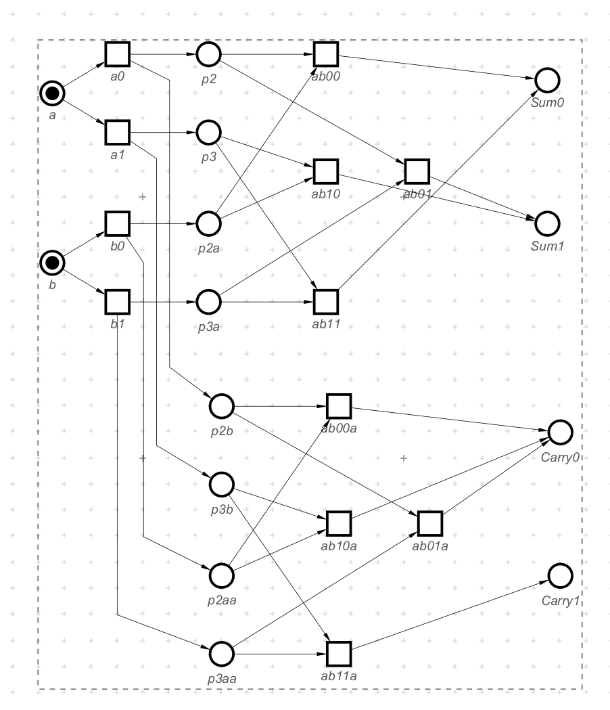

Truth Table Half-adder (./HA_via_Truthtable.work):

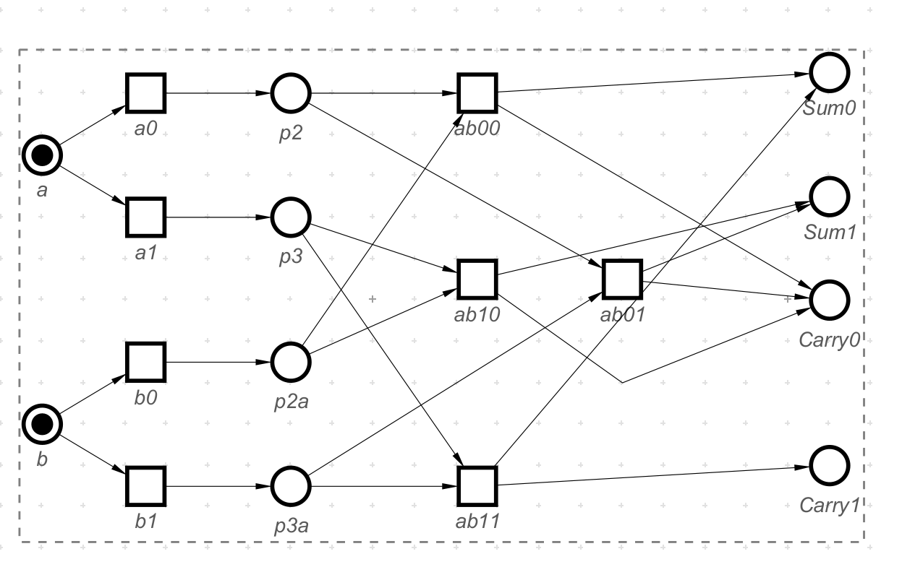

logic-gate Full-adder (./FA_via_Gates.work)

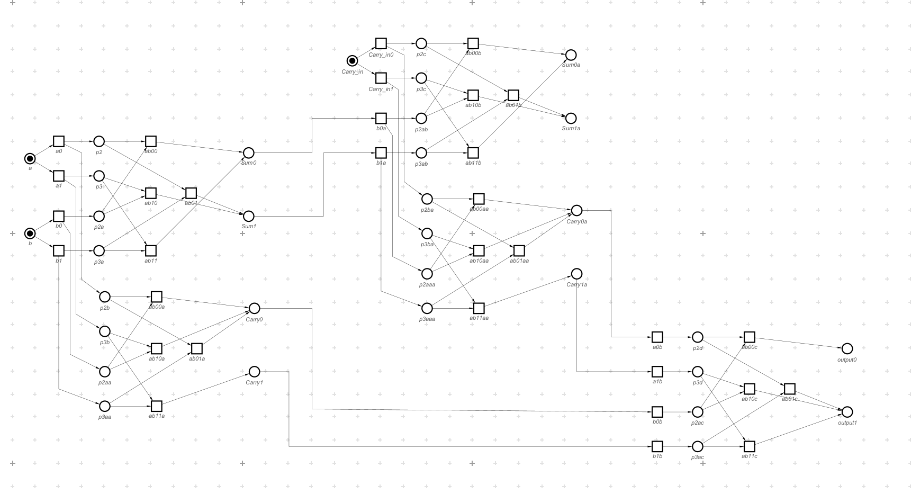

Truth Table Full-adder (./FA_via_Truthtable.work)

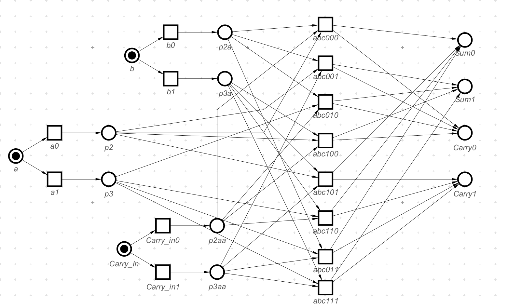

Comparing the designs generated from Truth Table and Logic-gate, the advantages and disadvantages could be observed obviously. The truth-table models are simpler in architectures, which have less places / transitions, so that would provide a higher efficiency. In the logic-gate based designs, the architectures are more complicated, which have more places and transitions. However, the gate-based designs have better performance in modulator developing process. Compared to the truth-table based modelling, which structure should be redesigned according to different truth table, logic-gates based models could be simply constructed by the default logic-gates whatever the purpose is. 

In conclusion, the true-table based models could have better efficiency and brief structure, but the cost of design may increase obviously. The logic-gates based models would have more modular choices, which allows you to construct the circuit from previous gate-level models. The modular design method could reduce the cost of designing significantly, however have lower efficiency and scale of architecture in return. The trade-off between efficiency and cost should be considered in real-world condition.

To implement the adder designs above, I constructed an environment to receive the input and generate the output in a deadlock-free circle. An example of HA environment is shown as below (./Environment_with_HA.work)

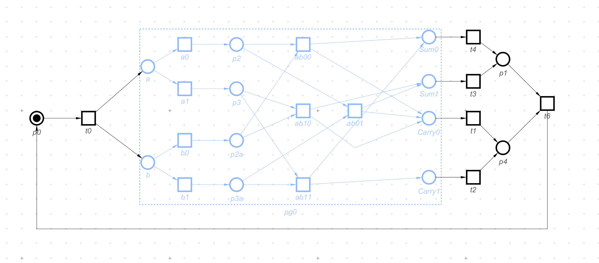

The input for the half adder could be got from transition a0, a1, b0 and b1. After the calculation, the output in transition t4, t3, t2 and t1 could be extracted to another storing blocks, than the firing of t6 would lead the token return to the input. The system was tested as deadlock-free.

## Task 2: Modelling buffers and frequency dividers

In this task, I built the constant-latency multi-place buffer shown as below (./Parallel_Buffer.work):

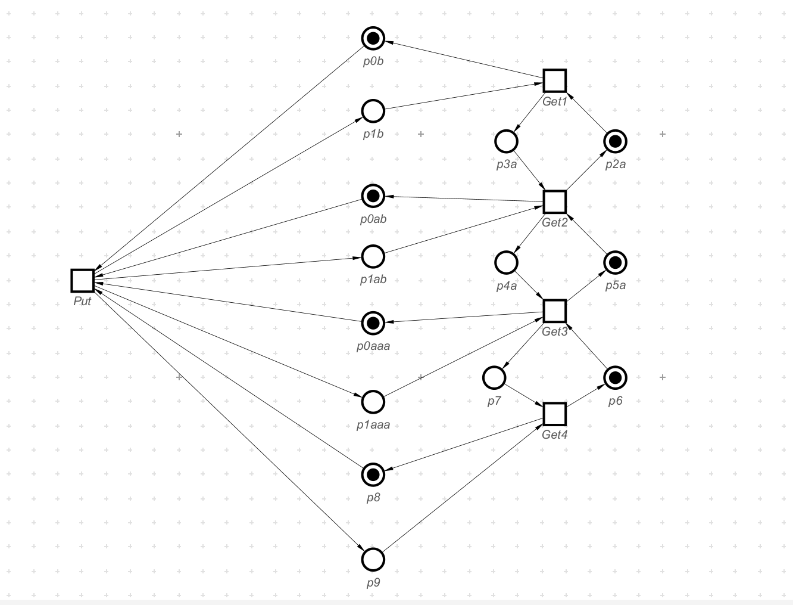

In my multi-place buffer design, I choose the parallel method to avoid the increasing latency in linear-buffer design, which have 3 places. 

With the help of Workcraft software, I constructed the reachability state graph for it as following (./Parallel_FSM.work):

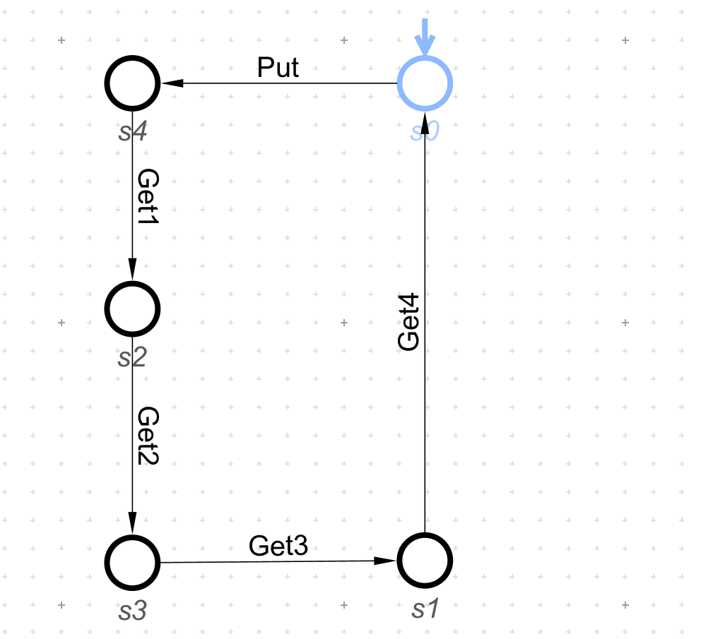

Based on the Multi-place buffer design above, the 3-frequency-divider petri-net circuit could be constructed as (./3_Frequency_Divider.work):

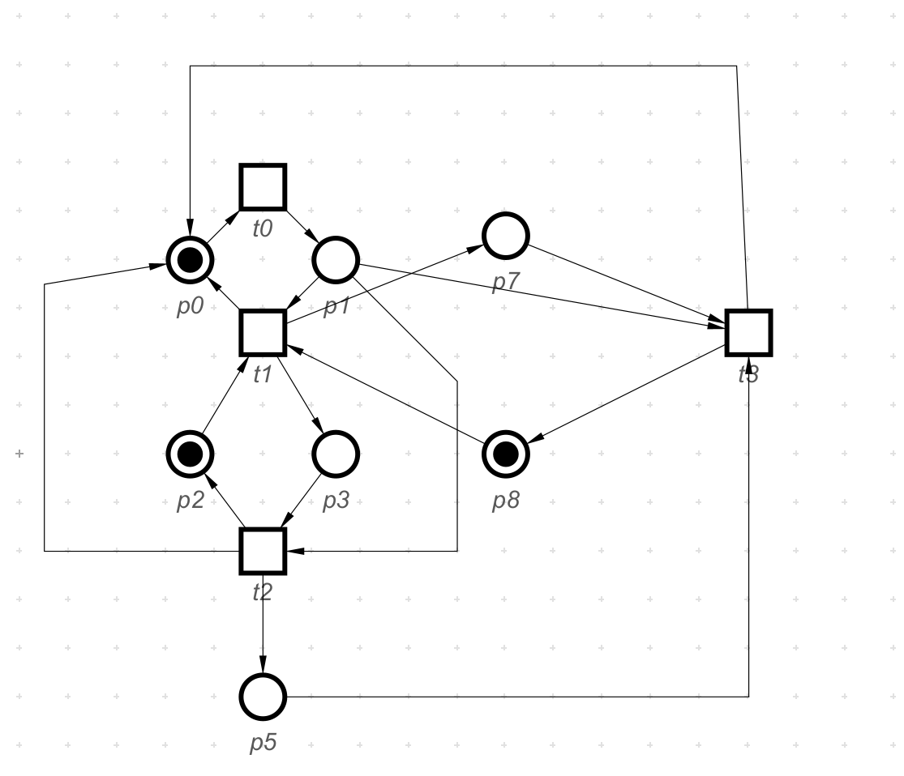

In each stage, the system could divide the frequency by three.

## Task 3: Modelling systems with arbitration 

In the following design, I developed a Petri-net model of a 3-philosophers-problem, which is shown in below (./philosophers_3_asym.work):

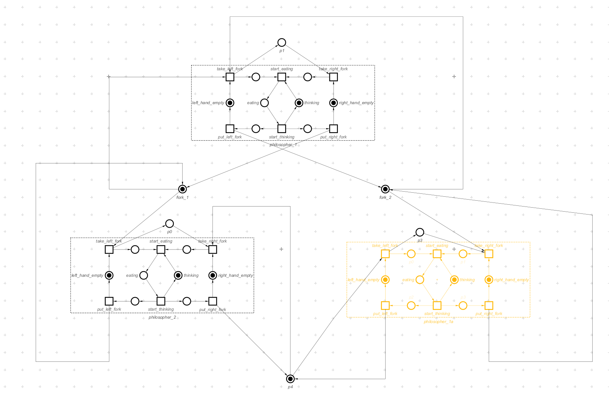

In my solution for the 3-philosopher problem, I used three hand-shake standing for three folks among three philosophers. When a philosopher has picked up one folk, the adjacent philosophers in his both sides would be forbidden to pick up the nearby folks, which avoid the conflicts. This method could solve this problem with deadlock-free result.

## Task 4: Modelling simple CPUs

According to the basic principle, a simple CPU without pipeline could be derived as following (./No_pipeline_CPU.work):

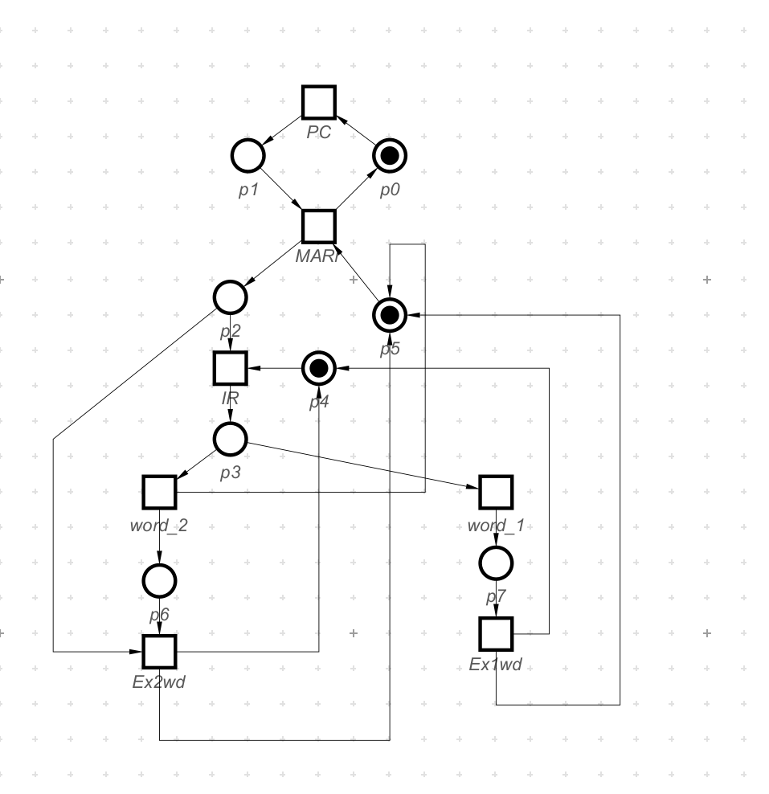

This CPU Petri-net design could model the process of increase Program Counter, visit Memory Read Register and read in instructions from IR to execute a single instruction. To improve the efficiency, the multi-level pipeline could be added.

A low-level pipeline CPU could be designed as below (./Original_CPU.work):

In the first version of the pipeline design, the deadlock would occur in a certain condition. When the store-instruction has been decoded into MAR_read, another word could be fetched from PC as a pipeline. In this condition, the Instructor Register should wait for the store to complete, and the newly fetched word is also waiting for the response of IR, which would lead to a deadlock.

To solve this deadlock, an extra register is necessary to store the newly fetched word and allow MAR to accept the request from store (./One_latch_CPU.work):

A new latch could send back the request to MAR_read, which could allow the store to continue. As a result, another place from IR to MAR_read would allow the access to MAR_read. In addition, when a two-word instruction executes, the second word is fetched in parallel with the instruction decoding. After decoding completes, the appropriate register can start to latch the data earlier, which allows more concurrency.

According to the practical testing, the addition of another latch could lead to more pipeline possibility. The design with two-latches could be shown as below (./Two_latches_CPU.work):

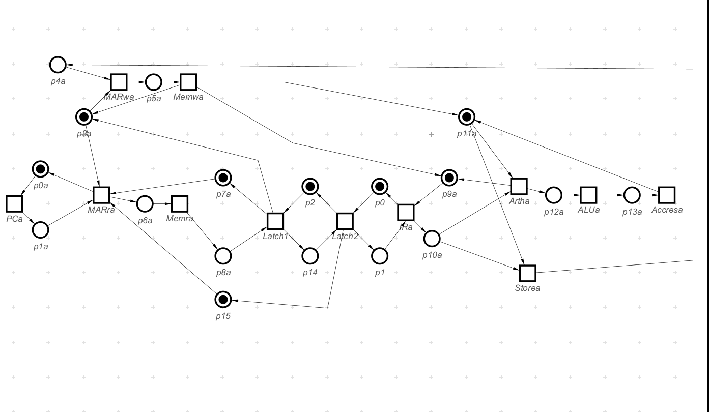

The two latches decouple the instruction and memory registers. Data latching into the instruction register can also occur concurrently with the
fetching of new words from memory, which is even more concurrent compared to the one-latch version CPU.

## Extra Task 1: Serial Multiplier 

Due to the time limit, I only designed the first full-adder and the first part of shift-register, which is shown as below (./multiplier.work):

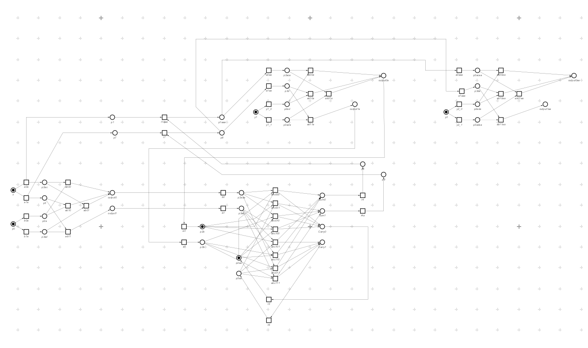

The design could calculate the first two bits of the multiplication result, i.e. $x_0.y_0$ and $x_1y_0 + x_0y_1$. The shifting effect is implemented using handshake between each instruction.

## Task 5: Design of a multi-place buffer

TWith the request and acknowledge signals, the one-place buffer could be implemented. The simple buffer in STG could be design as below (./buffer_simple_stg.work):

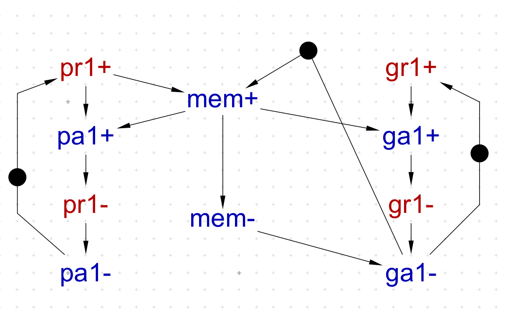

Based on the principle of buffer and frequency_divider, I applied the tree-structure on a frequency divider by 2, which could lead to a frequency divider by 4 shown as below (./Freq-div-by-4_stg.work):

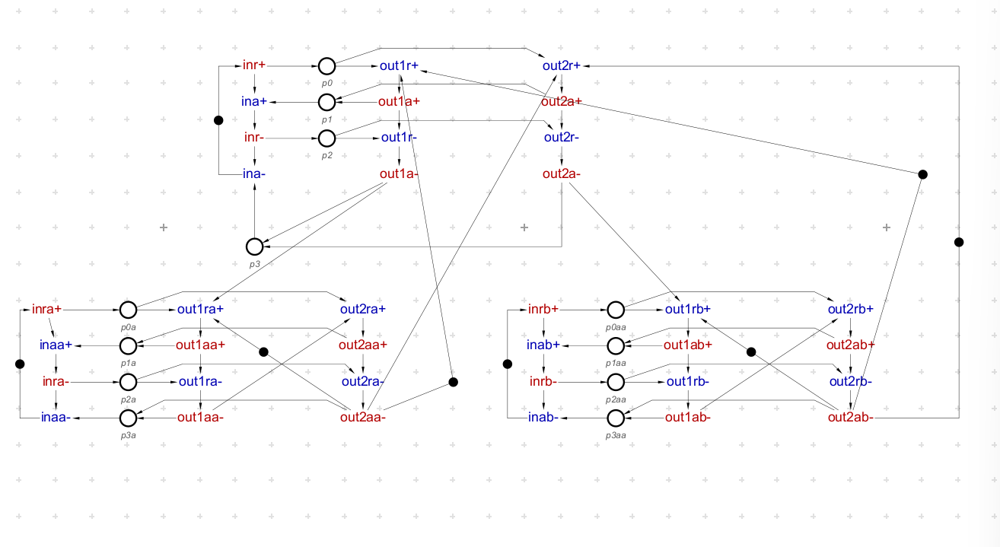

The system is being tested as deadlock-free. The synthesis circuit was also generated as below (./Freq-div-by-4_stg_circuit.work):

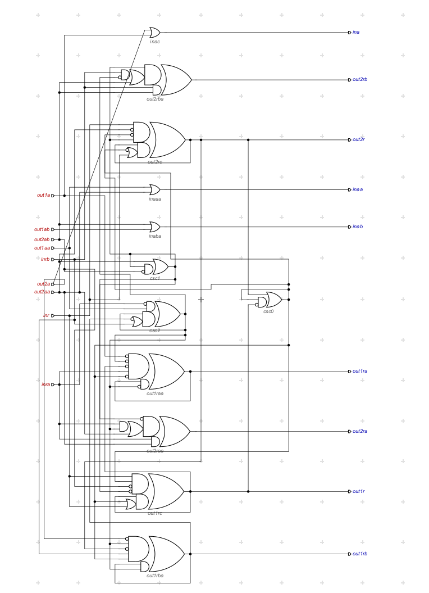

Based on the frequency divider by 4, the structure of a 4-place Buffer could be suggested as below:

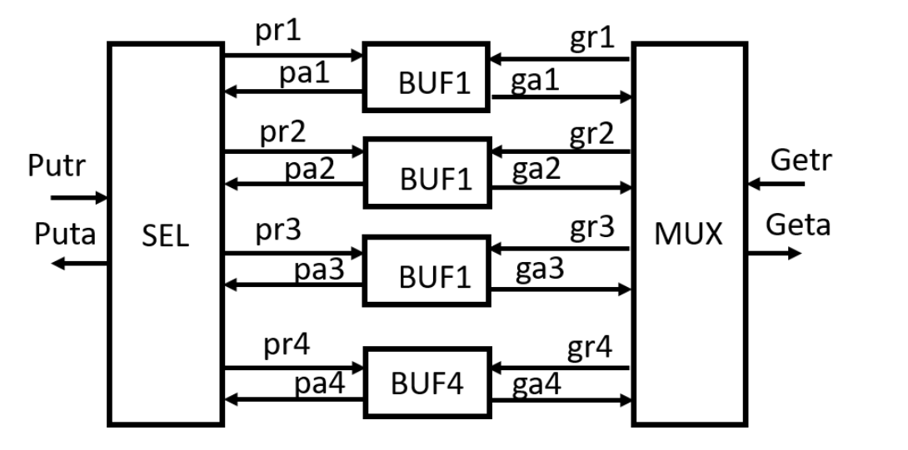

Applied the multi-place buffer structure above, I constructed the 4-frequency-divider and the one-place buffer as the following STG design (./4_place_buffer_stg.work)

After the check of consistency, output-persistency,
deadlock-freeness, and Complete State Coding, the 4-place buffer could also be synthesized as the following complex-gate circuit. (./Four_Place_Buffer_Circuit.work)

## Task 6: Design of ‘if’ and ‘do’ controllers

The STG model of if-block could be designed as below (./if_stg.work):

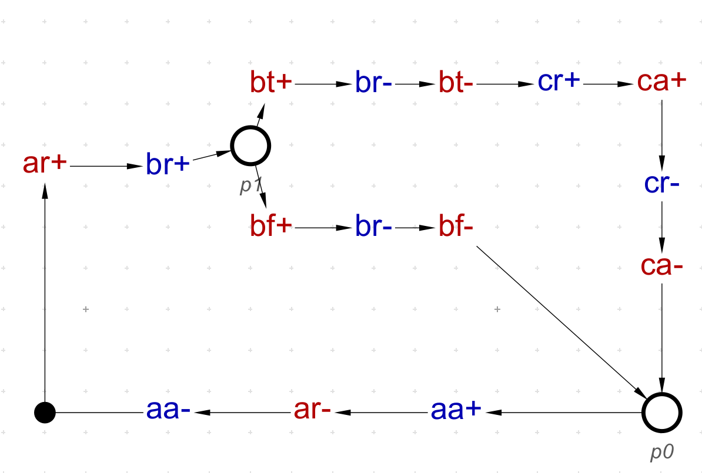

When the option of 'b_true' is activated, the transition of 'c' would be processed. In other conditions with 'b_false', it would return back to 'a' without execution of 'c'.

The technical mapping solution of the if-block could be generated as below (./if_stg_tech.work):

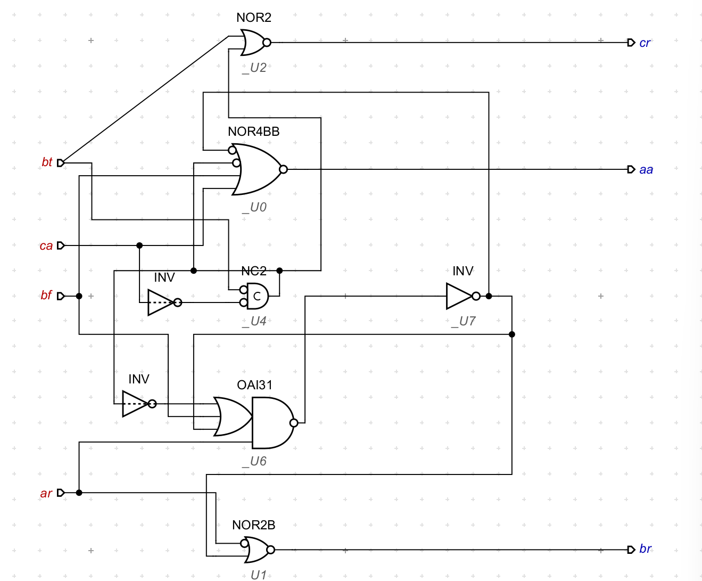

Following the same principle, the while-block could be designed as below (./While_stg.work):

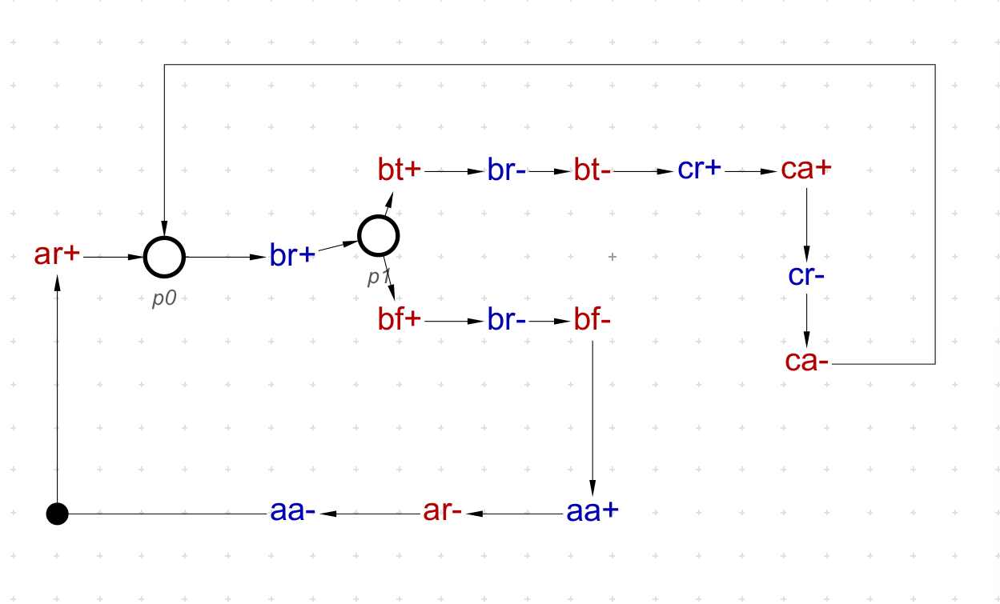

In the while-block, the signal request of 'a' could only be responded when 'b_false' is chosen, and it would repeat the loop when 'b_true' is chosen.

The technical mapping solution could be generated as below (./While_stg_tech.work):

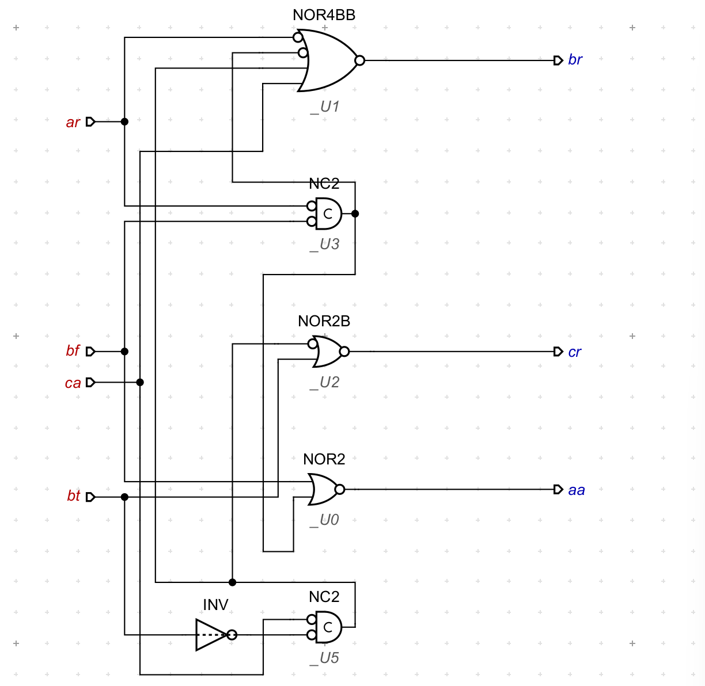

