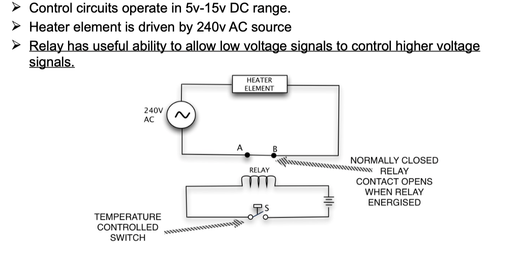
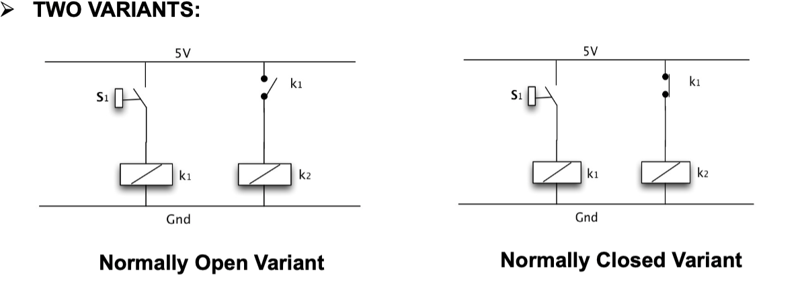
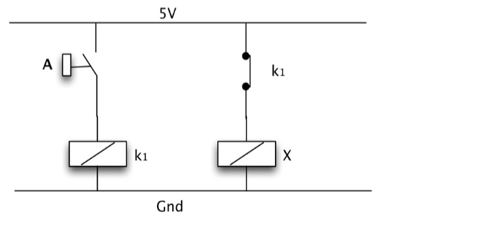
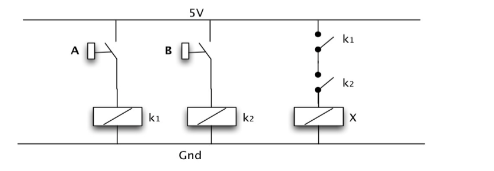
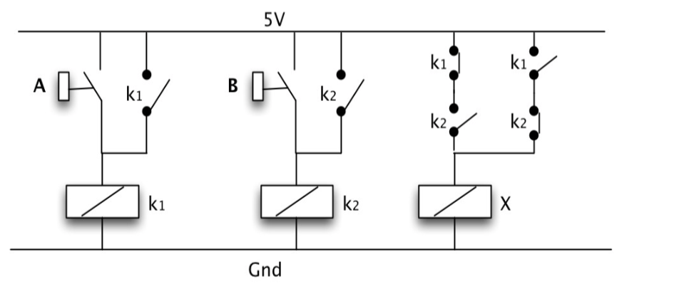

# Industrial Automation and Control Systems 

## I: ON-OFF (relay) Control 

### 1.1: Background 

- Often described as ON-OFF control or BANG-BANG Control.

- Could be implemented using simple RELAYS or by software implementation using PLC.

### 1.2: Washing Machine Example 

### 1.3: Type-1 RELAY 

- Using coils to control a different switch.

### 1.4: TYPE-2 Relay Latching and Reset Circuit 

- We need a mechanism which will latch the relay when
the button is pressed and released. We also need a mechanism to reset the latch.

- We could implement Logical Expression using Relays. 

- Buffer should be like:

- NOT Gate should be like:

- AND Gate:

- OR Gate:

- XOR Gate:

### 1.5: Example of a water-level control system 

- If the level reaches the setting level or the emergency switch being pushed, the water-flow would be stopped.

