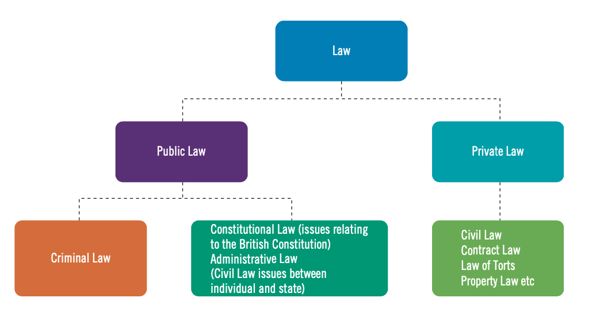
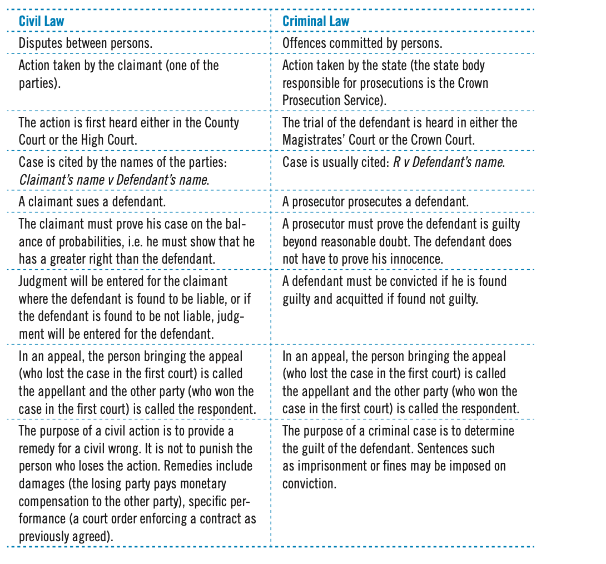
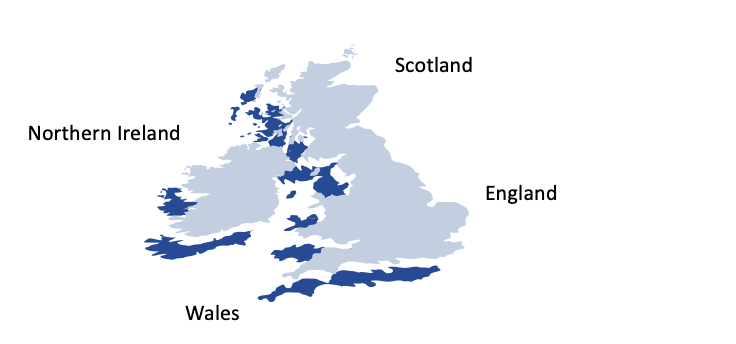
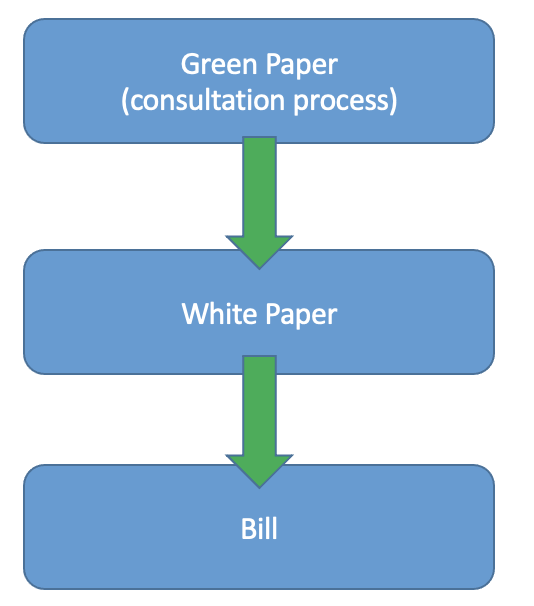
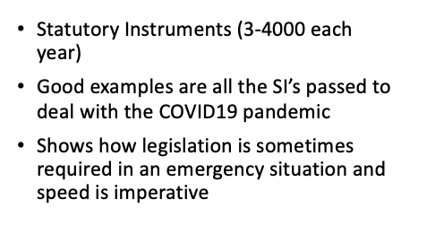
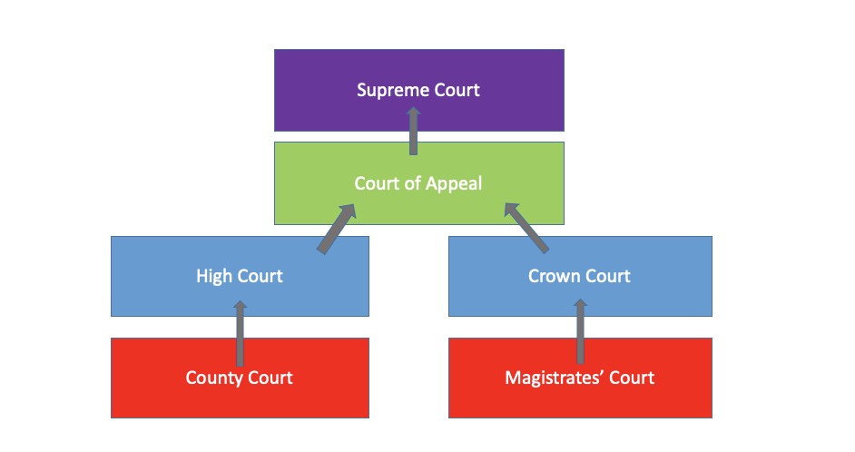

# Introduction to Business Laws 

## I: Introduction to English Laws

### 1: Public and Private Laws

### 2: Criminal Law and Civil Law 

## II: Sources of English Laws 

- There are 2 main sources of English Law:
    - Parliament (statutes)
    - The Courts (case law and common law)
    - Some EU laws after Brexit 

- UK has 3 distinct legal systems and sets of laws:
    - England and Wales 
    - Scotland
    - Northern Ireland 

### 1: Parliament 

- Makes most English Law, laws could be divided into two types:
    - Direct Legislation: Acts of Parliament 
    - Indirect Legislation (delegated legislation): created by a government department or local authority with delegated power to legislate.

- Consists of **House of Commons**, **House of Lords** and **The Monarch**.

- Process of create / repeal / change Acts of Parliament:

- Forms of delegated legislation:

### 2: Courts

- Decide cases and create law often referred to as *common law*.

- The English court structure is divided into two branches: criminal and civil.

- The Court Structure can be explained as:

#### 2.1: Criminal Courts 

- First instance courts:
    - Magistrates'courts
    - Crown courts

- Appellate courts:
    - High Court
    - Court of Appellate
    - Supreme Court

#### 2.2: Civil Courts 

- First instance courts:
    - County Courts
    - Magistrates'courts 
    - High courts 

- Appellate courts:
    - Court of Appeal 
    - Supreme Court 

### 3: Law of binding precedent 

- The common law relies on the doctrine of precedent.

- The decisions of higher courts *bind* lower courts.

- **Supreme Court** binds all others, except its previous decisions.

- **Court of Appeal** only binds all other lower courts, **mostly** bound by itself (previous decisions).

- **High Court** is bound by SC and CA, except by its own previous decisions.

- **Civil** and **Criminal** of CA do not bind each other.

### 4: Statutory Interpretation 

- In order to apply the law Judges often have to interpret the statute that has been made by Parliament.

- There may be ambiguity or dual meaning or an interpretation that wasn't what was envisaged when the Statute was created.

- Could be **Intrinsic aids** and **External aids**.

- Interpretation follows the rules below:
    - THE CONTEXTUAL APPROACH: Interpretation needs to consider the context of the statute and the surrounding and connected text and words.
    - THE ‘LITERAL’ RULE: Where the courts take the words at their face value where there is no ambiguity and their meaning is clear even if this produces an absurd result.
    - THE ‘GOLDEN’ RULE: If there is ambiguity the court will apply the least ridiculous meaning to avoid an absurd result.
    - THE ‘MISCHIEF’ RULE: Allows court to fulfil the statute's intended.

### 5: Laws from European Union: Impact from Brexit

- UK left EU on 31 Jan 2020, the transition period ended 31 Dec 2020.

- Some of EU laws still exist:
    - Domestic Law which implemented or related to former EU obligations. e.g. the UK’s Working Time Regulations which implemented the EU Working Time Directive.

    - EU legislation which was directly applicable in the UK without implementing legislation. e.g. EU General Data Protection Regulation.

    - Other rights and principles in the EU that had direct effect in the UK. e.g. the right not to be discriminated against on grounds of nationality.

